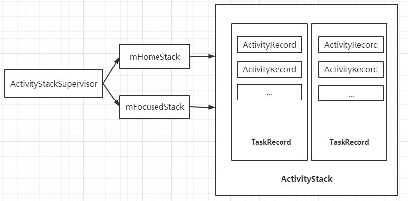
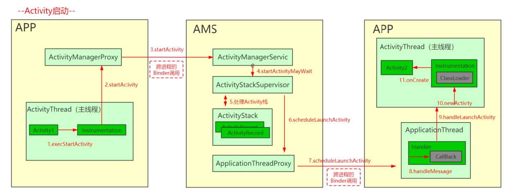
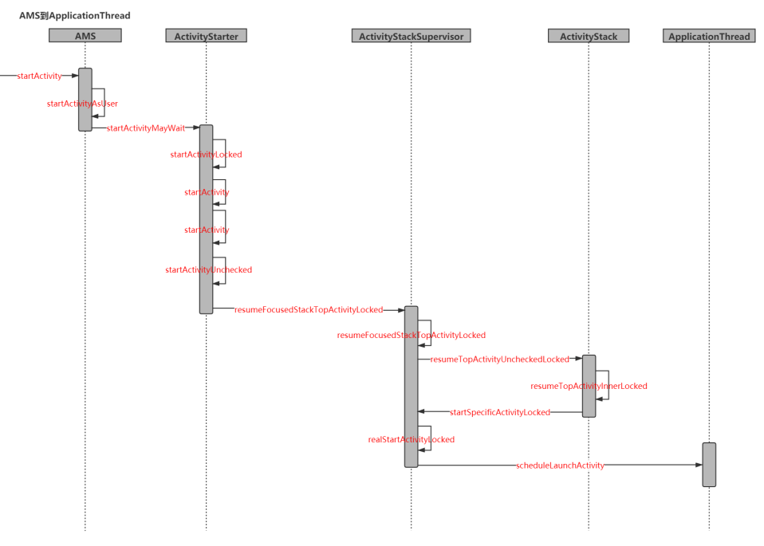
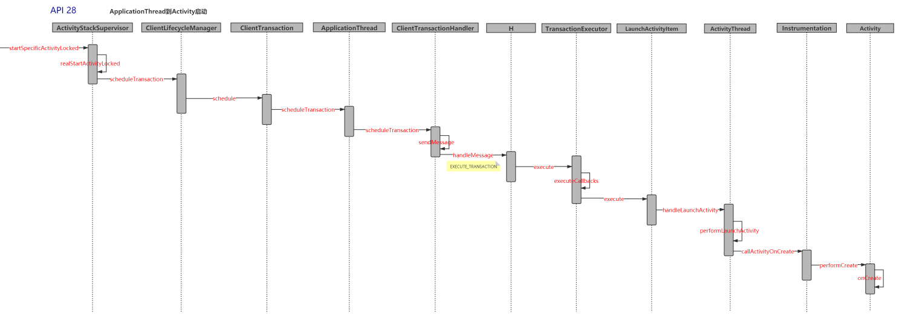

## 前言

ActivityManagerService是Android系统中一个特别重要的系统服务，也是我们上层APP打交道最多的系统服务之一。ActivityManagerService（以下简称AMS） 主要负责四大组件的启动、切换、调度以及应用进程的管理和调度工作。所有的APP应用都需要与AMS打交道Activity Manager的组成主要分为以下几个部分：
1. 服务代理：由ActivityManagerProxy实现，用于与Server端提供的系统服务进行进程间通信
2. 服务中枢：ActivityManagerNative继承自Binder并实现IActivityManager，它提供了服务接口和Binder接口的相互转化功能，并在内部存储服务代理对像，并提供了getDefault方法返回服务代理
3. Client：由ActivityManager封装一部分服务接口供Client调用。ActivityManager内部通过调用
ActivityManagerNative的getDefault方法，可以得到一个ActivityManagerProxy对像的引用，进而通过
该代理对像调用远程服务的方法
4. Server：由ActivityManagerService实现，提供Server端的系统服务

接下来将从AMS的启动流程、几个方面来学习AMS。

## AMS的启动流程

首先，在分析AMS的启动流程之前，我们先来回顾一下Android系统的启动流程。当我们按下开机键的时候，引导芯片代码从预定义的地方（固化在ROM中）加载到RAM中，这个就是我们所说的BootLoader引导程序，引导程序会进一步完成内核的设置，包括缓存、驱动、被保护存储器等。当内核设置完成好，会在文件系统中寻找init.c文件，然后启动init进程，并在init.main()方法中完成初始化设置。

init进程是Linux系统的第一个进程，它完成了文件目录的创建和挂载、初始化和启动属性服务，解析init.rc配置文件并启动zygote进程这三个重要的事情。zygote就是安卓系统的核心进程，然后又会fork出SystemService这一重要进程，我们所知道的ActivityManagerService、PowerManagerService、WindowManagerService都是由SystemService这一进程fork出来的，现在就来看一下它们是怎么启动起来的。

首先在Zygote启动的时候，会调用ZygoteInit.main()完成初始化工作。

```java
// ZygoteInit.main()
public static void main(String argv[]) {
    // ...省略
    try {
        boolean startSystemServer = false;
        for (int i = 1; i < argv.length; i++) {
            if ("start-system-server".equals(argv[i])) {
                startSystemServer = true;
            }
        }
        // ...省略
        if (startSystemServer) {
            Runnable r = forkSystemServer(abiList, zygoteSocketName, zygoteServer);

            if (r != null) {
                r.run();
                return;
            }
        }
    }
}
```
接下来看forkSystemServer()方法的实现：
```java
private static Runnable forkSystemServer(String abiList, String socketName,
            ZygoteServer zygoteServer) {

    String args[] = {
            "--setuid=1000",
            "--setgid=1000",
            "--setgroups=1001,1002,1003,1004,1005,1006,1007,1008,1009,1010,1018,1021,1023,"
                    + "1024,1032,1065,3001,3002,3003,3006,3007,3009,3010,3011",
            "--capabilities=" + capabilities + "," + capabilities,
            "--nice-name=system_server",
            "--runtime-args",
            "--target-sdk-version=" + VMRuntime.SDK_VERSION_CUR_DEVELOPMENT,
            "com.android.server.SystemServer",
    };

    int pid;

    try {
        parsedArgs = new ZygoteArguments(args);
        Zygote.applyDebuggerSystemProperty(parsedArgs);
        Zygote.applyInvokeWithSystemProperty(parsedArgs);

        /* Request to fork the system server process */
        pid = Zygote.forkSystemServer(
                parsedArgs.mUid, parsedArgs.mGid,
                parsedArgs.mGids,
                parsedArgs.mRuntimeFlags,
                null,
                parsedArgs.mPermittedCapabilities,
                parsedArgs.mEffectiveCapabilities);
    } catch (IllegalArgumentException ex) {
        throw new RuntimeException(ex);
    }

    /* For child process */
    if (pid == 0) {
        if (hasSecondZygote(abiList)) {
            waitForSecondaryZygote(socketName);
        }

        zygoteServer.closeServerSocket();
        return handleSystemServerProcess(parsedArgs);
    }

    return null;
}

static int forkSystemServer(int uid, int gid, int[] gids, int runtimeFlags,
        int[][] rlimits, long permittedCapabilities, long effectiveCapabilities) {
    ZygoteHooks.preFork();

    int pid = nativeForkSystemServer(
            uid, gid, gids, runtimeFlags, rlimits,
            permittedCapabilities, effectiveCapabilities);

    // Set the Java Language thread priority to the default value for new apps.
    Thread.currentThread().setPriority(Thread.NORM_PRIORITY);

    ZygoteHooks.postForkCommon();
    return pid;
}
```
在该方法中，首先初始化了相关参数args，然后调用Zygote.forkSystemServer()方法，最终调用的是nativeForkSystemServer方法，fork出了SystemServer进程，并返回进程号pid。如果返回的pid==0，就说明fork出的是子进程，则调用handleSystemServerProcess()，将之前整理的参数传入进行解析，最后返回得到的SystemServer进程。

接下来看SystemServer的启动，当zygote进程中开启了SystemServer进程后，就会从SystemServer.main()入口开启。：
```java
public final class SystemServer {

  //开始的入口
  public static void main(String[] args) {
          new SystemServer().run();
  }

  public SystemServer() {
      // Check for factory test mode.
      mFactoryTestMode = FactoryTest.getMode();
      // Remember if it's runtime restart(when sys.boot_completed is already set) or reboot
      mRuntimeRestart = "1".equals(SystemProperties.get("sys.boot_completed"));
  }

  private void run() {
      try {
          //开启Handler线程
          Looper.prepareMainLooper();

          System.loadLibrary("android_servers");

          // 检查最近一次关机是否失败
          performPendingShutdown();
          // 创建上下文对象
          createSystemContext();

          mSystemServiceManager = new SystemServiceManager(mSystemContext);
          LocalServices.addService(SystemServiceManager.class, mSystemServiceManager);
          // Prepare the thread pool for init tasks that can be parallelized
          SystemServerInitThreadPool.get();
      } finally {
          traceEnd();  // InitBeforeStartServices
      }

      // Start services.
      try {
          // 互相依赖的service会在这里被启动
          startBootstrapServices();
          //启动核心进程 DropBoxManagerService  BatteryService  UsageStatsService  WebViewUpdateService
          startCoreServices();

          // 安装系统核心provider、WindowManagerSerivce,Settings Observer
          // startSystemUi  SystemReady
          startOtherServices();
          SystemServerInitThreadPool.shutdown();
      } catch (Throwable ex) {
          throw ex;
      } finally {
          traceEnd();
      }

      // 开启线程循环
      Looper.loop();
  }

}
```
在SystemServer的run()方法中，首先进行了一系列准备工作，包括开启Handler线程，加载"android_servers"的native Library，以及创建系统上下文对象，并初始化SystemServiceManager，最后将会启动不同的服务，其中ActivityManagerService是在startBootstrapServices()方法中启动的。

```java

private void startBootstrapServices() {

    // 开启ActivityManagerService 服务
    mActivityManagerService = mSystemServiceManager.startService(
            ActivityManagerService.Lifecycle.class).getService();


    // 开启电源管理服务，其他服务的开启都需要依赖它
    mPowerManagerService = mSystemServiceManager.startService(PowerManagerService.class);

    // 开启RecoverySystemService
    mSystemServiceManager.startService(RecoverySystemService.class);

    // LightsService

    mSystemServiceManager.startService(LightsService.class);

    // DisplayManagerService

    mDisplayManagerService = mSystemServiceManager.startService(DisplayManagerService.class);

    // 开启PackageManagerService

    mPackageManagerService = PackageManagerService.main(mSystemContext, installer,
            mFactoryTestMode != FactoryTest.FACTORY_TEST_OFF, mOnlyCore);

    // ...
    mActivityManagerService.setSystemProcess();
}
```
在这里，我们注意到在startService方法中创建ActivityManagerService的时候，传入的是ActivityManagerService.Lifecycle，并通过反射调用构造函数，得到ActivityManagerService.Lifecycle的实例，最后返回作为ActivityManagerService的对象。
```java
public <T extends SystemService> T startService(Class<T> serviceClass) {
   try {
        final String name = serviceClass.getName();
        final T service;
        try {
          Constructor<T> constructor = serviceClass.getConstructor(Context.class);
          service = constructor.newInstance(mContext);
          startService(service);
          return service;
       }
    }
```
接下来我们来看一下这个ActivityManagerService.Lifecycle是一个什么样的类。
```java
public static final class Lifecycle extends SystemService {
    private final ActivityManagerService mService;
    private static ActivityTaskManagerService sAtm;

    public Lifecycle(Context context) {
        super(context);
        mService = new ActivityManagerService(context, sAtm);
    }

    public static ActivityManagerService startService(
            SystemServiceManager ssm, ActivityTaskManagerService atm) {
        sAtm = atm;
        return ssm.startService(ActivityManagerService.Lifecycle.class).getService();
    }

    @Override
    public void onStart() {
        mService.start();
    }

    @Override
    public void onBootPhase(int phase) {
        mService.mBootPhase = phase;
        if (phase == PHASE_SYSTEM_SERVICES_READY) {
            mService.mBatteryStatsService.systemServicesReady();
            mService.mServices.systemServicesReady();
        } else if (phase == PHASE_ACTIVITY_MANAGER_READY) {
            mService.startBroadcastObservers();
        } else if (phase == PHASE_THIRD_PARTY_APPS_CAN_START) {
            mService.mPackageWatchdog.onPackagesReady();
        }
    }

    @Override
    public void onCleanupUser(int userId) {
        mService.mBatteryStatsService.onCleanupUser(userId);
    }

    public ActivityManagerService getService() {
        return mService;
    }
}
```
Lifecycle继承自SystemService，在构造方法中实例化了ActivityManagerService实例，并覆写了SystemService的`onStart()`和`onBootPhase()`方法。从这里来看，ActivityManagerService.Lifecycle持有ActivityManagerService的引用，SystemService通过Lifecycle来对它进行管理，在不同的生命周期，调用ActivityManagerService相应的方法。


我们一开始就说了，AMS是一个特别重要的系统服务，主要负责四大组件的管理和调度工作，所以再来看看AMS的初始化做了哪些工作：
```java
public ActivityManagerService(Context systemContext) {
    LockGuard.installLock(this, LockGuard.INDEX_ACTIVITY);
    mInjector = new Injector();
    mContext = systemContext;//赋值mContext
    mFactoryTest = FactoryTest.getMode();
    //获取当前的ActivityThread
    mSystemThread = ActivityThread.currentActivityThread();
    //赋值mUiContext
    mUiContext = mSystemThread.getSystemUiContext();
    Slog.i(TAG, "Memory class: " + ActivityManager.staticGetMemoryClass());
    mPermissionReviewRequired = mContext.getResources().getBoolean(
    com.android.internal.R.bool.config_permissionReviewRequired);

    //创建Handler线程，用来处理handler消息
    mHandlerThread = new ServiceThread(TAG, THREAD_PRIORITY_FOREGROUND, false /*allowIo*/);
    mHandlerThread.start();

    mHandler = new MainHandler(mHandlerThread.getLooper());
    mUiHandler = mInjector.getUiHandler(this);//处理ui相关msg的Handler
    mProcStartHandlerThread = new ServiceThread(TAG + ":procStart", THREAD_PRIORITY_FOREGROUND, false /* allowIo */);
    mProcStartHandlerThread.start();
    mProcStartHandler = new Handler(mProcStartHandlerThread.getLooper());

    //管理AMS的一些常量，厂商定制系统就可能修改此处
    mConstants = new ActivityManagerConstants(this, mHandler);
    /* static; one-time init here */
    if (sKillHandler == null) {
        sKillThread = new ServiceThread(TAG + ":kill",
        THREAD_PRIORITY_BACKGROUND, true /* allowIo */);
        sKillThread.start();
        sKillHandler = new KillHandler(sKillThread.getLooper());
    }
    //初始化管理前台、后台广播的队列， 系统会优先遍历发送前台广播
    mFgBroadcastQueue = new BroadcastQueue(this, mHandler, "foreground", BROADCAST_FG_TIMEOUT, false);
    mBgBroadcastQueue = new BroadcastQueue(this, mHandler, "background", BROADCAST_BG_TIMEOUT, true);
    mBroadcastQueues[0] = mFgBroadcastQueue;
    mBroadcastQueues[1] = mBgBroadcastQueue;
    //初始化管理Service的 ActiveServices对象
    mServices = new ActiveServices(this);
    //初始化Provider的管理者
    mProviderMap = new ProviderMap(this);
    //初始化APP错误日志的打印器
    mAppErrors = new AppErrors(mUiContext, this);
    //创建电池统计服务， 并输出到指定目录
    File dataDir = Environment.getDataDirectory();
    File systemDir = new File(dataDir, "system");
    systemDir.mkdirs();
    mAppWarnings = new AppWarnings(this, mUiContext, mHandler, mUiHandler, systemDir);
    // TODO: Move creation of battery stats service outside of activity manager service.
    mBatteryStatsService = new BatteryStatsService(systemContext, systemDir, mHandler);
    mBatteryStatsService.getActiveStatistics().readLocked();
    mBatteryStatsService.scheduleWriteToDisk();
    mOnBattery = DEBUG_POWER ? true :
          mBatteryStatsService.getActiveStatistics().getIsOnBattery();
    //创建进程统计分析服务，追踪统计哪些进程有滥用或不良行为
    mBatteryStatsService.getActiveStatistics().setCallback(this);
    mProcessStats = new ProcessStatsService(this, new File(systemDir, "procstats"));
    mAppOpsService = mInjector.getAppOpsService(new File(systemDir,"appops.xml"), mHandler);
    //加载Uri的授权文件
    mGrantFile = new AtomicFile(new File(systemDir, "urigrants.xml"), "urigrants");
    //负责管理多用户
    mUserController = new UserController(this);
    //vr功能的控制器
    mVrController = new VrController(this);
    //初始化OpenGL版本号
    GL_ES_VERSION = SystemProperties.getInt("ro.opengles.version", ConfigurationInfo.GL_ES_VERSION_UNDEFINED);
    if (SystemProperties.getInt("sys.use_fifo_ui", 0) != 0) {
        mUseFifoUiScheduling = true;
    }
    mTrackingAssociations = "1".equals(SystemProperties.get("debug.trackassociations"));
    mTempConfig.setToDefaults();
    mTempConfig.setLocales(LocaleList.getDefault());
    mConfigurationSeq = mTempConfig.seq = 1;

    //管理ActivityStack的重要类，这里面记录着activity状态信息，是AMS中的核心类
    mStackSupervisor = createStackSupervisor();
    mStackSupervisor.onConfigurationChanged(mTempConfig);
    //根据当前可见的Activity类型，控制Keyguard遮挡，关闭和转换。 Keyguard就是我们的锁屏相关页面
    mKeyguardController = mStackSupervisor.getKeyguardController();
    // 管理APK的兼容性配置
    // 解析/data/system/packages-compat.xml文件，该文件用于存储那些需要考虑屏幕尺寸的APK信息，
    mCompatModePackages = new CompatModePackages(this, systemDir, mHandler);
    //Intent防火墙，Google定义了一组规则，来过滤intent，如果触发了，则intent会被系统丢弃，且不会告知发送者
    mIntentFirewall = new IntentFirewall(new IntentFirewallInterface(), mHandler);
    mTaskChangeNotificationController =
    new TaskChangeNotificationController(this, mStackSupervisor, mHandler);
    //这是activity启动的处理类，这里管理者activity启动中用到的intent信息和flag标识，也和stack和task有重要的联系
    mActivityStartController = new ActivityStartController(this);
    mRecentTasks = createRecentTasks();
    mStackSupervisor.setRecentTasks(mRecentTasks);
    mLockTaskController = new LockTaskController(mContext, mStackSupervisor, mHandler);
    // app activity生命周期相关
    mLifecycleManager = new ClientLifecycleManager();
    //启动一个线程专门跟进cpu当前状态信息，AMS对当前cpu状态了如指掌，可以更加高效的安排其他工作
    mProcessCpuThread = new Thread("CpuTracker") {
        @Override
        public void run() {
            synchronized (mProcessCpuTracker) {
                mProcessCpuInitLatch.countDown();
                mProcessCpuTracker.init();
            }
            while (true) {
                try {
                    try {
                        synchronized(this) {
                            final long now = SystemClock.uptimeMillis();
                            long nextCpuDelay = (mLastCpuTime.get()+MONITOR_CPU_MAX_TIME)-now;
                            long nextWriteDelay = (mLastWriteTime+BATTERY_STATS_TIME) - now;
                            //Slog.i(TAG, "Cpu delay=" + nextCpuDelay

                            // + ", write delay=" + nextWriteDelay);
                            if (nextWriteDelay < nextCpuDelay) {
                                nextCpuDelay = nextWriteDelay;
                            }
                            if (nextCpuDelay > 0) {
                                mProcessCpuMutexFree.set(true);
                                this.wait(nextCpuDelay);
                            }
                      }
                  } catch (InterruptedException e) {
                  }
                  updateCpuStatsNow();
              } catch (Exception e) {
                  Slog.e(TAG, "Unexpected exception collecting process
                  stats", e);
              }
          }
        }
    };
    mHiddenApiBlacklist = new HiddenApiSettings(mHandler, mContext);
    //看门狗，监听进程。这个类每分钟调用一次监视器。 如果进程没有任何返回就杀掉
    Watchdog.getInstance().addMonitor(this);
    Watchdog.getInstance().addThread(mHandler);
    // bind background thread to little cores
    // this is expected to fail inside of framework tests because apps can't touch cpusets directly
    // make sure we've already adjusted system_server's internal view of itself first
    updateOomAdjLocked();
    try {
        Process.setThreadGroupAndCpuset(BackgroundThread.get().getThreadId(),
        Process.THREAD_GROUP_BG_NONINTERACTIVE);
    } catch (Exception e) {
        Slog.w(TAG, "Setting background thread cpuset failed");
    }
}

```

最后，当开启完一系列服务后，会调用`setSystemProcess()`方法
```java
public void setSystemProcess() {
    try {
        //讲AMS注册到SM中
        ServiceManager.addService(Context.ACTIVITY_SERVICE, this, /* allowIsolated= */ true,
                DUMP_FLAG_PRIORITY_CRITICAL | DUMP_FLAG_PRIORITY_NORMAL | DUMP_FLAG_PROTO);
        // 进程统计
        ServiceManager.addService(ProcessStats.SERVICE_NAME, mProcessStats);
        //内存
        ServiceManager.addService("meminfo", new MemBinder(this), /* allowIsolated= */ false,
                DUMP_FLAG_PRIORITY_HIGH);
        //图像信息
        ServiceManager.addService("gfxinfo", new GraphicsBinder(this));
        //数据库
        ServiceManager.addService("dbinfo", new DbBinder(this));
        //cpu
        if (MONITOR_CPU_USAGE) {
            ServiceManager.addService("cpuinfo", new CpuBinder(this),
                    /* allowIsolated= */ false, DUMP_FLAG_PRIORITY_CRITICAL);
        }
        //权限
        ServiceManager.addService("permission", new PermissionController(this));
        //进程服务
        ServiceManager.addService("processinfo", new ProcessInfoService(this));

        ApplicationInfo info = mContext.getPackageManager().getApplicationInfo(
                "android", STOCK_PM_FLAGS | MATCH_SYSTEM_ONLY);
        mSystemThread.installSystemApplicationInfo(info, getClass().getClassLoader());

        synchronized (this) {
            ProcessRecord app = mProcessList.newProcessRecordLocked(info, info.processName,
                    false,
                    0,
                    new HostingRecord("system"));
            app.setPersistent(true);
            app.pid = MY_PID;
            app.getWindowProcessController().setPid(MY_PID);
            app.maxAdj = ProcessList.SYSTEM_ADJ;
            app.makeActive(mSystemThread.getApplicationThread(), mProcessStats);
            mPidsSelfLocked.put(app);
            mProcessList.updateLruProcessLocked(app, false, null);
            // 手机杀进程有关
            updateOomAdjLocked(OomAdjuster.OOM_ADJ_REASON_NONE);
        }
    } catch (PackageManager.NameNotFoundException e) {
        throw new RuntimeException(
                "Unable to find android system package", e);
    }

    // Start watching app ops after we and the package manager are up and running.
    mAppOpsService.startWatchingMode(AppOpsManager.OP_RUN_IN_BACKGROUND, null,
            new IAppOpsCallback.Stub() {
                @Override public void opChanged(int op, int uid, String packageName) {
                    if (op == AppOpsManager.OP_RUN_IN_BACKGROUND && packageName != null) {
                        if (mAppOpsService.checkOperation(op, uid, packageName)
                                != AppOpsManager.MODE_ALLOWED) {
                            runInBackgroundDisabled(uid);
                        }
                    }
                }
            });
}
```

- 注册服务。首先将ActivityManagerService注册到ServiceManager中，其次将几个与系统性能调试相关的服务注册到ServiceManager。这里还涉及到两个重要操作：

- 查询并处理ApplicationInfo。首先调用PackageManagerService的接口，查询包名为android的应用程序的ApplicationInfo信息，对应于**framework-res.apk**。然后以该信息为参数调用`ActivityThread上的installSystemApplicationInfo()`方法。

- 创建并处理ProcessRecord。调用ActivityManagerService上的newProcessRecordLocked，创建一个ProcessRecord类型的对象，并保存该对象的信息

经过上面这些步骤，ActivityManagerService的启动流程就走完了，且在`createSystemContext()`方法中完成了ActivityThread的创建，并通过`attach()`方法将两者绑定。


## Activity的启动流程

在前述中，我们说到，AMS是一个特别重要的系统服务，主要负责四大组件的管理和调度工作,那么Activity作为我们最为常用的组件，它是怎么启动的呢？。首先，先来了解一下AMS中与Activity管理相关的数据结构。

#### 与Activity管理相关的数据结构

##### ActivityRecord
ActivityRecord，源码中的注释介绍：An entry in the history stack, representing an activity. 意思就是历史栈中的一个条目，代表一个activity。
```java
final class ActivityRecord extends ConfigurationContainer implements AppWindowContainerListener {
    final ActivityManagerService service; // owner
    final IApplicationToken.Stub appToken; // window manager token
    AppWindowContainerController mWindowContainerController;
    final ActivityInfo info; // all about me
    final ApplicationInfo appInfo; // information about activity's app
    //省略其他成员变量

    //ActivityRecord所在的TaskRecord
    private TaskRecord task;

    //构造方法，需要传递大量信息
    ActivityRecord(ActivityManagerService _service, ProcessRecord _caller, int _launchedFromPid,
            int _launchedFromUid, String _launchedFromPackage, Intent _intent, String _resolvedType,
            ActivityInfo aInfo, Configuration _configuration,
            ActivityRecord _resultTo, String _resultWho, int _reqCode,
            boolean _componentSpecified, boolean _rootVoiceInteraction,
            ActivityStackSupervisor supervisor,
            ActivityContainer container, ActivityOptions options, ActivityRecord sourceRecord) {
            // ...省略

    }
```
ActivityRecord中存在着大量的成员变量，包含了一个Activity的所有信息。 ActivityRecord中的成员变量task表示其所在的TaskRecord，由此可以看出：ActivityRecord与TaskRecord建立了联系

```java
private int startActivity(IApplicationThread caller, Intent intent, Intent ephemeralIntent,
  String resolvedType, ActivityInfo aInfo, ResolveInfo rInfo,
  IVoiceInteractionSession voiceSession, IVoiceInteractor voiceInteractor,
    IBinder resultTo, String resultWho, int requestCode, int callingPid,
    int callingUid, String callingPackage, int realCallingPid, int realCallingUid,
    int startFlags, SafeActivityOptions options, boolean ignoreTargetSecurity, boolean componentSpecified,
    ActivityRecord[] outActivity, TaskRecord inTask, boolean allowPendingRemoteAnimationRegistryLookup) {
        ActivityRecord r = new ActivityRecord(mService, callerApp, callingPid,
        callingUid,
        callingPackage, intent, resolvedType, aInfo,
        mService.getGlobalConfiguration(),
        resultRecord, resultWho, requestCode, componentSpecified,
        voiceSession != null,
        mSupervisor, checkedOptions, sourceRecord);
}
```
##### TaskRecord
> \frameworks\base\services\core\java\com\android\server\am\TaskRecord.java

TaskRecord，内部维护一个ArrayList<ActivityRecord> 用来保存ActivityRecord。


```java
class TaskRecord extends ConfigurationContainer implements TaskWindowContainerListener {
    final int taskId; //任务ID
    final ArrayList<ActivityRecord> mActivities; //使用一个ArrayList来保存所有的
    ActivityRecord
    private ActivityStack mStack; //TaskRecord所在的ActivityStack

    TaskRecord(ActivityManagerService service, int _taskId, Intent _intent,
        Intent _affinityIntent, String _affinity, String _rootAffinity,
        ComponentName _realActivity, ComponentName _origActivity, boolean
        _rootWasReset,
        boolean _autoRemoveRecents, boolean _askedCompatMode, int _userId,
        int _effectiveUid, String _lastDescription,
        ArrayList<ActivityRecord> activities,
        long lastTimeMoved, boolean neverRelinquishIdentity,
        TaskDescription _lastTaskDescription, int taskAffiliation, int
        prevTaskId,
        int nextTaskId, int taskAffiliationColor, int callingUid, String
        callingPackage,
        int resizeMode, boolean supportsPictureInPicture, boolean
        _realActivitySuspended,
        boolean userSetupComplete, int minWidth, int minHeight) {

    }

    //添加Activity到顶部
    void addActivityToTop(com.android.server.am.ActivityRecord r) {
        addActivityAtIndex(mActivities.size(), r);
    }

    //添加Activity到指定的索引位置
    void addActivityAtIndex(int index, ActivityRecord r) {
    //...
        r.setTask(this);//为ActivityRecord设置TaskRecord，就是这里建立的联系
        //...
        index = Math.min(size, index);
        mActivities.add(index, r);//添加到mActivities
        //...
    }
}
```
可以看到TaskRecord中使用了一个ArrayList来保存所有的ActivityRecord。 同样，TaskRecord中的mStack表示其所在的ActivityStack。 startActivity()时也会创建一个TaskRecord。
##### ActivityStarter
>    \frameworks\base\services\core\java\com\android\server\am\ActivityStarter.java
```java
class ActivityStarter {
    private int setTaskFromReuseOrCreateNewTask(TaskRecord taskToAffiliate,
        int preferredLaunchStackId, ActivityStack topStack) {
        mTargetStack = computeStackFocus(mStartActivity, true,
        mLaunchBounds, mLaunchFlags, mOptions);
        if (mReuseTask == null) {
              //创建一个createTaskRecord，实际上是调用ActivityStack里面的createTaskRecord（）方法，ActivityStack下面会讲到
            final TaskRecord task = mTargetStack.createTaskRecord(
              mSupervisor.getNextTaskIdForUserLocked(mStartActivity.userId),
              mNewTaskInfo != null ? mNewTaskInfo :
              mStartActivity.info,
              mNewTaskIntent != null ? mNewTaskIntent : mIntent,
              mVoiceSession,
              mVoiceInteractor, !mLaunchTaskBehind /* toTop */,
              mStartActivity.mActivityType);
            //其他代码略
        }
    }
}
```
##### ActivityStack

ActivityStack,内部维护了一个ArrayList<TaskRecord> ，用来管理TaskRecord
```java
class ActivityStack<T extends StackWindowController> extends ConfigurationContainer
    implements StackWindowListener {
/**
* The back history of all previous (and possibly still
* running) activities. It contains #TaskRecord objects.
*/
    private final ArrayList<TaskRecord> mTaskHistory = new ArrayList<>();//使用一个ArrayList来保存TaskRecord
    protected final ActivityStackSupervisor mStackSupervisor;//持有一个 ActivityStackSupervisor，所有的运行中的ActivityStacks都通过它来进行管理
    ActivityStack(ActivityDisplay display, int stackId, ActivityStackSupervisor  supervisor,
        int windowingMode, int activityType, boolean onTop) {
    }

    TaskRecord createTaskRecord(int taskId, ActivityInfo info, Intent intent,
        IVoiceInteractionSession voiceSession,
        IVoiceInteractor voiceInteractor,
        boolean toTop, int type) {
        //创建一个task
        TaskRecord task = new TaskRecord(mService, taskId, info, intent,
        voiceSession, voiceInteractor, type);
        //将task添加到ActivityStack中去
        addTask(task, toTop, "createTaskRecord");
        //其他代码略
        return task;
    }
    //添加Task
    void addTask(final TaskRecord task, final boolean toTop, String reason)
    {
        addTask(task, toTop ? MAX_VALUE : 0, true /*
        schedulePictureInPictureModeChange */, reason);
        //其他代码略
    }
    //添加Task到指定位置
    void addTask(final TaskRecord task, int position, boolean
        schedulePictureInPictureModeChange,
        String reason) {
        mTaskHistory.remove(task);//若存在，先移除
        //...
        mTaskHistory.add(position, task);//添加task到mTaskHistory
        task.setStack(this);//为TaskRecord设置ActivityStack
        //...
    }
}
```
可以看到ActivityStack使用了一个ArrayList来保存TaskRecord。 另外，ActivityStack中还持有ActivityStackSupervisor对象，这个是用来管理ActivityStacks的。 ActivityStack是由ActivityStackSupervisor来创建的，实际ActivityStackSupervisor就是用来管理ActivityStack的。
##### ActivityStackSupervisor
>frameworks/base/services/core/java/com/android/server/am/ActivityStackSupervisor.java

ActivityStackSupervisor，顾名思义，就是用来管理ActivityStack的
```java
public class ActivityStackSupervisor extends ConfigurationContainer implements
    DisplayListener {
    ActivityStack mHomeStack;//管理的是Launcher相关的任务
    ActivityStack mFocusedStack;//管理非Launcher相关的任务
    //创建ActivityStack
    ActivityStack createStack(int stackId,
    ActivityStackSupervisor.ActivityDisplay display, boolean onTop) {
        switch (stackId) {
            case PINNED_STACK_ID:
            //PinnedActivityStack是ActivityStack的子类
              return new PinnedActivityStack(display, stackId, this, mRecentTasks, onTop);
            default:
            //创建一个ActivityStack
              return new ActivityStack(display, stackId, this, mRecentTasks, onTop);
        }
    }
}
```
ActivityStackSupervisor内部有两个不同的ActivityStack对象：mHomeStack、mFocusedStack，用来管理不同的任务。 ActivityStackSupervisor内部包含了创建ActivityStack对象的方法，在AMS初始化时会创建一个ActivityStackSupervisor对象



#### Activity的启动流程详解

当Android启动完毕就进入了Launcher，实际上Launcher就是一个APP。那么从Launcher中点击一个图标打开一个新APP，实际上就是一个startActivity的过程，由于不同的APP独属于不同的进程，那么这个跨进程的调用是怎么完成的呢？

在此之前，我们先来看了解一下Launcher是怎么启动的。

##### Launcher的启动流程
Launcher的启动实际上是发生在AMS的启动过程中。回顾AMS的启动流程，在`SystemServer.run()`方法中，AMS在`startBootStrapService()`中启动，然后在`startOtherService()`中，调用了`ActivityManagerService.systemReady()`方法，systemReady函数主要负责启动整个系统，包括一些准备工作：
1. 发送并处理与PRE_BOOT_COMPLETED广播相关的事情
2. 杀死哪些在AMS还未启动完毕就先启动的应用进程，这些进程是APK所在的java进程，而不是Native 进程
3. 从Setting数据库中获取配置信息，主要是debug_app、wait_for_debugger、always_finish_activities、font_scale
4. 调用systemReady设置的回调对象goingCallback的run函数，这个函数主要是启动systemUIService，启动watchdog等
5. 启动那些声明了persistent的APK。
6. 启动桌面，发送BOOT_COMPLETED广播

```java
public void systemReady(final Runnable goingCallback) {
    synchronized(this) {
        .....
        startHomeActivityLocked(currentUserId, "systemReady");
    ......
}
```
然后在`systemReady()`方法中，又再调用了`startHomeActivityLocked()`去启动HomeActivity，这个就是Launcher的Activity。
```java
 boolean startHomeActivityLocked(int userId, String reason) {

    Intent intent = getHomeIntent();
    ActivityInfo aInfo = resolveActivityInfo(intent, STOCK_PM_FLAGS, userId);
    if (aInfo != null) {
        intent.setComponent(new ComponentName(aInfo.applicationInfo.packageName, aInfo.name));
        // Don't do this if the home app is currently being
        // instrumented.
        aInfo = new ActivityInfo(aInfo);
        aInfo.applicationInfo = getAppInfoForUser(aInfo.applicationInfo, userId);
        ProcessRecord app = getProcessRecordLocked(aInfo.processName,
                aInfo.applicationInfo.uid, true);
        if (app == null || app.instr == null) {
            intent.setFlags(intent.getFlags() | FLAG_ACTIVITY_NEW_TASK);
            final int resolvedUserId = UserHandle.getUserId(aInfo.applicationInfo.uid);
            // For ANR debugging to verify if the user activity is the one that actually
            // launched.
            final String myReason = reason + ":" + userId + ":" + resolvedUserId;
            mActivityStartController.startHomeActivity(intent, aInfo, myReason);
        }
    } else {
        Slog.wtf(TAG, "No home screen found for " + intent, new Throwable());
    }

    return true;
}
```
我们来看一个这个intent是怎样的数据，来看`getHomeIntent()`方法。
```java
Intent getHomeIntent() {
      Intent intent = new Intent(mTopAction, mTopData != null ? Uri.parse(mTopData) : null);
      intent.setComponent(mTopComponent);
      intent.addFlags(Intent.FLAG_DEBUG_TRIAGED_MISSING);
      if (mFactoryTest != FactoryTest.FACTORY_TEST_LOW_LEVEL) {
          intent.addCategory(Intent.CATEGORY_HOME);
      }
      return intent;
  }
```
在这里mTopAction是Intent.ACTION_MAIN，重点关注`intent.addCategory(Intent.CATEGORY_HOME)`这条语句，给HomeActvity的 intent对象添加Category `Intent.CATEGORY_HOME`（android.intent.category.HOME），也就是说Launcher的Activity必须将Category声明为`android.intent.category.HOME`，即表明这个Actiivty是一个Home Activity。

取得Intent返回`startHomeActivityLocked()`方法，通过方法`resolveActivityInfo()`遍历手机中所有安装包含Category Intent.CATEGORY_HOME=android.intent.category.HOME的Activity，然后把Activity的信息作为Component通过`intent.setComponent()`方法传输给intent对象。如果是Android原生的手机，此时aInfo.applicationInfo.packageName的值是：com.android.launcher3，aInfo.name的值是：com.android.launcher3.Launcher，即com.android.launcher3.Launcher（Android 7.0）是Home Activity。

接下来通过`getProcessRecordLocked()`方法从ProcessRecord中查找是否存在相关进程未启动，由于是初次启动，因此该条件判断成立，继续调用`mActivityStartController.startHomeActivity()`方法。
```java
void startHomeActivity(Intent intent, ActivityInfo aInfo, String reason) {
    mSupervisor.moveHomeStackTaskToTop(reason);

    mLastHomeActivityStartResult = obtainStarter(intent, "startHomeActivity: " + reason)
            .setOutActivity(tmpOutRecord)
            .setCallingUid(0)
            .setActivityInfo(aInfo)
            .execute();
    mLastHomeActivityStartRecord = tmpOutRecord[0];
    if (mSupervisor.inResumeTopActivity) {
        // If we are in resume section already, home activity will be initialized, but not
        // resumed (to avoid recursive resume) and will stay that way until something pokes it
        // again. We need to schedule another resume.
        mSupervisor.scheduleResumeTopActivities();
    }
}
```
在该方法中，首先调用`mSupervisor.moveHomeStackTaskToTop(reason)`将HomeActivity所在的Task移动到栈顶。然后通过obtainStarter()拿到ActivityStarter，并setActivityInfo(aInfo)将info传入，最后调用execute()来startActivity。


##### APP的启动流程
现在再来看Launcher中启动APP的流程。无论我们调用的是哪个启动Activity的方式，最后都会调用到`Activity.startActivityForResult()`方法。
```java
public void startActivityForResult(@RequiresPermission Intent intent, int requestCode,
        @Nullable Bundle options) {
    //一般的Activity的mParent都是null，该变量只用于ActivityGroup中，已废弃
    if (mParent == null) {
        options = transferSpringboardActivityOptions(options);
        Instrumentation.ActivityResult ar =
            mInstrumentation.execStartActivity(
                this, mMainThread.getApplicationThread(), mToken, this,
                intent, requestCode, options);
        if (ar != null) {
            mMainThread.sendActivityResult(
                mToken, mEmbeddedID, requestCode, ar.getResultCode(),
                ar.getResultData());
        }
        if (requestCode >= 0) {
            // 如果有结果，则可以根据此避免在收到之前使得Activity可见
            mStartedActivity = true;
        }

        cancelInputsAndStartExitTransition(options);
        // TODO Consider clearing/flushing other event sources and events for child windows.
    } else {
        if (options != null) {
            mParent.startActivityFromChild(this, intent, requestCode, options);
        } else {
            // Note we want to go through this method for compatibility with
            // existing applications that may have overridden it.
            mParent.startActivityFromChild(this, intent, requestCode);
        }
    }
}
```
由于mParent为null，则会走`mInstrumentation.execStartActivity()`该方法。mInstrumentation是Activity的成员变量，用于监视系统与应用的交互。
```java
public ActivityResult execStartActivity(
            Context who, IBinder contextThread, IBinder token, Activity target,
            Intent intent, int requestCode, Bundle options) {
        IApplicationThread whoThread = (IApplicationThread) contextThread;

        // mActivityMonitors 是ActivityMonitor的集合，可以监视Activity的状态。
        if (mActivityMonitors != null) {
            synchronized (mSync) {
                final int N = mActivityMonitors.size();
                for (int i=0; i<N; i++) {
                    final ActivityMonitor am = mActivityMonitors.get(i);
                    ActivityResult result = null;
                    if (am.ignoreMatchingSpecificIntents()) {
                        result = am.onStartActivity(intent);
                    }
                    if (result != null) {
                        am.mHits++;
                        return result;
                    } else if (am.match(who, null, intent)) {
                        am.mHits++;
                        if (am.isBlocking()) {
                            return requestCode >= 0 ? am.getResult() : null;
                        }
                        break;
                    }
                }
            }
        }
        try {
            //真正的启动在这里
            int result = ActivityManager.getService()
                .startActivity(whoThread, who.getBasePackageName(), intent,
                        intent.resolveTypeIfNeeded(who.getContentResolver()),
                        token, target != null ? target.mEmbeddedID : null,
                        requestCode, 0, null, options);
            //checkStartActivityResult方法是抛异常专业户，它对上面开启activity的结果进行检查，如果无法打开activity，
            //则抛出诸如ActivityNotFoundException类似的各种异常
            checkStartActivityResult(result, intent);
        } catch (RemoteException e) {
            throw new RuntimeException("Failure from system", e);
        }
        return null;
    }
```
在该方法中，通过`ActivityManager.getService()`拿到IActivityManager的实例，然后调用它的startActivity方法。
```java
public static IActivityManager getService() {
        return IActivityManagerSingleton.get();
    }

private static final Singleton<IActivityManager> IActivityManagerSingleton =
      new Singleton<IActivityManager>() {
          @Override
          protected IActivityManager create() {
              // 通过SM拿到AMS的IBinder引用
              final IBinder b = ServiceManager.getService(Context.ACTIVITY_SERVICE);
              // 然后通过建立了AMS的本地代理
              final IActivityManager am = IActivityManager.Stub.asInterface(b);
              return am;
          }
      };
```
我们来看该实例具体是什么对象，在create()方法中，首先通过ServiceManager.getService(Context.ACTIVITY_SERVICE)获取到AMS的IBinder引用，然后通过AIDL的方式将它转变成IActivityManager对象的本地代理。

>注意Android 8.0 之前并没有采用AIDL，而是采用了类似AIDL的形式，用AMS的代理对象ActivityManagerProxy来与AMS进行进程间通信，Android 8.0 去除了ActivityManagerNative的内部类ActivityManagerProxy，代替它的则是IActivityManager，它是AMS在本地的代理。

通过该代理，就能跨进程远程调用AMS的startActivity方法了，最后同样会调用通过obtainStarter()拿到ActivityStarter，并将info传入，再调用execute()来startActivity。




APP->AMS

setSystemProcess中将AMS添加到SM中

ActivityManager.getService("activity")拿到AMS

AMS->APP

IApplicationThread


IActivityManager

##### Launcher请求AMS阶段

##### AMS到ApplicationThread阶段

##### ApplicationThread到Activity阶段

