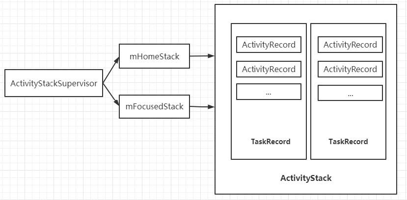
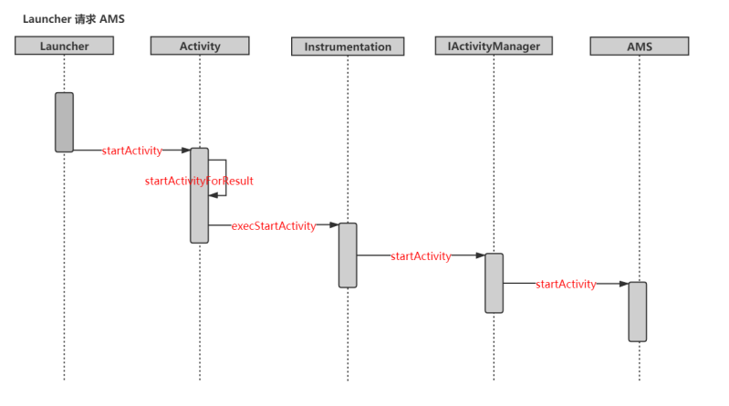
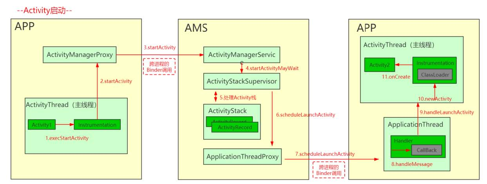
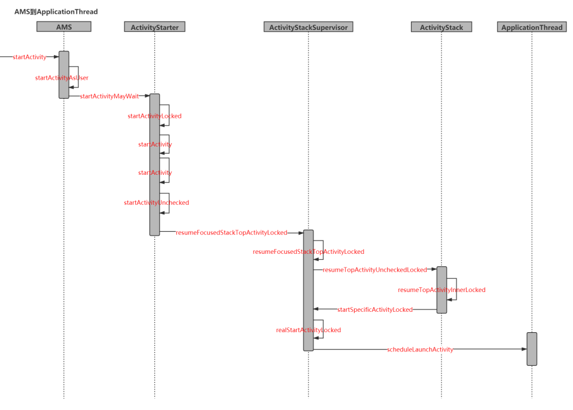
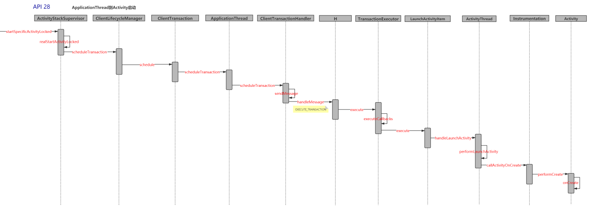

## 前言

在前述中，我们说到，AMS是一个特别重要的系统服务，主要负责四大组件的管理和调度工作,那么Activity作为我们最为常用的组件，它是怎么启动的呢？。首先，先来了解一下AMS中与Activity管理相关的数据结构。

## 与Activity管理相关的数据结构

### ActivityRecord
ActivityRecord，源码中的注释介绍：An entry in the history stack, representing an activity. 意思就是历史栈中的一个条目，代表一个activity。
```java
final class ActivityRecord extends ConfigurationContainer implements AppWindowContainerListener {
    final ActivityManagerService service; // owner
    final IApplicationToken.Stub appToken; // window manager token
    AppWindowContainerController mWindowContainerController;
    final ActivityInfo info; // all about me
    final ApplicationInfo appInfo; // information about activity's app
    //省略其他成员变量

    //ActivityRecord所在的TaskRecord
    private TaskRecord task;

    //构造方法，需要传递大量信息
    ActivityRecord(ActivityManagerService _service, ProcessRecord _caller, int _launchedFromPid,
            int _launchedFromUid, String _launchedFromPackage, Intent _intent, String _resolvedType,
            ActivityInfo aInfo, Configuration _configuration,
            ActivityRecord _resultTo, String _resultWho, int _reqCode,
            boolean _componentSpecified, boolean _rootVoiceInteraction,
            ActivityStackSupervisor supervisor,
            ActivityContainer container, ActivityOptions options, ActivityRecord sourceRecord) {
            // ...省略

    }
```
ActivityRecord中存在着大量的成员变量，包含了一个Activity的所有信息。 ActivityRecord中的成员变量task表示其所在的TaskRecord，由此可以看出：ActivityRecord与TaskRecord建立了联系

```java
private int startActivity(IApplicationThread caller, Intent intent, Intent ephemeralIntent,
  String resolvedType, ActivityInfo aInfo, ResolveInfo rInfo,
  IVoiceInteractionSession voiceSession, IVoiceInteractor voiceInteractor,
    IBinder resultTo, String resultWho, int requestCode, int callingPid,
    int callingUid, String callingPackage, int realCallingPid, int realCallingUid,
    int startFlags, SafeActivityOptions options, boolean ignoreTargetSecurity, boolean componentSpecified,
    ActivityRecord[] outActivity, TaskRecord inTask, boolean allowPendingRemoteAnimationRegistryLookup) {
        ActivityRecord r = new ActivityRecord(mService, callerApp, callingPid,
        callingUid,
        callingPackage, intent, resolvedType, aInfo,
        mService.getGlobalConfiguration(),
        resultRecord, resultWho, requestCode, componentSpecified,
        voiceSession != null,
        mSupervisor, checkedOptions, sourceRecord);
}
```
### TaskRecord
> \frameworks\base\services\core\java\com\android\server\am\TaskRecord.java

TaskRecord，内部维护一个ArrayList<ActivityRecord> 用来保存ActivityRecord。


```java
class TaskRecord extends ConfigurationContainer implements TaskWindowContainerListener {
    final int taskId; //任务ID
    final ArrayList<ActivityRecord> mActivities; //使用一个ArrayList来保存所有的
    ActivityRecord
    private ActivityStack mStack; //TaskRecord所在的ActivityStack

    TaskRecord(ActivityManagerService service, int _taskId, Intent _intent,
        Intent _affinityIntent, String _affinity, String _rootAffinity,
        ComponentName _realActivity, ComponentName _origActivity, boolean
        _rootWasReset,
        boolean _autoRemoveRecents, boolean _askedCompatMode, int _userId,
        int _effectiveUid, String _lastDescription,
        ArrayList<ActivityRecord> activities,
        long lastTimeMoved, boolean neverRelinquishIdentity,
        TaskDescription _lastTaskDescription, int taskAffiliation, int
        prevTaskId,
        int nextTaskId, int taskAffiliationColor, int callingUid, String
        callingPackage,
        int resizeMode, boolean supportsPictureInPicture, boolean
        _realActivitySuspended,
        boolean userSetupComplete, int minWidth, int minHeight) {

    }

    //添加Activity到顶部
    void addActivityToTop(com.android.server.am.ActivityRecord r) {
        addActivityAtIndex(mActivities.size(), r);
    }

    //添加Activity到指定的索引位置
    void addActivityAtIndex(int index, ActivityRecord r) {
    //...
        r.setTask(this);//为ActivityRecord设置TaskRecord，就是这里建立的联系
        //...
        index = Math.min(size, index);
        mActivities.add(index, r);//添加到mActivities
        //...
    }
}
```
可以看到TaskRecord中使用了一个ArrayList来保存所有的ActivityRecord。 同样，TaskRecord中的mStack表示其所在的ActivityStack。 startActivity()时也会创建一个TaskRecord。
### ActivityStarter
>    \frameworks\base\services\core\java\com\android\server\am\ActivityStarter.java
```java
class ActivityStarter {
    private int setTaskFromReuseOrCreateNewTask(TaskRecord taskToAffiliate,
        int preferredLaunchStackId, ActivityStack topStack) {
        mTargetStack = computeStackFocus(mStartActivity, true,
        mLaunchBounds, mLaunchFlags, mOptions);
        if (mReuseTask == null) {
              //创建一个createTaskRecord，实际上是调用ActivityStack里面的createTaskRecord（）方法，ActivityStack下面会讲到
            final TaskRecord task = mTargetStack.createTaskRecord(
              mSupervisor.getNextTaskIdForUserLocked(mStartActivity.userId),
              mNewTaskInfo != null ? mNewTaskInfo :
              mStartActivity.info,
              mNewTaskIntent != null ? mNewTaskIntent : mIntent,
              mVoiceSession,
              mVoiceInteractor, !mLaunchTaskBehind /* toTop */,
              mStartActivity.mActivityType);
            //其他代码略
        }
    }
}
```
### ActivityStack

ActivityStack,内部维护了一个ArrayList<TaskRecord> ，用来管理TaskRecord
```java
class ActivityStack<T extends StackWindowController> extends ConfigurationContainer
    implements StackWindowListener {
/**
* The back history of all previous (and possibly still
* running) activities. It contains #TaskRecord objects.
*/
    private final ArrayList<TaskRecord> mTaskHistory = new ArrayList<>();//使用一个ArrayList来保存TaskRecord
    protected final ActivityStackSupervisor mStackSupervisor;//持有一个 ActivityStackSupervisor，所有的运行中的ActivityStacks都通过它来进行管理
    ActivityStack(ActivityDisplay display, int stackId, ActivityStackSupervisor  supervisor,
        int windowingMode, int activityType, boolean onTop) {
    }

    TaskRecord createTaskRecord(int taskId, ActivityInfo info, Intent intent,
        IVoiceInteractionSession voiceSession,
        IVoiceInteractor voiceInteractor,
        boolean toTop, int type) {
        //创建一个task
        TaskRecord task = new TaskRecord(mService, taskId, info, intent,
        voiceSession, voiceInteractor, type);
        //将task添加到ActivityStack中去
        addTask(task, toTop, "createTaskRecord");
        //其他代码略
        return task;
    }
    //添加Task
    void addTask(final TaskRecord task, final boolean toTop, String reason)
    {
        addTask(task, toTop ? MAX_VALUE : 0, true /*
        schedulePictureInPictureModeChange */, reason);
        //其他代码略
    }
    //添加Task到指定位置
    void addTask(final TaskRecord task, int position, boolean
        schedulePictureInPictureModeChange,
        String reason) {
        mTaskHistory.remove(task);//若存在，先移除
        //...
        mTaskHistory.add(position, task);//添加task到mTaskHistory
        task.setStack(this);//为TaskRecord设置ActivityStack
        //...
    }
}
```
可以看到ActivityStack使用了一个ArrayList来保存TaskRecord。 另外，ActivityStack中还持有ActivityStackSupervisor对象，这个是用来管理ActivityStacks的。 ActivityStack是由ActivityStackSupervisor来创建的，实际ActivityStackSupervisor就是用来管理ActivityStack的。
### ActivityStackSupervisor
>frameworks/base/services/core/java/com/android/server/am/ActivityStackSupervisor.java

ActivityStackSupervisor，顾名思义，就是用来管理ActivityStack的
```java
public class ActivityStackSupervisor extends ConfigurationContainer implements
    DisplayListener {
    ActivityStack mHomeStack;//管理的是Launcher相关的任务
    ActivityStack mFocusedStack;//管理非Launcher相关的任务
    //创建ActivityStack
    ActivityStack createStack(int stackId,
    ActivityStackSupervisor.ActivityDisplay display, boolean onTop) {
        switch (stackId) {
            case PINNED_STACK_ID:
            //PinnedActivityStack是ActivityStack的子类
              return new PinnedActivityStack(display, stackId, this, mRecentTasks, onTop);
            default:
            //创建一个ActivityStack
              return new ActivityStack(display, stackId, this, mRecentTasks, onTop);
        }
    }
}
```
ActivityStackSupervisor内部有两个不同的ActivityStack对象：mHomeStack、mFocusedStack，用来管理不同的任务。 ActivityStackSupervisor内部包含了创建ActivityStack对象的方法，在AMS初始化时会创建一个ActivityStackSupervisor对象



## Activity的启动流程详解

当Android启动完毕就进入了Launcher，实际上Launcher就是一个APP。那么从Launcher中点击一个图标打开一个新APP，实际上就是一个startActivity的过程，由于不同的APP独属于不同的进程，那么这个跨进程的调用是怎么完成的呢？

在此之前，我们先来看了解一下Launcher是怎么启动的。

### Launcher的启动流程
Launcher的启动实际上是发生在AMS的启动过程中。回顾AMS的启动流程，在`SystemServer.run()`方法中，AMS在`startBootStrapService()`中启动，然后在`startOtherService()`中，调用了`ActivityManagerService.systemReady()`方法，systemReady函数主要负责启动整个系统，包括一些准备工作：
1. 发送并处理与PRE_BOOT_COMPLETED广播相关的事情
2. 杀死哪些在AMS还未启动完毕就先启动的应用进程，这些进程是APK所在的java进程，而不是Native 进程
3. 从Setting数据库中获取配置信息，主要是debug_app、wait_for_debugger、always_finish_activities、font_scale
4. 调用systemReady设置的回调对象goingCallback的run函数，这个函数主要是启动systemUIService，启动watchdog等
5. 启动那些声明了persistent的APK。
6. 启动桌面，发送BOOT_COMPLETED广播

```java
public void systemReady(final Runnable goingCallback) {
    synchronized(this) {
        .....
        startHomeActivityLocked(currentUserId, "systemReady");
    ......
}
```
然后在`systemReady()`方法中，又再调用了`startHomeActivityLocked()`去启动HomeActivity，这个就是Launcher的Activity。
```java
 boolean startHomeActivityLocked(int userId, String reason) {

    Intent intent = getHomeIntent();
    ActivityInfo aInfo = resolveActivityInfo(intent, STOCK_PM_FLAGS, userId);
    if (aInfo != null) {
        intent.setComponent(new ComponentName(aInfo.applicationInfo.packageName, aInfo.name));
        // Don't do this if the home app is currently being
        // instrumented.
        aInfo = new ActivityInfo(aInfo);
        aInfo.applicationInfo = getAppInfoForUser(aInfo.applicationInfo, userId);
        ProcessRecord app = getProcessRecordLocked(aInfo.processName,
                aInfo.applicationInfo.uid, true);
        if (app == null || app.instr == null) {
            intent.setFlags(intent.getFlags() | FLAG_ACTIVITY_NEW_TASK);
            final int resolvedUserId = UserHandle.getUserId(aInfo.applicationInfo.uid);
            // For ANR debugging to verify if the user activity is the one that actually
            // launched.
            final String myReason = reason + ":" + userId + ":" + resolvedUserId;
            mActivityStartController.startHomeActivity(intent, aInfo, myReason);
        }
    } else {
        Slog.wtf(TAG, "No home screen found for " + intent, new Throwable());
    }

    return true;
}
```
我们来看一个这个intent是怎样的数据，来看`getHomeIntent()`方法。
```java
Intent getHomeIntent() {
      Intent intent = new Intent(mTopAction, mTopData != null ? Uri.parse(mTopData) : null);
      intent.setComponent(mTopComponent);
      intent.addFlags(Intent.FLAG_DEBUG_TRIAGED_MISSING);
      if (mFactoryTest != FactoryTest.FACTORY_TEST_LOW_LEVEL) {
          intent.addCategory(Intent.CATEGORY_HOME);
      }
      return intent;
  }
```
在这里mTopAction是Intent.ACTION_MAIN，重点关注`intent.addCategory(Intent.CATEGORY_HOME)`这条语句，给HomeActvity的 intent对象添加Category `Intent.CATEGORY_HOME`（android.intent.category.HOME），也就是说Launcher的Activity必须将Category声明为`android.intent.category.HOME`，即表明这个Actiivty是一个Home Activity。

取得Intent返回`startHomeActivityLocked()`方法，通过方法`resolveActivityInfo()`遍历手机中所有安装包含Category Intent.CATEGORY_HOME=android.intent.category.HOME的Activity，然后把Activity的信息作为Component通过`intent.setComponent()`方法传输给intent对象。如果是Android原生的手机，此时aInfo.applicationInfo.packageName的值是：com.android.launcher3，aInfo.name的值是：com.android.launcher3.Launcher，即com.android.launcher3.Launcher（Android 7.0）是Home Activity。

接下来通过`getProcessRecordLocked()`方法从ProcessRecord中查找是否存在相关进程未启动，由于是初次启动，因此该条件判断成立，继续调用`mActivityStartController.startHomeActivity()`方法。
```java
void startHomeActivity(Intent intent, ActivityInfo aInfo, String reason) {
    mSupervisor.moveHomeStackTaskToTop(reason);

    mLastHomeActivityStartResult = obtainStarter(intent, "startHomeActivity: " + reason)
            .setOutActivity(tmpOutRecord)
            .setCallingUid(0)
            .setActivityInfo(aInfo)
            .execute();
    mLastHomeActivityStartRecord = tmpOutRecord[0];
    if (mSupervisor.inResumeTopActivity) {
        // If we are in resume section already, home activity will be initialized, but not
        // resumed (to avoid recursive resume) and will stay that way until something pokes it
        // again. We need to schedule another resume.
        mSupervisor.scheduleResumeTopActivities();
    }
}
```
在该方法中，首先调用`mSupervisor.moveHomeStackTaskToTop(reason)`将HomeActivity所在的Task移动到栈顶。然后通过obtainStarter()拿到ActivityStarter，并setActivityInfo(aInfo)将info传入，最后调用execute()来startActivity。

**流程总结如下：**



### Activity启动流程源码解析
#### Step1：Activity.startActivityForResult()
现在再来看Launcher中启动APP的流程。无论我们调用的是哪个启动Activity的方式，最后都会调用到`Activity.startActivityForResult()`方法。
```java
public void startActivityForResult(@RequiresPermission Intent intent, int requestCode,
        @Nullable Bundle options) {
    //一般的Activity的mParent都是null，该变量只用于ActivityGroup中，已废弃
    if (mParent == null) {
        options = transferSpringboardActivityOptions(options);
        Instrumentation.ActivityResult ar =
            mInstrumentation.execStartActivity(
                this, mMainThread.getApplicationThread(), mToken, this,
                intent, requestCode, options);
        if (ar != null) {
            mMainThread.sendActivityResult(
                mToken, mEmbeddedID, requestCode, ar.getResultCode(),
                ar.getResultData());
        }
        if (requestCode >= 0) {
            // 如果有结果，则可以根据此避免在收到之前使得Activity可见
            mStartedActivity = true;
        }

        cancelInputsAndStartExitTransition(options);
        // TODO Consider clearing/flushing other event sources and events for child windows.
    } else {
        if (options != null) {
            mParent.startActivityFromChild(this, intent, requestCode, options);
        } else {
            // Note we want to go through this method for compatibility with
            // existing applications that may have overridden it.
            mParent.startActivityFromChild(this, intent, requestCode);
        }
    }
}
```
#### Step2：Instrumentation.execStartActivity()
由于mParent为null，则会走`mInstrumentation.execStartActivity()`该方法。mInstrumentation是Activity的成员变量，用于监视系统与应用的交互。
```java
public ActivityResult execStartActivity(
            Context who, IBinder contextThread, IBinder token, Activity target,
            Intent intent, int requestCode, Bundle options) {
        IApplicationThread whoThread = (IApplicationThread) contextThread;

        // mActivityMonitors 是ActivityMonitor的集合，可以监视Activity的状态。
        if (mActivityMonitors != null) {
            synchronized (mSync) {
                final int N = mActivityMonitors.size();
                for (int i=0; i<N; i++) {
                    final ActivityMonitor am = mActivityMonitors.get(i);
                    ActivityResult result = null;
                    if (am.ignoreMatchingSpecificIntents()) {
                        result = am.onStartActivity(intent);
                    }
                    if (result != null) {
                        am.mHits++;
                        return result;
                    } else if (am.match(who, null, intent)) {
                        am.mHits++;
                        if (am.isBlocking()) {
                            return requestCode >= 0 ? am.getResult() : null;
                        }
                        break;
                    }
                }
            }
        }
        try {
            //真正的启动在这里
            int result = ActivityManager.getService()
                .startActivity(whoThread, who.getBasePackageName(), intent,
                        intent.resolveTypeIfNeeded(who.getContentResolver()),
                        token, target != null ? target.mEmbeddedID : null,
                        requestCode, 0, null, options);
            //checkStartActivityResult方法是抛异常专业户，它对上面开启activity的结果进行检查，如果无法打开activity，
            //则抛出诸如ActivityNotFoundException类似的各种异常
            checkStartActivityResult(result, intent);
        } catch (RemoteException e) {
            throw new RuntimeException("Failure from system", e);
        }
        return null;
    }
```
在该方法中，通过`ActivityManager.getService()`拿到IActivityManager的实例，然后调用它的startActivity方法。
```java
public static IActivityManager getService() {
        return IActivityManagerSingleton.get();
    }

private static final Singleton<IActivityManager> IActivityManagerSingleton =
      new Singleton<IActivityManager>() {
          @Override
          protected IActivityManager create() {
              // 通过SM拿到AMS的IBinder引用
              final IBinder b = ServiceManager.getService(Context.ACTIVITY_SERVICE);
              // 然后通过建立了AMS的本地代理
              final IActivityManager am = IActivityManager.Stub.asInterface(b);
              return am;
          }
      };
```
我们来看该实例具体是什么对象，在create()方法中，首先通过ServiceManager.getService(Context.ACTIVITY_SERVICE)获取到AMS的IBinder引用，然后通过AIDL的方式将它转变成IActivityManager对象的本地代理。

>注意Android 8.0 之前并没有采用AIDL，而是采用了类似AIDL的形式，用AMS的代理对象ActivityManagerProxy来与AMS进行进程间通信，Android 8.0 去除了ActivityManagerNative的内部类ActivityManagerProxy，代替它的则是IActivityManager，它是AMS在本地的代理。

#### Step3：ActivityManagerService.startActivityAsUser()
通过该代理，就能跨进程远程调用AMS的startActivity方法了，最后同样会调用通过obtainStarter()拿到ActivityStarter，并将info传入，再调用execute()来startActivity。
```java
// startActivity方法最后会进入startActivityAsUser方法
public final int startActivityAsUser(IApplicationThread caller, String callingPackage,
        Intent intent, String resolvedType, IBinder resultTo, String resultWho, int requestCode,
        int startFlags, ProfilerInfo profilerInfo, Bundle bOptions, int userId,
        boolean validateIncomingUser) {
    enforceNotIsolatedCaller("startActivity");

    userId = mActivityStartController.checkTargetUser(userId, validateIncomingUser,
            Binder.getCallingPid(), Binder.getCallingUid(), "startActivityAsUser");

    // TODO: Switch to user app stacks here.
    return mActivityStartController.obtainStarter(intent, "startActivityAsUser")
            .setCaller(caller)
            .setCallingPackage(callingPackage)
            .setResolvedType(resolvedType)
            .setResultTo(resultTo)
            .setResultWho(resultWho)
            .setRequestCode(requestCode)
            .setStartFlags(startFlags)
            .setProfilerInfo(profilerInfo)
            .setActivityOptions(bOptions)
            .setMayWait(userId)
            .execute();

}
```
#### Step4：ActivityStarter.excute()
在ActivityStarter的setMayWait()中，将mRequest.mayWait变量赋值为true，这里在execute()方法中的判断会用到。
```java
 int execute() {
    try {
        // TODO(b/64750076): Look into passing request directly to these methods to allow
        // for transactional diffs and preprocessing.
        if (mRequest.mayWait) {
            return startActivityMayWait(mRequest.caller, mRequest.callingUid,
                    mRequest.callingPackage, mRequest.intent, mRequest.resolvedType,
                    mRequest.voiceSession, mRequest.voiceInteractor, mRequest.resultTo,
                    mRequest.resultWho, mRequest.requestCode, mRequest.startFlags,
                    mRequest.profilerInfo, mRequest.waitResult, mRequest.globalConfig,
                    mRequest.activityOptions, mRequest.ignoreTargetSecurity, mRequest.userId,
                    mRequest.inTask, mRequest.reason,
                    mRequest.allowPendingRemoteAnimationRegistryLookup);
        } else {
            return startActivity(mRequest.caller, mRequest.intent, mRequest.ephemeralIntent,
                    mRequest.resolvedType, mRequest.activityInfo, mRequest.resolveInfo,
                    mRequest.voiceSession, mRequest.voiceInteractor, mRequest.resultTo,
                    mRequest.resultWho, mRequest.requestCode, mRequest.callingPid,
                    mRequest.callingUid, mRequest.callingPackage, mRequest.realCallingPid,
                    mRequest.realCallingUid, mRequest.startFlags, mRequest.activityOptions,
                    mRequest.ignoreTargetSecurity, mRequest.componentSpecified,
                    mRequest.outActivity, mRequest.inTask, mRequest.reason,
                    mRequest.allowPendingRemoteAnimationRegistryLookup);
        }
    } finally {
        onExecutionComplete();
    }
}
```
#### Step5：ActivityStarter.startActivityMayWait()
由于mayWait为true，因此会进入startActivityMayWait()方法。
```java
final int startActivityMayWait(IApplicationThread caller, int callingUid,
                               String callingPackage, Intent intent, String resolvedType,
                               IVoiceInteractionSession voiceSession, IVoiceInteractor voiceInteractor,
                               IBinder resultTo, String resultWho, int requestCode, int startFlags,
                               ProfilerInfo profilerInfo, WaitResult outResult, Configuration config,
                               Bundle options, int userId, IActivityContainer iContainer, TaskRecord inTask) {
    // ...
    // Don't modify the client's object!
    intent = new Intent(intent);

    // resolveIntent经过了两个步骤，首先根据传递的信息选出符合条件的集合，然后从集合中找出最合适的信息
    ResolveInfo rInfo = mSupervisor.resolveIntent(intent, resolvedType, userId,
                0 /* matchFlags */,
                        computeResolveFilterUid(
                                callingUid, realCallingUid, mRequest.filterCallingUid));
    // 调用resolveActivity()根据意图intent参数，解析目标Activity的一些信息保存到aInfo中，
    // 这些信息包括activity的name、applicationInfo、processName、theme、launchMode、permission、flags等等
    // 这都是在AndroidManifest.xml中为activity配置的
    ActivityInfo aInfo = resolveActivity(intent, resolvedType, startFlags,
            profilerInfo, userId);

    // ...
    synchronized (mService) {
        //下面省略的代码用于重新组织startActivityLocked()方法需要的参数
        // ...

        //继续调用startActivity开启目标activity
        int res = startActivity(caller, intent, ephemeralIntent, resolvedType, aInfo, rInfo,
                    voiceSession, voiceInteractor, resultTo, resultWho, requestCode, callingPid,
                    callingUid, callingPackage, realCallingPid, realCallingUid, startFlags, options,
                    ignoreTargetSecurity, componentSpecified, outRecord, inTask, reason,
                    allowPendingRemoteAnimationRegistryLookup);
        // ...

        if (outResult != null) {
            //如果outResult不为null,则设置开启activity的结果
            outResult.result = res;
            ...

        return res;
    }
}
```
#### Step6：ActivityStarter.startActivity()
继续看startActivity方法做了什么：
```java
private int startActivity(IApplicationThread caller, Intent intent, Intent ephemeralIntent,
        String resolvedType, ActivityInfo aInfo, ResolveInfo rInfo,
        IVoiceInteractionSession voiceSession, IVoiceInteractor voiceInteractor,
        IBinder resultTo, String resultWho, int requestCode, int callingPid, int callingUid,
        String callingPackage, int realCallingPid, int realCallingUid, int startFlags,
        SafeActivityOptions options, boolean ignoreTargetSecurity, boolean componentSpecified,
        ActivityRecord[] outActivity, TaskRecord inTask, String reason,
        boolean allowPendingRemoteAnimationRegistryLookup) {

    if (TextUtils.isEmpty(reason)) {
        throw new IllegalArgumentException("Need to specify a reason.");
    }
    mLastStartReason = reason;
    mLastStartActivityTimeMs = System.currentTimeMillis();
    mLastStartActivityRecord[0] = null;

    mLastStartActivityResult = startActivity(caller, intent, ephemeralIntent, resolvedType,
            aInfo, rInfo, voiceSession, voiceInteractor, resultTo, resultWho, requestCode,
            callingPid, callingUid, callingPackage, realCallingPid, realCallingUid, startFlags,
            options, ignoreTargetSecurity, componentSpecified, mLastStartActivityRecord,
            inTask, allowPendingRemoteAnimationRegistryLookup);

    if (outActivity != null) {
        // mLastStartActivityRecord[0] is set in the call to startActivity above.
        outActivity[0] = mLastStartActivityRecord[0];
    }

    return getExternalResult(mLastStartActivityResult);
}
```
再一次调用了startActivity的重载方法。
```java
private int startActivity(IApplicationThread caller, Intent intent, Intent ephemeralIntent,
        String resolvedType, ActivityInfo aInfo, ResolveInfo rInfo,
        IVoiceInteractionSession voiceSession, IVoiceInteractor voiceInteractor,
        IBinder resultTo, String resultWho, int requestCode, int callingPid, int callingUid,
        String callingPackage, int realCallingPid, int realCallingUid, int startFlags,
        SafeActivityOptions options,
        boolean ignoreTargetSecurity, boolean componentSpecified, ActivityRecord[] outActivity,
        TaskRecord inTask, boolean allowPendingRemoteAnimationRegistryLookup) {
    int err = ActivityManager.START_SUCCESS;
    // Pull the optional Ephemeral Installer-only bundle out of the options early.
    final Bundle verificationBundle
            = options != null ? options.popAppVerificationBundle() : null;
    //调用者的进程信息，也就是哪个进程要开启此Activity的
    ProcessRecord callerApp = null;
    if (caller != null) {
        callerApp = mService.getRecordForAppLocked(caller);
        if (callerApp != null) {
            callingPid = callerApp.pid;
            callingUid = callerApp.info.uid;
        } else {
            Slog.w(TAG, "Unable to find app for caller " + caller
                    + " (pid=" + callingPid + ") when starting: "
                    + intent.toString());
            err = ActivityManager.START_PERMISSION_DENIED;
        }
    }

    //下面有很多if语句，用于判断一些错误信息，并给err赋值相应的错误码
    final int userId = aInfo != null && aInfo.applicationInfo != null
            ? UserHandle.getUserId(aInfo.applicationInfo.uid) : 0;


    ActivityRecord sourceRecord = null;
    ActivityRecord resultRecord = null;
    if (resultTo != null) {
        sourceRecord = mSupervisor.isInAnyStackLocked(resultTo);
        if (DEBUG_RESULTS) Slog.v(TAG_RESULTS,
                "Will send result to " + resultTo + " " + sourceRecord);
        if (sourceRecord != null) {
            if (requestCode >= 0 && !sourceRecord.finishing) {
                resultRecord = sourceRecord;
            }
        }
    }

    final int launchFlags = intent.getFlags();

    if ((launchFlags & Intent.FLAG_ACTIVITY_FORWARD_RESULT) != 0 && sourceRecord != null) {
        // Transfer the result target from the source activity to the new
        // one being started, including any failures.
        if (requestCode >= 0) {
            SafeActivityOptions.abort(options);
            return ActivityManager.START_FORWARD_AND_REQUEST_CONFLICT;
        }
        resultRecord = sourceRecord.resultTo;
        if (resultRecord != null && !resultRecord.isInStackLocked()) {
            resultRecord = null;
        }
        resultWho = sourceRecord.resultWho;
        requestCode = sourceRecord.requestCode;
        sourceRecord.resultTo = null;
        if (resultRecord != null) {
            resultRecord.removeResultsLocked(sourceRecord, resultWho, requestCode);
        }
        if (sourceRecord.launchedFromUid == callingUid) {
            // The new activity is being launched from the same uid as the previous
            // activity in the flow, and asking to forward its result back to the
            // previous.  In this case the activity is serving as a trampoline between
            // the two, so we also want to update its launchedFromPackage to be the
            // same as the previous activity.  Note that this is safe, since we know
            // these two packages come from the same uid; the caller could just as
            // well have supplied that same package name itself.  This specifially
            // deals with the case of an intent picker/chooser being launched in the app
            // flow to redirect to an activity picked by the user, where we want the final
            // activity to consider it to have been launched by the previous app activity.
            callingPackage = sourceRecord.launchedFromPackage;
        }
    }

    final ActivityStack resultStack = resultRecord == null ? null : resultRecord.getStack();
    // 检查权限
    boolean abort = !mSupervisor.checkStartAnyActivityPermission(intent, aInfo, resultWho,
            requestCode, callingPid, callingUid, callingPackage, ignoreTargetSecurity,
            inTask != null, callerApp, resultRecord, resultStack);
    abort |= !mService.mIntentFirewall.checkStartActivity(intent, callingUid,
            callingPid, resolvedType, aInfo.applicationInfo);

    // Merge the two options bundles, while realCallerOptions takes precedence.
    ActivityOptions checkedOptions = options != null
            ? options.getOptions(intent, aInfo, callerApp, mSupervisor)
            : null;
    if (allowPendingRemoteAnimationRegistryLookup) {
        checkedOptions = mService.getActivityStartController()
                .getPendingRemoteAnimationRegistry()
                .overrideOptionsIfNeeded(callingPackage, checkedOptions);
    }
    if (mService.mController != null) {
        try {
            // The Intent we give to the watcher has the extra data
            // stripped off, since it can contain private information.
            Intent watchIntent = intent.cloneFilter();
            abort |= !mService.mController.activityStarting(watchIntent,
                    aInfo.applicationInfo.packageName);
        } catch (RemoteException e) {
            mService.mController = null;
        }
    }

    mInterceptor.setStates(userId, realCallingPid, realCallingUid, startFlags, callingPackage);
    if (mInterceptor.intercept(intent, rInfo, aInfo, resolvedType, inTask, callingPid,
            callingUid, checkedOptions)) {
        // activity start was intercepted, e.g. because the target user is currently in quiet
        // mode (turn off work) or the target application is suspended
        intent = mInterceptor.mIntent;
        rInfo = mInterceptor.mRInfo;
        aInfo = mInterceptor.mAInfo;
        resolvedType = mInterceptor.mResolvedType;
        inTask = mInterceptor.mInTask;
        callingPid = mInterceptor.mCallingPid;
        callingUid = mInterceptor.mCallingUid;
        checkedOptions = mInterceptor.mActivityOptions;
    }

    if (abort) {
        if (resultRecord != null) {
            resultStack.sendActivityResultLocked(-1, resultRecord, resultWho, requestCode,
                    RESULT_CANCELED, null);
        }
        // We pretend to the caller that it was really started, but
        // they will just get a cancel result.
        ActivityOptions.abort(checkedOptions);
        return START_ABORTED;
    }

    // If permissions need a review before any of the app components can run, we
    // launch the review activity and pass a pending intent to start the activity
    // we are to launching now after the review is completed.
    if (mService.mPermissionReviewRequired && aInfo != null) {
        if (mService.getPackageManagerInternalLocked().isPermissionsReviewRequired(
                aInfo.packageName, userId)) {
            IIntentSender target = mService.getIntentSenderLocked(
                    ActivityManager.INTENT_SENDER_ACTIVITY, callingPackage,
                    callingUid, userId, null, null, 0, new Intent[]{intent},
                    new String[]{resolvedType}, PendingIntent.FLAG_CANCEL_CURRENT
                            | PendingIntent.FLAG_ONE_SHOT, null);

            final int flags = intent.getFlags();
            Intent newIntent = new Intent(Intent.ACTION_REVIEW_PERMISSIONS);
            newIntent.setFlags(flags
                    | Intent.FLAG_ACTIVITY_EXCLUDE_FROM_RECENTS);
            newIntent.putExtra(Intent.EXTRA_PACKAGE_NAME, aInfo.packageName);
            newIntent.putExtra(Intent.EXTRA_INTENT, new IntentSender(target));
            if (resultRecord != null) {
                newIntent.putExtra(Intent.EXTRA_RESULT_NEEDED, true);
            }
            intent = newIntent;

            resolvedType = null;
            callingUid = realCallingUid;
            callingPid = realCallingPid;

            rInfo = mSupervisor.resolveIntent(intent, resolvedType, userId, 0,
                    computeResolveFilterUid(
                            callingUid, realCallingUid, mRequest.filterCallingUid));
            aInfo = mSupervisor.resolveActivity(intent, rInfo, startFlags,
                    null /*profilerInfo*/);

            if (DEBUG_PERMISSIONS_REVIEW) {
                Slog.i(TAG, "START u" + userId + " {" + intent.toShortString(true, true,
                        true, false) + "} from uid " + callingUid + " on display "
                        + (mSupervisor.mFocusedStack == null
                        ? DEFAULT_DISPLAY : mSupervisor.mFocusedStack.mDisplayId));
            }
        }
    }

    // If we have an ephemeral app, abort the process of launching the resolved intent.
    // Instead, launch the ephemeral installer. Once the installer is finished, it
    // starts either the intent we resolved here [on install error] or the ephemeral
    // app [on install success].
    if (rInfo != null && rInfo.auxiliaryInfo != null) {
        intent = createLaunchIntent(rInfo.auxiliaryInfo, ephemeralIntent,
                callingPackage, verificationBundle, resolvedType, userId);
        resolvedType = null;
        callingUid = realCallingUid;
        callingPid = realCallingPid;

        aInfo = mSupervisor.resolveActivity(intent, rInfo, startFlags, null /*profilerInfo*/);
    }

    // 为该Activity创建一个ActivityRecord对象
    ActivityRecord r = new ActivityRecord(mService, callerApp, callingPid, callingUid,
            callingPackage, intent, resolvedType, aInfo, mService.getGlobalConfiguration(),
            resultRecord, resultWho, requestCode, componentSpecified, voiceSession != null,
            mSupervisor, checkedOptions, sourceRecord);
    if (outActivity != null) {
        outActivity[0] = r;
    }


    final ActivityStack stack = mSupervisor.mFocusedStack;


    return startActivity(r, sourceRecord, voiceSession, voiceInteractor, startFlags,
            true /* doResume */, checkedOptions, inTask, outActivity);
}
```

这个方法主要是判断一些错误信息和检查权限，如果没有发现错误`（err==START_SUCCESS）`就继续开启activity， 否则直接返回错误码。继续查看`startActivity()`方法：
```java
 private int startActivity(final ActivityRecord r, ActivityRecord sourceRecord,
            IVoiceInteractionSession voiceSession, IVoiceInteractor voiceInteractor,
            int startFlags, boolean doResume, ActivityOptions options, TaskRecord inTask,
            ActivityRecord[] outActivity) {
    int result = START_CANCELED;
    try {
        mService.mWindowManager.deferSurfaceLayout();
        result = startActivityUnchecked(r, sourceRecord, voiceSession, voiceInteractor,
                startFlags, doResume, options, inTask, outActivity);
    } finally {
        // If we are not able to proceed, disassociate the activity from the task. Leaving an
        // activity in an incomplete state can lead to issues, such as performing operations
        // without a window container.
        final ActivityStack stack = mStartActivity.getStack();
        if (!ActivityManager.isStartResultSuccessful(result) && stack != null) {
            stack.finishActivityLocked(mStartActivity, RESULT_CANCELED,
                    null /* intentResultData */, "startActivity", true /* oomAdj */);
        }
        mService.mWindowManager.continueSurfaceLayout();
    }

    postStartActivityProcessing(r, result, mTargetStack);

    return result;
}
```
#### step7:然后继续调用startActivityUnchecked()
然后继续调用startActivityUnchecked()方法
```java

```


APP->AMS

setSystemProcess中将AMS添加到SM中

ActivityManager.getService("activity")拿到AMS

AMS->APP

IApplicationThread


IActivityManager

##### AMS到ApplicationThread阶段

##### ApplicationThread到Activity阶段

