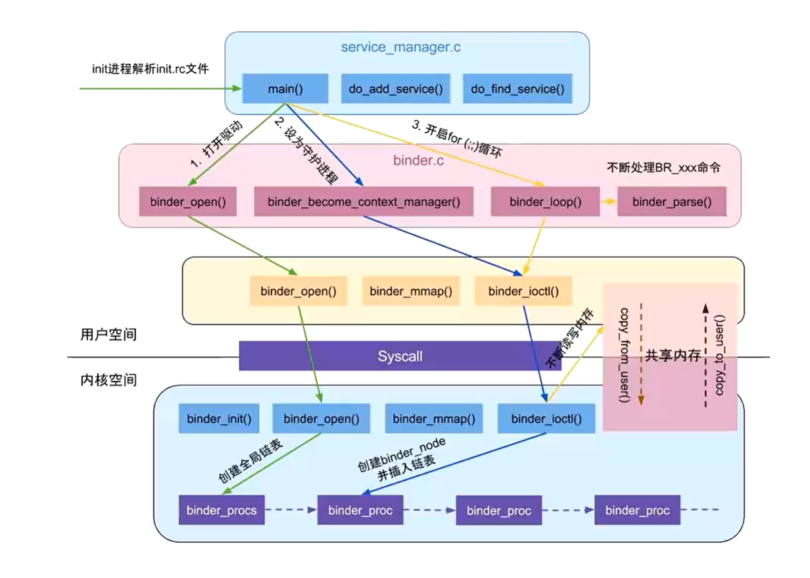

> 本文由 [简悦 SimpRead](http://ksria.com/simpread/) 转码， 原文地址 [blog.csdn.net](https://blog.csdn.net/sdkdlwk/article/details/88942427)

基于 Android 6.0 的源码剖析， 本文详细地讲解了 ServiceManager 启动流程

framework/native/cmds/servicemanager/

- service_manager.c

- binder.c

kernel/drivers/ (不同 Linux 分支路径略有不同)

- staging/android/binder.c

- android/binder.c

一. 概述
-----

ServiceManager 是 Binder IPC 通信过程中的守护进程，本身也是一个 Binder 服务，但并没有采用 libbinder 中的多线程模型来与 Binder 驱动通信，而是自行编写了 binder.c 直接和 Binder 驱动来通信，并且只有一个循环 binder_loop 来进行读取和处理事务，这样的好处是简单而高效。

ServiceManager 本身工作相对简单，其功能：查询和注册服务。 对于 Binder IPC 通信过程中，其实更多的情形是 BpBinder 和 BBinder 之间的通信，比如 ActivityManagerProxy 和 ActivityManagerService 之间的通信等。

### 1.1 流程图

启动过程主要以下几个阶段：

1.  打开 binder 驱动：binder_open；
2.  注册成为 binder 服务的大管家：binder_become_context_manager；
3.  进入无限循环，处理 client 端发来的请求：binder_loop；


二. 启动过程
-------

ServiceManager 是由 [init 进程 ](http://gityuan.com/2016/02/05/android-init/)通过解析 init.rc 文件而创建的，其所对应的可执行程序 /system/bin/servicemanager，所对应的源文件是 service_manager.c，进程名为 /system/bin/servicemanager。

```java
service servicemanager /system/bin/servicemanager
    class core
    user system
    group system
    critical
    onrestart restart healthd
    onrestart restart zygote
    onrestart restart media
    onrestart restart surfaceflinger
    onrestart restart drm
```

启动 Service Manager 的入口函数是 service_manager.c 中的 main() 方法，代码如下：

### 2.1 main

[-> service_manager.c]
```java
int main(int argc, char **argv) {
    struct binder_state *bs;
    // 打开 binder 驱动，申请 128k 字节大小的内存空间 【见小节 2.2】
    bs = binder_open(128*1024);
    ...
 
    // 成为上下文管理者 【见小节 2.3】
    if (binder_become_context_manager(bs)) {
        return -1;
    }
 
    selinux_enabled = is_selinux_enabled(); //selinux 权限是否使能
    sehandle = selinux_android_service_context_handle();
    selinux_status_open(true);
 
    if (selinux_enabled> 0) {
        if (sehandle == NULL) {  
            abort(); // 无法获取 sehandle
        }
        if (getcon(&service_manager_context) != 0) {
            abort(); // 无法获取 service_manager 上下文
        }
    }
    ...
 
    // 进入无限循环，处理 client 端发来的请求 【见小节 2.4】
    binder_loop(bs, svcmgr_handler);
    return 0;
}
```
### 2.2 binder_open

[-> servicemanager/binder.c]
```java
struct binder_state *binder_open(size_t mapsize)
{
    struct binder_state *bs;【见小节 2.2.1】
    struct binder_version vers;
 
    bs = malloc(sizeof(*bs));
    if (!bs) {
        errno = ENOMEM;
        return NULL;
    }
 
    // 通过系统调用陷入内核，打开 Binder 设备驱动
    bs->fd = open("/dev/binder", O_RDWR);
    if (bs->fd < 0) {
        goto fail_open; // 无法打开 binder 设备
    }
 
     // 通过系统调用，ioctl 获取 binder 版本信息
    if ((ioctl(bs->fd, BINDER_VERSION, &vers) == -1) ||
        (vers.protocol_version != BINDER_CURRENT_PROTOCOL_VERSION)) {
        goto fail_open; // 内核空间与用户空间的 binder 不是同一版本
    }
 
    bs->mapsize = mapsize;
    // 通过系统调用，mmap 内存映射，mmap 必须是 page 的整数倍
    bs->mapped = mmap(NULL, mapsize, PROT_READ, MAP_PRIVATE, bs->fd, 0);
    if (bs->mapped == MAP_FAILED) {
        goto fail_map; // binder 设备内存无法映射
    }
 
    return bs;
 
fail_map:
    close(bs->fd);
fail_open:
    free(bs);
    return NULL;
}
```
打开 binder 驱动相关操作:

先调用 open() 打开 binder 设备，open() 方法经过系统调用，进入 Binder 驱动，然后调用方法 [binder_open()](http://gityuan.com/2015/11/01/binder-driver/#binderopen)，该方法会在 Binder 驱动层创建一个`binder_proc`对象，再将`binder_proc`对象赋值给 fd->private_data，同时放入全局链表`binder_procsstatic HLIST_HEAD(binder_procs);）`。再通过 ioctl() 检验当前 binder 版本与 Binder 驱动层的版本是否一致。

调用 mmap() 进行内存映射，同理 mmap() 方法经过系统调用，对应于 Binder 驱动层的 [binder_mmap()](http://gityuan.com/2015/11/01/binder-driver/#bindermmap) 方法，该方法会在 Binder 驱动层创建`Binder_buffer`对象，并放入当前 binder_proc 的`proc->buffers`链表。

2.2.1 binder_state

[-> servicemanager/binder.c]
```java
struct binder_state
{
    int fd; // dev/binder 的文件描述符
    void *mapped; // 指向 mmap 的内存地址
    size_t mapsize; // 分配的内存大小，默认为 128KB
};
```
### 2.3 binder_become_context_manager

binder_become_context_manager这个函数主要就是做了两件事:

首先通过调用ioctl最终进入到binder内核中，通过设备文件的private_data字段得到进程信息binder_pro，然后调用`binder_get_thread`函数从binder_proc上找到发起binder_become_context_manager调用的binder_thread信息，`binder_get_thread`的内部逻辑会首先在binder_proc的threads队列上找匹配的binder_thread，此时threads上没有任何binder_thread，所以逻辑会进入到创建`binder_thread`流程中，并将创建的binder_thread保存到threads上，那么下次再调用binder_get_thread的时候就能找到相应的binder_thread了。这是binder_become_context_manager做的第一件事，创建或者找到binder_thread。

第二件事就是通过调用binder_new_node创建一个binder_node实体对象，并将该binder_node设置给binder_context_mgr_node，binder_node中通过proc字段来表示对应的进程信息。这个binder_context_mgr_node非常重要是各个client今后获取各种系统服务都要打交道的一个binder实体对象。


[-> servicemanager/binder.c]
```java
int binder_become_context_manager(struct binder_state *bs) {
    // 通过 ioctl，传递 BINDER_SET_CONTEXT_MGR 指令【见小节 2.3.1】
    return ioctl(bs->fd, BINDER_SET_CONTEXT_MGR, 0);
}
```
成为上下文的管理者，整个系统中只有一个这样的管理者。 通过 ioctl() 方法经过系统调用，对应于 Binder 驱动层的 [binder_ioctl()](http://gityuan.com/2015/11/01/binder-driver/#binderioctl) 方法.

2.3.1 binder_ioctl

[-> kernel/drivers/android/binder.c]
```java
static long binder_ioctl(struct file *filp, unsigned int cmd, unsigned long arg) {
    binder_lock(__func__);
    switch (cmd) {
      case BINDER_SET_CONTEXT_MGR:
          ret = binder_ioctl_set_ctx_mgr(filp);//【见小节 2.3.2】
          break;
      }
      case :...
    }
    binder_unlock(__func__);
}
```
根据参数`BINDER_SET_CONTEXT_MGR`，最终调用 binder_ioctl_set_ctx_mgr() 方法，这个过程会持有 binder_main_lock。

2.3.2 binder_ioctl_set_ctx_mgr

[-> kernel/drivers/android/binder.c]
```java
static int binder_ioctl_set_ctx_mgr(struct file *filp)
{
    int ret = 0;
    struct binder_proc *proc = filp->private_data;
    kuid_t curr_euid = current_euid();
 
    // 保证只创建一次 mgr_node 对象
    if (binder_context_mgr_node != NULL) {
        ret = -EBUSY; 
        goto out;
    }
 
    if (uid_valid(binder_context_mgr_uid)) {
        ...
    } else {
        // 设置当前线程 euid 作为 Service Manager 的 uid
        binder_context_mgr_uid = curr_euid;
    }
 
    // 创建 ServiceManager 实体【见小节 2.3.3】
    binder_context_mgr_node = binder_new_node(proc, 0, 0);
    ...
    binder_context_mgr_node->local_weak_refs++;
    binder_context_mgr_node->local_strong_refs++;
    binder_context_mgr_node->has_strong_ref = 1;
    binder_context_mgr_node->has_weak_ref = 1;
out:
    return ret;
}
```
进入 binder 驱动，在 Binder 驱动中定义的静态变量
```java
// service manager 所对应的 binder_node;
static struct binder_node *binder_context_mgr_node;
// 运行 service manager 的线程 uid
static kuid_t binder_context_mgr_uid = INVALID_UID;
```
创建了全局的 binder_node 对象`binder_context_mgr_node`，并将 binder_context_mgr_node 的强弱引用各加 1.

2.3.3 binder_new_node

[-> kernel/drivers/android/binder.c]
```java
static struct binder_node *binder_new_node(struct binder_proc *proc,
                       binder_uintptr_t ptr,
                       binder_uintptr_t cookie)
{
    struct rb_node **p = &proc->nodes.rb_node;
    struct rb_node *parent = NULL;
    struct binder_node *node;
    // 首次进来为空
    while (*p) {
        parent = *p;
        node = rb_entry(parent, struct binder_node, rb_node);
 
        if (ptr < node->ptr)
            p = &(*p)->rb_left;
        else if (ptr> node->ptr)
            p = &(*p)->rb_right;
        else
            return NULL;
    }
 
    // 给新创建的 binder_node 分配内核空间
    node = kzalloc(sizeof(*node), GFP_KERNEL);
    if (node == NULL)
        return NULL;
    binder_stats_created(BINDER_STAT_NODE);
    // 将新创建的 node 对象添加到 proc 红黑树；
    rb_link_node(&node->rb_node, parent, p);
    rb_insert_color(&node->rb_node, &proc->nodes);
    node->debug_id = ++binder_last_id;
    node->proc = proc;
    node->ptr = ptr;
    node->cookie = cookie;
    node->work.type = BINDER_WORK_NODE;  // 设置 binder_work 的 type
    INIT_LIST_HEAD(&node->work.entry);
    INIT_LIST_HEAD(&node->async_todo);
    return node;
}
```
在 Binder 驱动层创建 [binder_node 结构体](http://gityuan.com/2015/11/01/binder-driver/#bindernode)对象，并将当前 binder_proc 加入到`binder_node`的`node->proc`。并创建 binder_node 的 async_todo 和 binder_work 两个队列。

### 2.4 binder_loop

[-> servicemanager/binder.c]
```java
void binder_loop(struct binder_state *bs, binder_handler func) {
    int res;
    struct binder_write_read bwr;
    uint32_t readbuf[32];
 
    bwr.write_size = 0;
    bwr.write_consumed = 0;
    bwr.write_buffer = 0;
 
    readbuf[0] = BC_ENTER_LOOPER;
    // 将 BC_ENTER_LOOPER 命令发送给 binder 驱动，让 Service Manager 进入循环 【见小节 2.4.1】
    binder_write(bs, readbuf, sizeof(uint32_t));
 
    for (;;) {
        bwr.read_size = sizeof(readbuf);
        bwr.read_consumed = 0;
        bwr.read_buffer = (uintptr_t) readbuf;
 
        res = ioctl(bs->fd, BINDER_WRITE_READ, &bwr); // 进入循环，不断地 binder 读写过程
        if (res < 0) {
            break;
        }
 
        // 解析 binder 信息 【见小节 2.5】
        res = binder_parse(bs, 0, (uintptr_t) readbuf, bwr.read_consumed, func);
        if (res == 0) {
            break;
        }
        if (res < 0) {
            break;
        }
    }
}
```
进入循环读写操作，由 main() 方法传递过来的参数 func 指向 svcmgr_handler。

`binder_write`通过 ioctl() 将 BC_ENTER_LOOPER 命令发送给 binder 驱动，此时 bwr 只有 write_buffer 有数据，进入 [binder_thread_write()](http://gityuan.com/2015/11/02/binder-driver-2//#section-1) 方法。 接下来进入 for 循环，执行 ioctl()，此时 bwr 只有 read_buffer 有数据，那么进入 [binder_thread_read()](http://gityuan.com/2015/11/02/binder-driver-2//#section-4) 方法。

2.4.1 binder_write

[-> servicemanager/binder.c]
```java
int binder_write(struct binder_state *bs, void *data, size_t len) {
    struct binder_write_read bwr;
    int res;
 
    bwr.write_size = len;
    bwr.write_consumed = 0;
    bwr.write_buffer = (uintptr_t) data; // 此处 data 为 BC_ENTER_LOOPER
    bwr.read_size = 0;
    bwr.read_consumed = 0;
    bwr.read_buffer = 0;
    //【见小节 2.4.2】
    res = ioctl(bs->fd, BINDER_WRITE_READ, &bwr);
    return res;
}
```
根据传递进来的参数，初始化 bwr，其中 write_size 大小为 4，write_buffer 指向缓冲区的起始地址，其内容为 BC_ENTER_LOOPER 请求协议号。通过 ioctl 将 bwr 数据发送给 binder 驱动，则调用其 binder_ioctl 方法，如下：

2.4.2 binder_ioctl

[-> kernel/drivers/android/binder.c]
```java
static long binder_ioctl(struct file *filp, unsigned int cmd, unsigned long arg)
{
    int ret;
    struct binder_proc *proc = filp->private_data;
    struct binder_thread *thread;
    ret = wait_event_interruptible(binder_user_error_wait, binder_stop_on_user_error < 2);
    ...
 
    binder_lock(__func__);
    thread = binder_get_thread(proc); // 获取 binder_thread，为 binder_open 创建的 binder_thread
    switch (cmd) {
      case BINDER_WRITE_READ:  // 进行 binder 的读写操作
          ret = binder_ioctl_write_read(filp, cmd, arg, thread); //【见小节 2.4.3】
          if (ret)
              goto err;
          break;
      case ...
    }
    ret = 0;
 
err:
    if (thread)
        thread->looper &= ~BINDER_LOOPER_STATE_NEED_RETURN;
    binder_unlock(__func__);
     ...
    return ret;
}
```
2.4.3 binder_ioctl_write_read

[-> kernel/drivers/android/binder.c]
```java
static int binder_ioctl_write_read(struct file *filp,
                unsigned int cmd, unsigned long arg,
                struct binder_thread *thread)
{
    int ret = 0;
    struct binder_proc *proc = filp->private_data;
    void __user *ubuf = (void __user *)arg;
    struct binder_write_read bwr;
    if (size != sizeof(struct binder_write_read)) {
        ret = -EINVAL;
        goto err;
    }
    /* 从用户态地址读取struct binder_write_read结构体 */
    if (copy_from_user(&bwr, ubuf, sizeof(bwr))) {
        ret = -EFAULT;
        goto err;
    }
    if (binder_debug_mask & BINDER_DEBUG_READ_WRITE)
        printk(KERN_INFO "binder: %d:%d write %ld at %08lx, read %ld at %08lx\n",
        proc->pid, thread->pid, bwr.write_size, bwr.write_buffer, bwr.read_size, bwr.read_buffer);
        /* write_size大于0，表示用户进程有数据发送到驱动，则调用binder_thread_write发送数据 */
    if (bwr.write_size > 0) {
        ret = binder_thread_write(proc, thread, (void __user *)bwr.write_buffer, bwr.write_size, &bwr.write_consumed);
        if (ret < 0) {
            bwr.read_consumed = 0;
            if (copy_to_user(ubuf, &bwr, sizeof(bwr)))
                ret = -EFAULT;
            goto err;
        }
    }
     /*read_size大于0， 表示进程用户态地址空间希望有数据返回给它，则调用binder_thread_read进行处理*/
    if (bwr.read_size > 0) {
        ret = binder_thread_read(proc, thread, (void __user *)bwr.read_buffer,
                bwr.read_size,
                &bwr.read_consumed,
                filp->f_flags & O_NONBLOCK);

        /*读取完后，如果proc->todo链表不为空，则唤醒在proc->wait等待队列上的进程*/
        if (!list_empty(&proc->todo))
            wake_up_interruptible(&proc->wait);
        if (ret < 0) {
            if (copy_to_user(ubuf, &bwr, sizeof(bwr)))
                ret = -EFAULT;
            goto err;
        }
    }
    ......
    /* 处理成功的情况，也需要将bwr拷贝回进程的用户态地址空间*/
    if (copy_to_user(ubuf, &bwr, sizeof(bwr))) {
        ret = -EFAULT;
        goto err;
    }
    break;
out:
    return ret;
}
```
从代码可以看出binder_ioctl是先执行write然后才执行read操作的，这部分代码中有两个需要关注的地方，第一可以在代码中发现一对函数copy_from_user和copy_to_user，前者用来将用户空间数据拷贝到内核空间，后者用来将内核空间数据返回给用户空间，binder_ioctl就是通过这对函数实现内核态和用户态的数据传递。


2.4.4 binder_thread_write

[-> kernel/drivers/android/binder.c]
```java
static int binder_thread_write(struct binder_proc *proc, struct binder_thread *thread, binder_uintptr_t binder_buffer, size_t size, binder_size_t *consumed) {
  uint32_t cmd;
  void __user *buffer = (void __user *)(uintptr_t)binder_buffer;
  void __user *ptr = buffer + *consumed;
  void __user *end = buffer + size;
  
  while (ptr < end && thread->return_error == BR_OK) {
    get_user(cmd, (uint32_t __user *)ptr); // 获取命令
    switch (cmd) {
      case BC_ENTER_LOOPER:
          // 设置该线程的 looper 状态
          thread->looper |= BINDER_LOOPER_STATE_ENTERED;
          break;
      case ...;
    }
  }    }
```
从 bwr.write_buffer 拿出 cmd 数据, 此处为 BC_ENTER_LOOPER. 可见上层本次调用 binder_write() 方法，主要是完成设置当前线程的 looper 状态为 BINDER_LOOPER_STATE_ENTERED。
### 2.5 binder_parse

[-> servicemanager/binder.c]
```java
int binder_parse(struct binder_state *bs, struct binder_io *bio,
                 uintptr_t ptr, size_t size, binder_handler func)
{
    int r = 1;
    uintptr_t end = ptr + (uintptr_t) size;
 
    while (ptr < end) {
        uint32_t cmd = *(uint32_t *) ptr;
        ptr += sizeof(uint32_t);
        switch(cmd) {
        case BR_NOOP:  // 无操作，退出循环
            break;
        case BR_TRANSACTION_COMPLETE:
            break;
        case BR_INCREFS:
        case BR_ACQUIRE:
        case BR_RELEASE:
        case BR_DECREFS:
            ptr += sizeof(struct binder_ptr_cookie);
            break;
        case BR_TRANSACTION: {
            struct binder_transaction_data *txn = (struct binder_transaction_data *) ptr;
            ...
            binder_dump_txn(txn);
            if (func) {
                unsigned rdata[256/4];
                struct binder_io msg; 
                struct binder_io reply;
                int res;
                //【见小节 2.5.1】
                bio_init(&reply, rdata, sizeof(rdata), 4);
                bio_init_from_txn(&msg, txn); // 从 txn 解析出 binder_io 信息
                 //【见小节 2.6】
                res = func(bs, txn, &msg, &reply);
                //【见小节 3.4】
                binder_send_reply(bs, &reply, txn->data.ptr.buffer, res);
            }
            ptr += sizeof(*txn);
            break;
        }
        case BR_REPLY: {
            struct binder_transaction_data *txn = (struct binder_transaction_data *) ptr;
            ...
            binder_dump_txn(txn);
            if (bio) {
                bio_init_from_txn(bio, txn);
                bio = 0;
            }
            ptr += sizeof(*txn);
            r = 0;
            break;
        }
        case BR_DEAD_BINDER: {
            struct binder_death *death = (struct binder_death *)(uintptr_t) *(binder_uintptr_t *)ptr;
            ptr += sizeof(binder_uintptr_t);
            // binder 死亡消息【见小节 3.3】
            death->func(bs, death->ptr);
            break;
        }
        case BR_FAILED_REPLY:
            r = -1;
            break;
        case BR_DEAD_REPLY:
            r = -1;
            break;
        default:
            return -1;
        }
    }
    return r;
}
```
解析 binder 信息，此处参数 ptr 指向 BC_ENTER_LOOPER，func 指向 svcmgr_handler。故有请求到来，则调用 svcmgr_handler。

2.5.1 bio_init

[-> servicemanager/binder.c]
```java
void bio_init(struct binder_io *bio, void *data,
              size_t maxdata, size_t maxoffs)
{
    size_t n = maxoffs * sizeof(size_t);
    if (n> maxdata) {
        ...
    }
 
    bio->data = bio->data0 = (char *) data + n;
    bio->offs = bio->offs0 = data;
    bio->data_avail = maxdata - n;
    bio->offs_avail = maxoffs;
    bio->flags = 0;
}
```
其中
```java
struct binder_io
{
    char *data;            /* pointer to read/write from */
    binder_size_t *offs;   /* array of offsets */
    size_t data_avail;     /* bytes available in data buffer */
    size_t offs_avail;     /* entries available in offsets array */
 
    char *data0;           //data buffer 起点位置
    binder_size_t *offs0;  //buffer 偏移量的起点位置
    uint32_t flags;
    uint32_t unused;
};
```
2.5.2 bio_init_from_txn

[-> servicemanager/binder.c]
```java
void bio_init_from_txn(struct binder_io *bio, struct binder_transaction_data *txn)
{
    bio->data = bio->data0 = (char *)(intptr_t)txn->data.ptr.buffer;
    bio->offs = bio->offs0 = (binder_size_t *)(intptr_t)txn->data.ptr.offsets;
    bio->data_avail = txn->data_size;
    bio->offs_avail = txn->offsets_size / sizeof(size_t);
    bio->flags = BIO_F_SHARED;
}
```
将 readbuf 的数据赋给 bio 对象的 data。
### 2.6 svcmgr_handler

[-> service_manager.c]
```java
int svcmgr_handler(struct binder_state *bs,
                   struct binder_transaction_data *txn,
                   struct binder_io *msg,
                   struct binder_io *reply)
{
    struct svcinfo *si; //【见小节 2.6.1】
    uint16_t *s;
    size_t len;
    uint32_t handle;
    uint32_t strict_policy;
    int allow_isolated;
    ...
    
    strict_policy = bio_get_uint32(msg);
    s = bio_get_string16(msg, &len);
    ...
 
    switch(txn->code) {
    case SVC_MGR_GET_SERVICE:
    case SVC_MGR_CHECK_SERVICE: 
        s = bio_get_string16(msg, &len); // 服务名
        // 根据名称查找相应服务 【见小节 3.1】
        handle = do_find_service(bs, s, len, txn->sender_euid, txn->sender_pid);
        //【见小节 3.1.2】
        bio_put_ref(reply, handle);
        return 0;
 
    case SVC_MGR_ADD_SERVICE: 
        s = bio_get_string16(msg, &len); // 服务名
        handle = bio_get_ref(msg); //handle【见小节 3.2.3】
        allow_isolated = bio_get_uint32(msg) ? 1 : 0;
         // 注册指定服务 【见小节 3.2】
        if (do_add_service(bs, s, len, handle, txn->sender_euid,
            allow_isolated, txn->sender_pid))
            return -1;
        break;
 
    case SVC_MGR_LIST_SERVICES: {  
        uint32_t n = bio_get_uint32(msg);
 
        if (!svc_can_list(txn->sender_pid)) {
            return -1;
        }
        si = svclist;
        while ((n--> 0) && si)
            si = si->next;
        if (si) {
            bio_put_string16(reply, si->name);
            return 0;
        }
        return -1;
    }
    default:
        return -1;
    }
 
    bio_put_uint32(reply, 0);
    return 0;
}
```
该方法的功能：查询服务，注册服务，以及列举所有服务

2.6.1 svcinfo
```java
struct svcinfo
{
    struct svcinfo *next;
    uint32_t handle; // 服务的 handle 值
    struct binder_death death;
    int allow_isolated;
    size_t len; // 名字长度
    uint16_t name[0]; // 服务名
};
```
每一个服务用 svcinfo 结构体来表示，该 handle 值是在注册服务的过程中，由服务所在进程那一端所确定的。

三. 核心工作
-------

servicemanager 的核心工作就是注册服务和查询服务。

### 3.1 do_find_service

[-> service_manager.c]

```java
uint32_t do_find_service(struct binder_state *bs, const uint16_t *s, size_t len, uid_t uid, pid_t spid)
{
    //查询相应的服务 【见小节3.1.1】
    struct svcinfo *si = find_svc(s, len);
 
    if (!si || !si->handle) {
        return 0;
    }
 
    if (!si->allow_isolated) {
        uid_t appid = uid % AID_USER;
        //检查该服务是否允许孤立于进程而单独存在
        if (appid >= AID_ISOLATED_START && appid <= AID_ISOLATED_END) {
            return 0;
        }
    }
 
    //服务是否满足查询条件
    if (!svc_can_find(s, len, spid)) {
        return 0;
    }
    return si->handle;
}
```

查询到目标服务，并返回该服务所对应的 handle

3.1.1 find_svc

```java
struct svcinfo *find_svc(const uint16_t *s16, size_t len)
{
    struct svcinfo *si;
 
    for (si = svclist; si; si = si->next) {
        //当名字完全一致，则返回查询到的结果
        if ((len == si->len) &&
            !memcmp(s16, si->name, len * sizeof(uint16_t))) {
            return si;
        }
    }
    return NULL;
}
```

从 svclist 服务列表中，根据服务名遍历查找是否已经注册。当服务已存在`svclist`，则返回相应的服务名，否则返回 NULL。

当找到服务的 handle, 则调用 bio_put_ref(reply, handle)，将 handle 封装到 reply.

3.1.2 bio_put_ref
```java
void bio_put_ref(struct binder_io *bio, uint32_t handle) {
    struct flat_binder_object *obj;
 
    if (handle)
        obj = bio_alloc_obj(bio); //[见小节 3.1.3]
    else
        obj = bio_alloc(bio, sizeof(*obj));
 
    if (!obj)
        return;
 
    obj->flags = 0x7f | FLAT_BINDER_FLAG_ACCEPTS_FDS;
    obj->type = BINDER_TYPE_HANDLE; // 返回的是 HANDLE 类型
    obj->handle = handle;
    obj->cookie = 0;
}
```
3.1.3 bio_alloc_obj
```java
static struct flat_binder_object *bio_alloc_obj(struct binder_io *bio)
{
    struct flat_binder_object *obj;
    obj = bio_alloc(bio, sizeof(*obj));//[见小节 3.1.4]
 
    if (obj && bio->offs_avail) {
        bio->offs_avail--;
        *bio->offs++ = ((char*) obj) - ((char*) bio->data0);
        return obj;
    }
    bio->flags |= BIO_F_OVERFLOW;
    return NULL;
}
```
3.1.4 bio_alloc
```java
static void *bio_alloc(struct binder_io *bio, size_t size)
{
    size = (size + 3) & (~3);
    if (size> bio->data_avail) {
        bio->flags |= BIO_F_OVERFLOW;
        return NULL;
    } else {
        void *ptr = bio->data;
        bio->data += size;
        bio->data_avail -= size;
        return ptr;
    }
}
```
### 3.2 do_add_service

[-> service_manager.c]
```java
int do_add_service(struct binder_state *bs,
                   const uint16_t *s, size_t len,
                   uint32_t handle, uid_t uid, int allow_isolated,
                   pid_t spid)
{
    struct svcinfo *si;
 
    if (!handle || (len == 0) || (len > 127))
        return -1;
 
    // 权限检查【见小节 3.2.1】
    if (!svc_can_register(s, len, spid)) {
        return -1;
    }
 
    // 服务检索【见小节 3.1.1】
    si = find_svc(s, len);
    if (si) {
        if (si->handle) {
            svcinfo_death(bs, si); // 服务已注册时，释放相应的服务【见小节 3.2.2】
        }
        si->handle = handle;
    } else {
        si = malloc(sizeof(*si) + (len + 1) * sizeof(uint16_t));
        if (!si) {  // 内存不足，无法分配足够内存
            return -1;
        }
        si->handle = handle;
        si->len = len;
        memcpy(si->name, s, (len + 1) * sizeof(uint16_t)); // 内存拷贝服务信息
        si->name[len] = '\0';
        si->death.func = (void*) svcinfo_death;
        si->death.ptr = si;
        si->allow_isolated = allow_isolated;
        si->next = svclist; // svclist 保存所有已注册的服务
        svclist = si;
    }
  
    // 以 BC_ACQUIRE 命令，handle 为目标的信息，通过 ioctl 发送给 binder 驱动
    binder_acquire(bs, handle);
    // 以 BC_REQUEST_DEATH_NOTIFICATION 命令的信息，通过 ioctl 发送给 binder 驱动，主要用于清理内存等收尾工作。[见小节 3.3]
    binder_link_to_death(bs, handle, &si->death);
    return 0;
}
```
注册服务的分以下 3 部分工作：

- svc_can_register：检查权限，检查 selinux 权限是否满足；
- find_svc：服务检索，根据服务名来查询匹配的服务；
- svcinfo_death：释放服务，当查询到已存在同名的服务，则先清理该服务信息，再将当前的服务加入到服务列表 svclist；

3.2.1 svc_can_register

[-> service_manager.c]
```java
static int svc_can_register(const uint16_t *name, size_t name_len, pid_t spid) {
    const char *perm = "add";
    // 检查 selinux 权限是否满足
    return check_mac_perms_from_lookup(spid, perm, str8(name, name_len)) ? 1 : 0;
}
```
3.2.2 svcinfo_death

[-> service_manager.c]
```java
void svcinfo_death(struct binder_state *bs, void *ptr) {
    struct svcinfo *si = (struct svcinfo*) ptr;
 
    if (si->handle) {
        binder_release(bs, si->handle);
        si->handle = 0;
    }
}
```
3.2.3 bio_get_ref

[-> servicemanager/binder.c]
```java
uint32_t bio_get_ref(struct binder_io *bio) {
    struct flat_binder_object *obj;
 
    obj = _bio_get_obj(bio);
    if (!obj)
        return 0;
 
    if (obj->type == BINDER_TYPE_HANDLE)
        return obj->handle;
 
    return 0;
}
```
### 3.3 binder_link_to_death

[-> servicemanager/binder.c]
```java
void binder_link_to_death(struct binder_state *bs, uint32_t target, struct binder_death *death) {
    struct {
        uint32_t cmd;
        struct binder_handle_cookie payload;
    } __attribute__((packed)) data;
 
    data.cmd = BC_REQUEST_DEATH_NOTIFICATION;
    data.payload.handle = target;
    data.payload.cookie = (uintptr_t) death;
    binder_write(bs, &data, sizeof(data)); //[见小节 3.3.1]
}
```
binder_write 经过跟小节 2.4.1 一样的方式, 进入 Binder driver 后, 直接调用后进入 binder_thread_write, 处理 BC_REQUEST_DEATH_NOTIFICATION 命令

3.3.1 binder_ioctl_write_read

[-> kernel/drivers/android/binder.c]
```java
static int binder_ioctl_write_read(struct file *filp,
                unsigned int cmd, unsigned long arg,
                struct binder_thread *thread)
{
    int ret = 0;
    struct binder_proc *proc = filp->private_data;
    void __user *ubuf = (void __user *)arg;
    struct binder_write_read bwr;
 
    if (copy_from_user(&bwr, ubuf, sizeof(bwr))) { // 把用户空间数据 ubuf 拷贝到 bwr
        ret = -EFAULT;
        goto out;
    }
    if (bwr.write_size> 0) { // 此时写缓存有数据【见小节 3.3.2】
        ret = binder_thread_write(proc, thread,
                  bwr.write_buffer, bwr.write_size, &bwr.write_consumed);
         if (ret < 0) {
              bwr.read_consumed = 0;
              if (copy_to_user(ubuf, &bwr, sizeof(bwr)))
                  ret = -EFAULT;
              goto out;
          }
    }
 
    if (bwr.read_size> 0) { // 此时读缓存有数据【见小节 3.3.3】
        ret = binder_thread_read(proc, thread, bwr.read_buffer,
                 bwr.read_size,
                 &bwr.read_consumed,
                 filp->f_flags & O_NONBLOCK);
        if (!list_empty(&proc->todo))  // 进程 todo 队列不为空, 则唤醒该队列中的线程
            wake_up_interruptible(&proc->wait);
        if (ret < 0) {
            if (copy_to_user(ubuf, &bwr, sizeof(bwr)))
                ret = -EFAULT;
            goto out;
        }
    }
 
    if (copy_to_user(ubuf, &bwr, sizeof(bwr))) { // 将内核数据 bwr 拷贝到用户空间 ubuf
        ret = -EFAULT;
        goto out;
    }
out:
    return ret;
}
```
3.3.2 binder_thread_write

[-> kernel/drivers/android/binder.c]
```java
static int binder_thread_write(struct binder_proc *proc, struct binder_thread *thread, binder_uintptr_t binder_buffer, size_t size, binder_size_t *consumed) {
  uint32_t cmd;
  struct binder_context *context = proc->context;
  void __user *buffer = (void __user *)(uintptr_t)binder_buffer;
  void __user *ptr = buffer + *consumed; //ptr 指向小节 3.2.3 中 bwr 中 write_buffer 的 data.
  void __user *end = buffer + size;
  while (ptr < end && thread->return_error == BR_OK) {
    get_user(cmd, (uint32_t __user *)ptr); // 获取 BC_REQUEST_DEATH_NOTIFICATION
    ptr += sizeof(uint32_t);
    switch (cmd) {
        case BC_REQUEST_DEATH_NOTIFICATION:{ // 注册死亡通知
            uint32_t target;
            void __user *cookie;
            struct binder_ref *ref;
            struct binder_ref_death *death;
 
            get_user(target, (uint32_t __user *)ptr); // 获取 target
            ptr += sizeof(uint32_t);
            get_user(cookie, (void __user * __user *)ptr); // 获取 death
            ptr += sizeof(void *);
 
            ref = binder_get_ref(proc, target); // 拿到目标服务的 binder_ref
 
            if (cmd == BC_REQUEST_DEATH_NOTIFICATION) {
                if (ref->death) {
                    break;  // 已设置死亡通知
                }
                death = kzalloc(sizeof(*death), GFP_KERNEL);
 
                INIT_LIST_HEAD(&death->work.entry);
                death->cookie = cookie;
                ref->death = death;
                if (ref->node->proc == NULL) { // 当目标 binder 服务所在进程已死, 则发送死亡通知
                    ref->death->work.type = BINDER_WORK_DEAD_BINDER;
                    // 当前线程为 binder 线程, 则直接添加到当前线程的 todo 队列. 接下来, 进入 [小节 3.2.6]
                    if (thread->looper & (BINDER_LOOPER_STATE_REGISTERED | BINDER_LOOPER_STATE_ENTERED)) {
                        list_add_tail(&ref->death->work.entry, &thread->todo);
                    } else {
                        list_add_tail(&ref->death->work.entry, &proc->todo);
                        wake_up_interruptible(&proc->wait);
                    }
                }
            } else {
                ...
            }
        } break;
      case ...;
    }
    *consumed = ptr - buffer;
  }    }
```
此方法中的 proc, thread 都是指当前 servicemanager 进程的信息. 此时 TODO 队列有数据, 则进入 binder_thread_read.

那么哪些场景会向队列增加 BINDER_WORK_DEAD_BINDER 事务呢? 那就是当 binder 所在进程死亡后, 会调用 binder_release 方法, 然后调用 binder_node_release. 这个过程便会发出死亡通知的回调.

3.3.3 binder_thread_read
```java
static int binder_thread_read(struct binder_proc *proc,
                  struct binder_thread *thread,
                  binder_uintptr_t binder_buffer, size_t size,
                  binder_size_t *consumed, int non_block)
    ...
    // 只有当前线程 todo 队列为空，并且 transaction_stack 也为空，才会开始处于当前进程的事务
    if (wait_for_proc_work) {
        ...
        ret = wait_event_freezable_exclusive(proc->wait, binder_has_proc_work(proc, thread));
    } else {
        ...
        ret = wait_event_freezable(thread->wait, binder_has_thread_work(thread));
    }
    binder_lock(__func__); // 加锁
 
    if (wait_for_proc_work)
        proc->ready_threads--; // 空闲的 binder 线程减 1
    thread->looper &= ~BINDER_LOOPER_STATE_WAITING;
 
    while (1) {
        uint32_t cmd;
        struct binder_transaction_data tr;
        struct binder_work *w;
        struct binder_transaction *t = NULL;
 
        // 从 todo 队列拿出前面放入的 binder_work, 此时 type 为 BINDER_WORK_DEAD_BINDER
        if (!list_empty(&thread->todo)) {
            w = list_first_entry(&thread->todo, struct binder_work,
                         entry);
        } else if (!list_empty(&proc->todo) && wait_for_proc_work) {
            w = list_first_entry(&proc->todo, struct binder_work,
                         entry);
        }
 
        switch (w->type) {
            case BINDER_WORK_DEAD_BINDER: {
              struct binder_ref_death *death;
              uint32_t cmd;
 
              death = container_of(w, struct binder_ref_death, work);
              if (w->type == BINDER_WORK_CLEAR_DEATH_NOTIFICATION)
                  ...
              else
                  cmd = BR_DEAD_BINDER; // 进入此分支
              put_user(cmd, (uint32_t __user *)ptr);// 拷贝到用户空间 [见小节 3.3.4]
              ptr += sizeof(uint32_t);
 
              // 此处的 cookie 是前面传递的 svcinfo_death
              put_user(death->cookie, (binder_uintptr_t __user *)ptr);
              ptr += sizeof(binder_uintptr_t);
 
              if (w->type == BINDER_WORK_CLEAR_DEATH_NOTIFICATION) {
                  ...
              } else
                  list_move(&w->entry, &proc->delivered_death);
              if (cmd == BR_DEAD_BINDER)
                  goto done;
            } break;
        }
    }
    ...
    return 0;
}
```
将命令 BR_DEAD_BINDER 写到用户空间, 此处的 cookie 是前面传递的 svcinfo_death. 当 binder_loop 下一次 执行 binder_parse 的过程便会处理该消息。

3.3.4 binder_parse

[-> servicemanager/binder.c]
```java
int binder_parse(struct binder_state *bs, struct binder_io *bio, uintptr_t ptr, size_t size, binder_handler func) {
    int r = 1;
    uintptr_t end = ptr + (uintptr_t) size;
 
    while (ptr < end) {
        uint32_t cmd = *(uint32_t *) ptr;
        ptr += sizeof(uint32_t);
        switch(cmd) {
            case BR_DEAD_BINDER: {
                struct binder_death *death = (struct binder_death *)(uintptr_t) *(binder_uintptr_t *)ptr;
                ptr += sizeof(binder_uintptr_t);
                // binder 死亡消息【见小节 3.3.5】
                death->func(bs, death->ptr);
                break;
            }
            ...
        }
    }
    return r;
}
```
由小节 3.2 的 si->death.func = (void*) svcinfo_death; 可知此处 death->func 便是执行 svcinfo_death() 方法.

3.3.5 svcinfo_death

[-> service_manager.c]
```java
void svcinfo_death(struct binder_state *bs, void *ptr) {
    struct svcinfo *si = (struct svcinfo*) ptr;
 
    if (si->handle) {
        binder_release(bs, si->handle);
        si->handle = 0;
    }
}
```
3.3.6 binder_release

[-> service_manager.c]
```java
void binder_release(struct binder_state *bs, uint32_t target) {
    uint32_t cmd[2];
    cmd[0] = BC_RELEASE;
    cmd[1] = target;
    binder_write(bs, cmd, sizeof(cmd));
}
```
向 Binder Driver 写入 BC_RELEASE 命令, 最终进入 Binder Driver 后执行 binder_dec_ref(ref, 1) 来减少 binder node 的引用.

### 3.4 binder_send_reply

[-> servicemanager/binder.c]
```java
void binder_send_reply(struct binder_state *bs, struct binder_io *reply, binder_uintptr_t buffer_to_free, int status) {
    struct {
        uint32_t cmd_free;
        binder_uintptr_t buffer;
        uint32_t cmd_reply;
        struct binder_transaction_data txn;
    } __attribute__((packed)) data;
 
    data.cmd_free = BC_FREE_BUFFER; //free buffer 命令
    data.buffer = buffer_to_free;
    data.cmd_reply = BC_REPLY; // reply 命令
    data.txn.target.ptr = 0;
    data.txn.cookie = 0;
    data.txn.code = 0;
    if (status) {
        data.txn.flags = TF_STATUS_CODE;
        data.txn.data_size = sizeof(int);
        data.txn.offsets_size = 0;
        data.txn.data.ptr.buffer = (uintptr_t)&status;
        data.txn.data.ptr.offsets = 0;
    } else {
        data.txn.flags = 0;
        data.txn.data_size = reply->data - reply->data0;
        data.txn.offsets_size = ((char*) reply->offs) - ((char*) reply->offs0);
        data.txn.data.ptr.buffer = (uintptr_t)reply->data0;
        data.txn.data.ptr.offsets = (uintptr_t)reply->offs0;
    }
    // 向 Binder 驱动通信
    binder_write(bs, &data, sizeof(data));
}
```
当小节 2.5 执行 binder_parse 方法，先调用 svcmgr_handler()，再然后执行 binder_send_reply 过程。该方法会调用 [小节 2.4.1] binder_write 进入 binder 驱动后，将 BC_FREE_BUFFER 和 BC_REPLY 命令协议发送给 Binder 驱动，向 client 端发送 reply. 其中 data 的数据区中保存的是 TYPE 为 HANDLE.

四. 总结
-----

ServiceManger 集中管理系统内的所有服务，通过权限控制进程是否有权注册服务, 通过字符串名称来查找对应的 Service; 由于 ServiceManger 进程建立跟所有向其注册服务的死亡通知, 那么当服务所在进程死亡后, 会只需告知 ServiceManager. 每个 Client 通过查询 ServiceManager 可获取 Server 进程的情况，降低所有 Client 进程直接检测会导致负载过重。

**ServiceManager 启动流程：**

1.  打开 binder 驱动，并调用 mmap() 方法分配 128k 的内存映射空间：binder_open();
2.  通知 binder 驱动使其成为守护进程：binder_become_context_manager()；
3.  验证 selinux 权限，判断进程是否有权注册或查看指定服务；
4.  进入循环状态，等待 Client 端的请求：binder_loop()。
5.  注册服务的过程，根据服务名称，但同一个服务已注册，重新注册前会先移除之前的注册信息；
6.  死亡通知: 当 binder 所在进程死亡后, 会调用 binder_release 方法, 然后调用 binder_node_release. 这个过程便会发出死亡通知的回调.

ServiceManager 最核心的两个功能为查询和注册服务：

*   注册服务：记录服务名和 handle 信息，保存到 svclist 列表；
*   查询服务：根据服务名查询相应的的 handle 信息。
