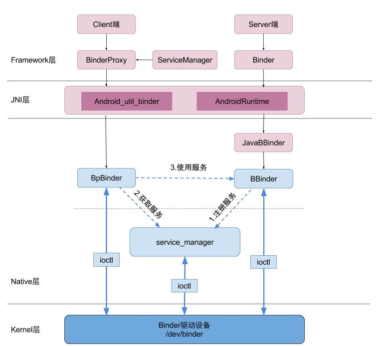

##### 总结

<table><thead><tr><th>概念</th><th>作用</th></tr></thead><tbody><tr><td>Binder 代理对象</td><td>类型为 BpBinder, 在用户空间创建, 且执行在 Client 进程中. 会被 Client 进程中的其他对象引用, 另外会引用 Binder 驱动程序中的 Binder 引用对象.</td></tr><tr><td>Binder 引用对象</td><td>类型为 binder_ref, 在 Binder 驱动程序中创建, 被 Binder 代理对象引用.</td></tr><tr><td>Binder 实体对象</td><td>类型为 binder_node, 在 Binder 驱动程序中创建, 被 Binder 引用对象所引用</td></tr><tr><td>Binder 本地对象</td><td>类型为 BBinder, 在用户空间中创建, 且执行在 Server 进程中. 会被 Server 进程中其他对象引用, 还会被 Binder 实体对象引用.</td></tr></tbody></table>

##### Binder 本地对象与 Binder 代理对象

Binder 本地对象在 Service 组件中, 使用模板类 BnInterface 描述.

1.  Binder 本地对象在 Binder 驱动中对应 Binder 实体对象.

```java
// IInterface.h
template<typename INTERFACE>
// 该模板类继承子BBinder.
// BBinder为Binder本地对象提供了抽象的进程间接口.
class BnInterface : public INTERFACE, public BBinder
{
public:
    virtual sp<IInterface>      queryLocalInterface(const String16& _descriptor);
    virtual const String16&     getInterfaceDescriptor() const;

protected:
    virtual IBinder*            onAsBinder();
};
```

Binder 代理对象在 Client 组件中, 使用模板类 BpInterface 描述.

*   Binder 代理对象在 Binder 驱动中对应 Binder 引用对象.

```java
// IInterface.h
template<typename INTERFACE>
class BpInterface : public INTERFACE, public BpRefBase
{
public:
                                BpInterface(const sp<IBinder>& remote);
protected:
    virtual IBinder*            onAsBinder();
};
```

##### BBinder

1.  模板类 BnInterface 继承了 BBinder,BBinder 中定义了 Binder 本地对象进程间通信的接口.
2.  当 Binder 代理对象通过 Binder 驱动向 Binder 本地对象发送进程间通信请求时, Binder 本地对象 onTransact() 方法将被调用.

```java
// Binder.h
class BBinder : public IBinder
{
public:
                        BBinder();
...
protected:
    virtual             ~BBinder();

    virtual status_t    onTransact( uint32_t code,
                                    const Parcel& data,
                                    Parcel* reply,
                                    uint32_t flags = 0);
...
};
```

##### BpBinder

BpInterface 继承自 BpRefBase.

*   BpRefBase 为 Binder 代理对象提供了进程间通信的接口
    BpRefBase 类中有个成员变量 mRemote, 它属于 BpBinder 类型.

```java
class BpRefBase : public virtual RefBase
{
    ...
    IBinder* const          mRemote;//BpBinder类型
    RefBase::weakref_type*  mRefs;
    volatile int32_t        mState;
};
```

*   BpBinder 中的成员变量 mHandler 表示 Binder 引用对象的句柄值.

```java
class BpBinder : public IBinder
{
public:
                        BpBinder(int32_t handle);
    ...
    // Binder代理对象通过该方法向Binder本地对象发送消息,
    // 会将mHandle和通信数据发送给Binder驱动,驱动就能根据mHandle找到Binder引用对象->Binder实体对象->Binder本地对象
    virtual status_t    transact(   uint32_t code,
                                    const Parcel& data,
                                    Parcel* reply,
                                    uint32_t flags = 0);
    ...
private:
    const   int32_t             mHandle;
    ...
};
```
