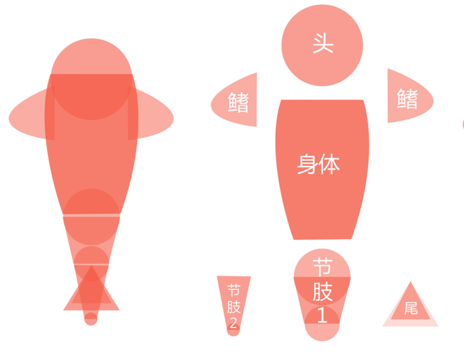
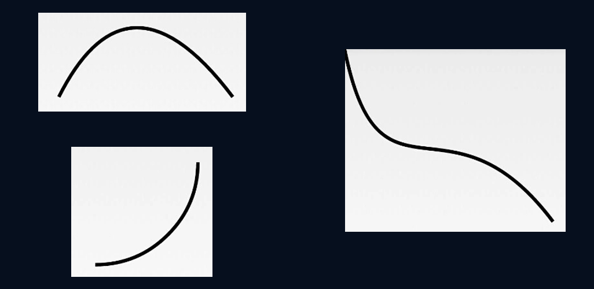
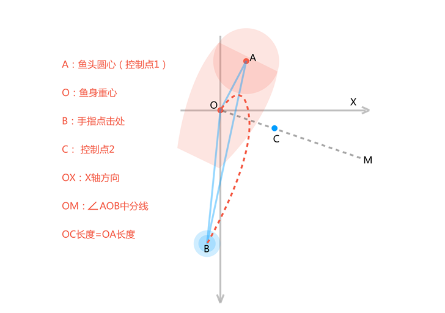
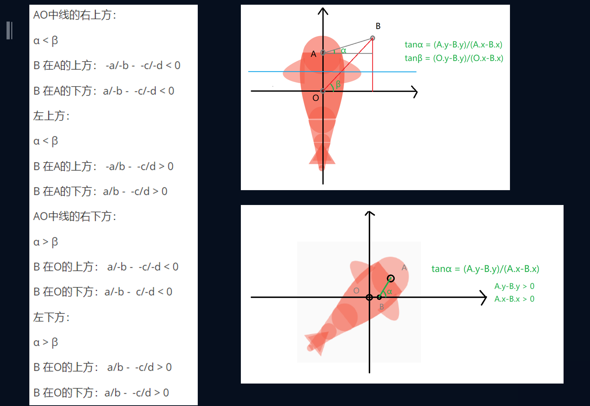

今天来实现自定义View之灵动的锦鲤，首先来看效果。


我们要实现锦鲤的绘制，有以下三个步骤：
1. 实现小鱼的绘制
2. 实现小鱼的原地摆动
3. 实现小鱼点击滑动
## 锦鲤的绘制

首先先来看锦鲤的绘制，在这里锦鲤是由简单的图形组合而成，我们可以看分解图，将锦鲤共分成**头**、**鱼鳍**、**身体**、**节肢**、**尾巴**几个部分组成。



从分解图上看，涉及到了圆、贝塞尔曲线、梯形、三角形等图形的绘制，为此我们先来了解以下绘制相关的知识。

### 绘制基础
#### Drawable
Drawable是一种可以在Canvas上进行绘制的抽象的概念，颜色、图片等都可以是一个Drawable。Drawable可以通过XML定义，或者通过代码创建，在Android中Drawable是一个抽象类，每个具体的Drawable都是其子类。在这里我们用ImageView来显示基于Drawable绘制的FishDrawable对象。

使用Drawable具有以下优点：
1. 使用简单，比自定义View成本低
2. 非图片类的Drawable所占空间小，能减小apk大小

自定义Drawable需要重写setAlpha、setColorFilter、getOpacity、draw四个方法。
```java
public class FishDrawable extends Drawable {
    @Override
    public void draw(@NonNull Canvas canvas) {

    }

    @Override
    public void setAlpha(int alpha) {

    }

    @Override
    public void setColorFilter(@Nullable ColorFilter colorFilter) {

    }

    @Override
    public int getOpacity() {
        return PixelFormat.OPAQUE;
    }
}

```

#### Path
Path封装了由直线和曲线(二次，三次贝塞尔曲线)构成的几何路径。你能用Canvas中的drawPath来把这条路径画出来(同样支持Paint的不同绘制模式)，也可以用于剪裁画布和根据路径绘制文字。



注意：用drawPath绘制了后，Path的路径还是存在的，所以如果需要绘制新的路径，需要先调用Path的reset方法。

#### Canvas
Canvas 在一般的情况下可以看作是一张画布，所有的绘图操作如drawBitmap, drawCircle都发生在这张画布上，这张画板还定义了一些属性比如Matrix，颜色等等。但是如果需要实现一些相对复杂的绘图操作，比如多层动画，地图（地图可以有多个地图层叠加而成，比如：政区层，道路层，兴趣点层）。Canvas提供了图层（Layer）支持，缺省情况可以看作是只有一个图层Layer。如果需要按层次来绘图，Android的Canvas可以使用saveLayerXXX, restore 来创建一些中间层，对于这些Layer是按照“栈结构“来管理的：


创建一个新的Layer到“栈”中，可以使用saveLayer, savaLayerAlpha, 从“栈”中推出一个Layer，可以使用restore,restoreToCount。当Layer入栈时，后续的DrawXXX操作都发生在这个 Layer上，而Layer退栈时，就会把本层绘制的图像“绘制”到上层或是Canvas上

### 绘制锦鲤
为了方便绘制，我们通过xy轴坐标系来确定绘制锦鲤时的坐标点。


另外由于我们的锦鲤是可以旋转的，所以需要确定一个旋转的中心，在旋转的时候，通过三角函数去计算新的坐标点。


由此我们给出以下方法，通过传入起始坐标点，也就是旋转中心，半径的长度，已经旋转角度，就可以用过三角函数方法得到对应点的x、y值。
```java
/**
     * @param startPoint 起始点坐标
     * @param length     要求的点到起始点的直线距离 -- 线长
     * @param angle      鱼当前的朝向角度
     * @return
     */
    public PointF calculatePoint(PointF startPoint, float length, float angle) {
        // x坐标
        float deltaX = (float) (Math.cos(Math.toRadians(angle)) * length);
        // y坐标
        float deltaY = (float) (Math.sin(Math.toRadians(angle - 180)) * length);

        return new PointF(startPoint.x + deltaX, startPoint.y + deltaY);
    }
```

对于锦鲤的绘制，我们设定以下初始参数:
```java
//透明度
private int OTHER_ALPHA = 110;
private int BODY_ALPHA = 160;
// 鱼的主要朝向角度
private float fishMainAngle = 0;
// 绘制鱼头的半径
private float HEAD_RADIUS = 100;
// 鱼的重心
private PointF middlePoint =new PointF(4.19f * HEAD_RADIUS, 4.19f * HEAD_RADIUS);
// 鱼身长度
private float BODY_LENGTH = HEAD_RADIUS * 3.2f;
// 寻找鱼鳍起始点坐标的线长
private float FIND_FINS_LENGTH = 0.9f * HEAD_RADIUS;
// 鱼鳍的长度
private float FINS_LENGTH = 1.3f * HEAD_RADIUS;
// 大圆的半径
private float BIG_CIRCLE_RADIUS = 0.7f * HEAD_RADIUS;
// 中圆的半径
private float MIDDLE_CIRCLE_RADIUS = 0.6f * BIG_CIRCLE_RADIUS;
// 小圆半径
private float SMALL_CIRCLE_RADIUS = 0.4f * MIDDLE_CIRCLE_RADIUS;
// --寻找尾部中圆圆心的线长
private final float FIND_MIDDLE_CIRCLE_LENGTH = BIG_CIRCLE_RADIUS * (0.6f + 1);
// --寻找尾部小圆圆心的线长
private final float FIND_SMALL_CIRCLE_LENGTH = MIDDLE_CIRCLE_RADIUS * (0.4f + 2.7f);
// --寻找大三角形底边中心点的线长
private final float FIND_TRIANGLE_LENGTH = MIDDLE_CIRCLE_RADIUS * 2.7f;
```

为了便于绘制，我们的鱼的初始角度为0°，绘制时候的坐标系原点为鱼的重心。
#### 锦鲤的头部
由分解图得，鱼头就是一个圆形，我们首先确定鱼头的圆心位置，然后通过canvas.drawCircle()方法绘制。
```java

@Override
public void draw(@NonNull Canvas canvas) {
    PointF headPoint = calculatePoint(middlePoint, BODY_LENGTH / 2, fishAngle);
    canvas.drawCircle(headPoint.x, headPoint.y, HEAD_RADIUS, mPaint);
    ...
}
```
#### 锦鲤的鱼鳍
由分解图得，鱼鳍为一个二阶贝塞尔曲线，因此需要确定起始点与终点，与控制点。
```java
@Override
public void draw(@NonNull Canvas canvas) {
    ...
    // 画右鱼鳍
    PointF rightFinsPoint = calculatePoint(headPoint, FIND_FINS_LENGTH, fishAngle - 110);
    makeFins(canvas, rightFinsPoint, fishAngle, true);
    // 画左鱼鳍
    PointF leftFinsPoint = calculatePoint(headPoint, FIND_FINS_LENGTH, fishAngle + 110);
    makeFins(canvas, leftFinsPoint, fishAngle, false);
    ...
}

private void makeFins(Canvas canvas, PointF startPoint, float fishAngle, boolean isRight) {
      float controlAngle = 115;

      // 鱼鳍的终点 --- 二阶贝塞尔曲线的终点
      PointF endPoint = calculatePoint(startPoint, FINS_LENGTH, fishAngle - 180);
      // 控制点
      PointF controlPoint = calculatePoint(startPoint, FINS_LENGTH * 1.8f,
              isRight ? fishAngle - controlAngle : fishAngle + controlAngle);
      // 绘制
      mPath.reset();
      // 将画笔移动到起始点
      mPath.moveTo(startPoint.x, startPoint.y);
      // 二阶贝塞尔曲线
      mPath.quadTo(controlPoint.x, controlPoint.y, endPoint.x, endPoint.y);
      canvas.drawPath(mPath, mPaint);
  }
```
#### 锦鲤的身体
由分解图，锦鲤的身体是由两段贝塞尔曲线形成的，因此需要确定身体的四个点与两个控制点的坐标。
```java
PointF bodyBottomCenterPoint = calculatePoint(headPoint, BODY_LENGTH, fishAngle - 180);

private void makeBody(Canvas canvas, PointF headPoint, PointF bodyBottomCenterPoint, float fishAngle) {
        // 身体的四个点求出来
    PointF topLeftPoint = calculatePoint(headPoint, HEAD_RADIUS, fishAngle + 90);
    PointF topRightPoint = calculatePoint(headPoint, HEAD_RADIUS, fishAngle - 90);
    PointF bottomLeftPoint = calculatePoint(bodyBottomCenterPoint, BIG_CIRCLE_RADIUS,
            fishAngle + 90);
    PointF bottomRightPoint = calculatePoint(bodyBottomCenterPoint, BIG_CIRCLE_RADIUS,
            fishAngle - 90);

    // 二阶贝塞尔曲线的控制点 --- 决定鱼的胖瘦
    PointF controlLeft = calculatePoint(headPoint, BODY_LENGTH * 0.56f,
            fishAngle + 130);
    PointF controlRight = calculatePoint(headPoint, BODY_LENGTH * 0.56f,
            fishAngle - 130);

    // 绘制
    mPath.reset();
    mPath.moveTo(topLeftPoint.x, topLeftPoint.y);
    mPath.quadTo(controlLeft.x, controlLeft.y, bottomLeftPoint.x, bottomLeftPoint.y);
    mPath.lineTo(bottomRightPoint.x, bottomRightPoint.y);
    mPath.quadTo(controlRight.x, controlRight.y, topRightPoint.x, topRightPoint.y);
    mPaint.setAlpha(BODY_ALPHA);
    canvas.drawPath(mPath, mPaint);
}
```
#### 锦鲤的节肢
由分解图，锦鲤共有两段节肢，第一段节肢由两个圆与一个梯形组成。

第二段节肢由一个圆与一个梯形组成。
```java
private PointF makeSegment(Canvas canvas, PointF bottomCenterPoint, float bigRadius, float smallRadius,
                               float findSmallCircleLength, float fishAngle, boolean hasBigCircle) {

    // 梯形上底圆的圆心
    PointF upperCenterPoint = calculatePoint(bottomCenterPoint, findSmallCircleLength,
            fishAngle - 180);
    // 梯形的四个点
    PointF bottomLeftPoint = calculatePoint(bottomCenterPoint, bigRadius, fishAngle + 90);
    PointF bottomRightPoint = calculatePoint(bottomCenterPoint, bigRadius, fishAngle - 90);
    PointF upperLeftPoint = calculatePoint(upperCenterPoint, smallRadius, fishAngle + 90);
    PointF upperRightPoint = calculatePoint(upperCenterPoint, smallRadius, fishAngle - 90);

    if (hasBigCircle) {
        // 画大圆 --- 只在节肢1 上才绘画
        canvas.drawCircle(bottomCenterPoint.x, bottomCenterPoint.y, bigRadius, mPaint);
    }
    // 画小圆
    canvas.drawCircle(upperCenterPoint.x, upperCenterPoint.y, smallRadius, mPaint);

    // 画梯形
    mPath.reset();
    mPath.moveTo(upperLeftPoint.x, upperLeftPoint.y);
    mPath.lineTo(upperRightPoint.x, upperRightPoint.y);
    mPath.lineTo(bottomRightPoint.x, bottomRightPoint.y);
    mPath.lineTo(bottomLeftPoint.x, bottomLeftPoint.y);
    canvas.drawPath(mPath, mPaint);

    return upperCenterPoint;
}
```
#### 锦鲤的尾巴
由分解图，锦鲤的尾巴由大小不同的两个等边三角形组成。
```java
private void makeTriangle(Canvas canvas, PointF startPoint, float findCenterLength,
                              float findEdgeLength, float fishAngle) {
    // 三角形底边的中心坐标
    PointF centerPoint = calculatePoint(startPoint, findCenterLength, fishAngle - 180);
    // 三角形底边两点
    PointF leftPoint = calculatePoint(centerPoint, findEdgeLength, fishAngle + 90);
    PointF rightPoint = calculatePoint(centerPoint, findEdgeLength, fishAngle - 90);

    mPath.reset();
    mPath.moveTo(startPoint.x, startPoint.y);
    mPath.lineTo(leftPoint.x, leftPoint.y);
    mPath.lineTo(rightPoint.x, rightPoint.y);
    canvas.drawPath(mPath, mPaint);
}
```

到这里，锦鲤的绘制就已经完成了，接下来我们来看锦鲤游动的动画该如何实现。
### 锦鲤的原地游动
我们看锦鲤的游动，包括了头部的摆动，尾部的摆动，其实都是角度的变化，因此我们可以用属性动画去实现。属性动画的运行机制是通过不断地对值进行操作来实，并将值赋值到指定对象的指定属性上，可以是任意对象的任意属性。所以我们仍然可以将一个View进行移动或者缩放，但同时也可以对自定义View中的Point对象进行动画操作了。我们只需要告诉系统动画的运行时长，需要执行哪种类型的动画，以及动画的初始值和结束值，剩下的工作就可以全部交给系统去完成了。
##### ValueAnimator
ValueAnimator是整个属性动画机制当中最核心的一个类，前面我们已经提到了，属性动画的运行机制是通过不断地对值进行操作来实现的，而初始值和结束值之间的动画过渡就是由ValueAnimator这个类来负责计算的。它的内部使用一种时间循环的机制来计算值与值之间的动画过渡，我们只需要将初始值和结束值提供给ValueAnimator，并且告诉它动画所需运行的时长，那么ValueAnimator就会自动帮我们完成从初始值平滑地过渡到结束值这样的效果。除此之外，ValueAnimator还负责管理动画的播放次数、播放模式、以及对动画设置监听器等，确实是一个非常重要的类。

在三角函数中，sin的值域是从(-1,1)，而sin的周期360°，所以可以取属性的值域为(0,3600f)，来让锦鲤的摆动更加平滑，
```java
 ValueAnimator valueAnimator = ValueAnimator.ofFloat(0, 3600f);
        // 动画周期
        valueAnimator.setDuration(15 * 1000);
        // 重复的模式：重新开始
        valueAnimator.setRepeatMode(ValueAnimator.RESTART);
        // 重复的次数
        valueAnimator.setRepeatCount(ValueAnimator.INFINITE);
        // 插值器
        valueAnimator.setInterpolator(new LinearInterpolator());
        valueAnimator.addUpdateListener(new ValueAnimator.AnimatorUpdateListener() {
            @Override
            public void onAnimationUpdate(ValueAnimator animator) {
                currentValue = (float) animator.getAnimatedValue();

                invalidateSelf();
            }
        });
        valueAnimator.start();
```
然后我们修改摆动的角度，从而让锦鲤产生游动的效果。
```java
// 鱼头朝向角度
float fishAngle = (float) (fishMainAngle +Math.sin(Math.toRadians(currentValue * 1.2 * frequence)) * 10);

// 三角形尾巴角度
float triangelAngle = (float) (fishAngle + Math.sin(Math.toRadians(currentValue * 1.5 * frequence)) * 35);

// 节肢角度
float segmentAngle;
if (hasBigCircle) {
    // 节肢1
    segmentAngle = (float) (fishAngle + Math.cos(Math.toRadians(currentValue * 1.5 * frequence)) * 15);
} else {
    // 节肢2
    segmentAngle = (float) (fishAngle + Math.sin(Math.toRadians(currentValue * 1.5 * frequence)) * 35);
}
```

### 点击时的锦鲤游动
我们看点击的时候的效果，在点击处会有放大的波纹点击效果，同时小鱼会调头向游动的方向游去。

##### 波纹放大效果
首先来看波纹的放大效果，我们同样是利用属性动画去实现，只不过这一次使用的是ObjectAnimator，它继承自ValueAnimator，相对于ValueAnimatior，可以直接操作控件。

它通过改变 View 的属性值来改变控件的形态，说白了就是通过反射技术来获取控件的一些属性如alpha、scaleY等的get和 set方法，从而实现所谓的动画效果。所以，这就需要我们的View（如自定义 View 中）具有set和get方法，如果没有则会导致程序的crash。
```java
private float ripple;
public float getRipple() {
    return ripple;
}

public void setRipple(float ripple) {
    // 透明度的变化 100 - 0
    alpha = (int) (100 * (1 - ripple));
    this.ripple = ripple;
}

@Override public boolean onTouchEvent(MotionEvent event)
{
   ...
   ObjectAnimator objectAnimator = ObjectAnimator.ofFloat(this,  "ripple", 0, 1f)
                                .setDuration(1000);
   objectAnimator.start();
   ...
}

 @Override
protected void onDraw(Canvas canvas) {
    super.onDraw(canvas);
    canvas.drawCircle(touchX, touchY, ripple * 150, mPaint);
    invalidate();
}

```
##### 锦鲤的游动
观察锦鲤的游动轨迹，首先是一个掉头的动作，然后是一个三阶贝塞尔曲线的路径。因此我们需要找到两个控制点，以鱼的重心O和触摸点B为起始点和终点，鱼头圆心A为第一控制点，取∠AOB的中线上的C点为第二控制点，可以得到三阶贝塞尔曲线如下。



那么如何确定C点的坐标呢，现在我们有A、O、B三点的坐标，通过向量夹角公式，我们可以得到cos∠AOB，再使用反三角函数就可以获得∠AOB。

向量的夹角公式计算夹角cosAOB = (OA*OB)/(|OA|*|OB|)其中OA*OB是向量的数量积,计算过程如下：
- OA=(Ax-Ox,Ay-Oy)
- OB=(Bx-Ox,By-Oy)
- OA*OB=(Ax-Ox)(Bx-Ox)+(Ay-Oy)*(By-Oy)
  |OA|表示线段OA的模即OA的长度



除此之外，我们确定鱼身需要向左还是向右转弯，由此得到的∠AOB的正负也不一样。


```java
public float includeAngle(PointF O, PointF A, PointF B) {
        // cosAOB
        // OA*OB=(Ax-Ox)(Bx-Ox)+(Ay-Oy)*(By-Oy)
        float AOB = (A.x - O.x) * (B.x - O.x) + (A.y - O.y) * (B.y - O.y);
        float OALength = (float) Math.sqrt((A.x - O.x) * (A.x - O.x) + (A.y - O.y) * (A.y - O.y));
        // OB 的长度
        float OBLength = (float) Math.sqrt((B.x - O.x) * (B.x - O.x) + (B.y - O.y) * (B.y - O.y));
        float cosAOB = AOB / (OALength * OBLength);

        // 反余弦
        float angleAOB = (float) Math.toDegrees(Math.acos(cosAOB));

        // AB连线与X的夹角的tan值 - OB与x轴的夹角的tan值
        float direction = (A.y - B.y) / (A.x - B.x) - (O.y - B.y) / (O.x - B.x);

        if (direction == 0) {
            if (AOB >= 0) {
                return 0;
            } else {
                return 180;
            }
        } else {
            if (direction > 0) {
                return -angleAOB;
            } else {
                return angleAOB;
            }
        }

    }
```
得到了∠AOB的大小α后，则∠AOC = ½∠AOB，为了确定C点坐标，我们取OX轴线上的一点（Ox+1，Oy），可以求出得到∠AOX的角度β，由于在角度计算时我们已经确定了∠AOB的正负，因此我们可以直接通过角度α/2+β得到控制点C的坐标。
```java
private void makeTrail() {

        // 鱼的重心：相对ImageView坐标
        PointF fishRelativeMiddle = fishDrawable.getMiddlePoint();
        // 鱼的重心：绝对坐标 --- 起始点
        PointF fishMiddle = new PointF(ivFish.getX() + fishRelativeMiddle.x, ivFish.getY() + fishRelativeMiddle.y);
        // 鱼头圆心的坐标 -- 控制点1
        final PointF fishHead = new PointF(ivFish.getX() + fishDrawable.getHeadPoint().x,
                ivFish.getY() + fishDrawable.getHeadPoint().y);
        // 点击坐标 -- 结束点
        PointF touch = new PointF(touchX, touchY);

        float angle = includeAngle(fishMiddle, fishHead, touch) / 2;
        float delta = includeAngle(fishMiddle, new PointF(fishMiddle.x + 1, fishMiddle.y), fishHead);
        // 控制点2 的坐标
        PointF controlPoint = fishDrawable.calculatePoint(fishMiddle,
                fishDrawable.getHEAD_RADIUS() * 1.6f, angle + delta);

        Path path = new Path();
        path.moveTo(fishMiddle.x - fishRelativeMiddle.x, fishMiddle.y - fishRelativeMiddle.y);
        path.cubicTo(fishHead.x - fishRelativeMiddle.x, fishHead.y - fishRelativeMiddle.y,
                controlPoint.x - fishRelativeMiddle.x, controlPoint.y - fishRelativeMiddle.y,
                touchX - fishRelativeMiddle.x, touchY - fishRelativeMiddle.y);
        ObjectAnimator objectAnimator = ObjectAnimator.ofFloat(ivFish, "x", "y", path);
        objectAnimator.setDuration(2000);
        objectAnimator.start();
```
这样一来，就可以控制鱼的点击游动了。在这里计算均采用相对坐标。为了实现鱼头的转向效果。我们利用PathMeasure类，可以确定path移动时候的切线位置，通过让鱼头与切线保持同样的角度，则可以实现鱼头的偏转。

getPosTan(float distance, float pos[], float tan[])

- distance : 这个参数就是确定要获取路径上哪个位置的点
- pos[] ：根据distance返回点的坐标信息并保存在传入的pos[]内， X保存在pos[0], Y则在pos[1]
- tan[] ：根据distance返回点的角度信息并保存传入tan[]内，tan[0]和tan[1]分别为单位圆的x和y坐标。
  主要结合float degree = (float) (Math.atan2(mTan[1], mTan[0]) * 180 / Math.PI);

```java
final PathMeasure pathMeasure = new PathMeasure(path, false);
final float[] tan = new float[2];
objectAnimator.addUpdateListener(new ValueAnimator.AnimatorUpdateListener() {
    @Override
    public void onAnimationUpdate(ValueAnimator animation) {
//                animation.getAnimatedValuRecyclerView实现吸顶效果RecyclerView实现吸顶效果e();
        // 执行了整个周期的百分之多少
        float fraction = animation.getAnimatedFraction();
        pathMeasure.getPosTan(pathMeasure.getLength() * fraction, null, tan);
        //这里取-tan[1]是因为在Android坐标系中，y轴向下为正，向上为负
        float angle = (float) Math.toDegrees(Math.atan2(-tan[1], tan[0]));
        fishDrawable.setFishMainAngle(angle);
    }
});
```

这样一来，锦鲤的游动动画也就完成了。

完整项目地址： https://github.com/Rainpler/Fish
