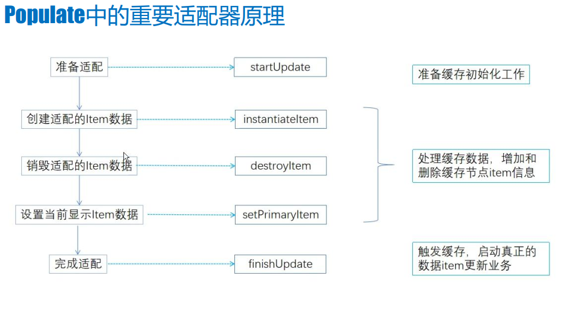
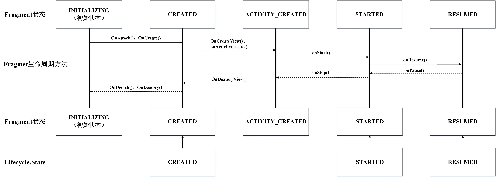

我们在

### ViewPager 页面缓存

在使用ViewPager的时候，我们通常会使用setOffscreenPageLimit(int limit)方法来缓存界面，通过传入limit变量，控制缓存的页面数目。

实际上，传入的limit值并不是说缓存页面数目为1，而是以当前选中Fragment为中心，前后各缓存的页面数目。因此，setOffscreenPageLimit(1)实际缓存的最大页面数目为2个，limit=2 的话，实际缓存的最大页面数目为4个。如果当前Fragment为第一个或者最后一个，则只会缓存左边或者右边的页面。我们来看一下ViewPager是如何实现页面的缓存的。
```java
public void setOffscreenPageLimit(int limit) {
    if (limit < DEFAULT_OFFSCREEN_PAGES) {
        limit = DEFAULT_OFFSCREEN_PAGES;
    }
    if (limit != mOffscreenPageLimit) {
        mOffscreenPageLimit = limit;
        populate();
    }
}
```
从该方法可以看出，limit传入的有效值必须是≥1的，否则也会被设置为默认值1，如果limit不等于上次赋值，则赋值给mOffscreenPageLimit，并进一步调用populate()方法。
```java
void populate() {
    populate(mCurItem);
}

void populate(int newCurrentItem) {
    //更新mCurItem为当前选中位置
    if (mCurItem != newCurrentItem) {
        oldCurInfo = infoForPosition(mCurItem);
        mCurItem = newCurrentItem;
    }
    //略 ...

    //开始更新
    mAdapter.startUpdate(this);

    //0.确定前后缓存位置
    //即[startPos,endPos] = [mCurItem - pageLimit, mCurItem + pageLimit]
    final int pageLimit = mOffscreenPageLimit;
    final int startPos = Math.max(0, mCurItem - pageLimit);
    final int N = mAdapter.getCount();
    final int endPos = Math.min(N - 1, mCurItem + pageLimit);


    //1. 找到第一个等于mCurItem的位置
    int curIndex = -1;
    ItemInfo curItem = null;
    for (curIndex = 0; curIndex < mItems.size(); curIndex++) {
        final ItemInfo ii = mItems.get(curIndex);
        if (ii.position >= mCurItem) {

            if (ii.position == mCurItem) curItem = ii;
            break;
        }
    }

    // mItems 中可能会找不到 curItem，需要 addNewItem
    // addNewItem 函数中会调用mAdapter.instantiateItem(this, position)创建新的视图
    if (curItem == null && N > 0) {
        curItem = addNewItem(mCurItem, curIndex);
    }


    //2.决定保留的页面范围，即[startPos，endPos]
    if (curItem != null) {
        //确定左边界
        float extraWidthLeft = 0.f;
        int itemIndex = curIndex - 1;
        ItemInfo ii = itemIndex >= 0 ? mItems.get(itemIndex) : null;
        //获取子View的可用宽大小，即viewPager测量宽度-内边距
        final int clientWidth = getClientWidth();
       // 计算左侧预加载视图宽度
        final float leftWidthNeeded = clientWidth <= 0 ? 0 :
                2.f - curItem.widthFactor + (float) getPaddingLeft() / (float) clientWidth;
        //逆序遍历
        for (int pos = mCurItem - 1; pos >= 0; pos--) {
            //如果在边界之外
            if (extraWidthLeft >= leftWidthNeeded && pos < startPos) {
                if (ii == null) {
                    break;
                }
                //移除该页面元素,销毁视图
                if (pos == ii.position && !ii.scrolling) {
                    mItems.remove(itemIndex);
                    mAdapter.destroyItem(this, pos, ii.object);

                    itemIndex--;
                    curIndex--;
                    ii = itemIndex >= 0 ? mItems.get(itemIndex) : null;
                }
            } else if (ii != null && pos == ii.position) {
              // 若该左侧元素在内存中，则更新记录
                extraWidthLeft += ii.widthFactor;
                itemIndex--;
                ii = itemIndex >= 0 ? mItems.get(itemIndex) : null;
            } else {
                // 若该左侧元素不在内存中，则重新添加，再一次来到了addNewItem
                ii = addNewItem(pos, itemIndex + 1);
                extraWidthLeft += ii.widthFactor;
                curIndex++;
                ii = itemIndex >= 0 ? mItems.get(itemIndex) : null;
            }
        }

        //确定右边界
        //...与确定左边界大体一致


        //计算页面偏移
        calculatePageOffsets(curItem, curIndex, oldCurInfo);

        //3.设置当前选中item
        mAdapter.setPrimaryItem(this, mCurItem, curItem.object);
    }


    //4. 结束更新
    mAdapter.finishUpdate(this);

    // 下面两部分分别是 LayoutParams 和 Focus 处理
    // 遍历子视图，若宽度不合法则重绘
    final int childCount = getChildCount();
    for (int i = 0; i < childCount; i++) {
        final View child = getChildAt(i);
        final LayoutParams lp = (LayoutParams) child.getLayoutParams();
        lp.childIndex = i;
        if (!lp.isDecor && lp.widthFactor == 0.f) {
            // 0 means requery the adapter for this, it doesn't have a valid width.
            //没有有效的宽度，则获取内存中保存的信息给子视图的LayoutParams
            final ItemInfo ii = infoForChild(child);
            if (ii != null) {
                lp.widthFactor = ii.widthFactor;
                lp.position = ii.position;
            }
        }
    }
    //重新将子绘图顺序排序
    sortChildDrawingOrder();

    //如果焦点在ViewPager上
    if (hasFocus()) {
        //找到焦点View，如果存在则获取它的信息
        View currentFocused = findFocus();
        ItemInfo ii = currentFocused != null ? infoForAnyChild(currentFocused) : null;
        //如果没找到，或者找到的焦点view不是当前位置，则遍历元素，如果找到对应元素则请求焦点
        if (ii == null || ii.position != mCurItem) {
            for (int i = 0; i < getChildCount(); i++) {
                View child = getChildAt(i);
                ii = infoForChild(child);
                if (ii != null && ii.position == mCurItem) {
                    //找到view，请求焦点
                    if (child.requestFocus(View.FOCUS_FORWARD)) {
                        break;
                    }
                }
            }
        }
    }
}
```
从代码来看，整个populate()有几个重要的步骤，首先先通过pageLimit确定了前后缓存的范围，然后决定要保留的页面，并将范围外的页面移除，最后设置当前选中的item，并结束更新事务。

ItemInfo，后面会用到它，它是ViewPager的一个内部类，包含了一个页面的基本信息，在调用Adapter的instantiateItem方法时，在ViewPager内部就会创建这个对象，但它不包含view，结构如下：
```java
static class ItemInfo {
    Object object;      // 为adapter中instantiateItem方法返回的对象
    int position;       // 页面position
    boolean scrolling;  // 是否正在滑动
    float widthFactor;  // 当前页面宽度和ViewPager宽度的比例
    float offset;       // 当前页面在所有已加载的页面中的索引
}
```
同时，在这里还涉及了adapter的几个基本方法，几乎是整个adapter的生命周期。
- **startUpdate()**  　开始更新事务
- **instantiateItem()**　 创建页面视图
- **destroyItem()**  　销毁页面视图
- **setPrimaryItem()**　设置当前选中页面
- **finishUpdate()** 　结束更新事务



但是预加载也会带来相应的问题，例如当预加载了P3，P4时，虽然它们还未可见，但是仍会请求服务器大量数据导致卡顿。为了解决这个问题，我们可以使用懒加载机制。

### ViewPager懒加载实现
懒加载，其实也就是延迟加载,就是等到该页面的UI展示给用户时，再加载该页面的数据(从网络、 数据库等)，而不是依靠ViewPager预加载机制提前加载两三个， 甚至更多页面的数据。这样可以提高所属Activity的初始化速度，也可以为用户节省流量。而这种懒加载的方式也已经/正在被诸多APP所采用。

为了学习ViewPager的懒加载机制，首先我们要了解ViewPager的源码。

#### ViewPager的适配器原理

>ViewPager要展示数据，必须绑定Adapter适配器，通过适配器完成数据的准备、展示和销毁工作。

Android为我们提供了PagerAdapter的基本抽象类，由此衍生出FragmentPagerAdapter与FragmentStatePagerAdapter两个实现类。我们主要来看
```java
public abstract class PagerAdapter {

    ...

    //准备适配
    public void startUpdate(@NonNull ViewGroup container) {
        startUpdate((View) container);
    }

    //准备适配的数据
    @NonNull
    public Object instantiateItem(@NonNull ViewGroup container, int position) {
        return instantiateItem((View) container, position);
    }

    //销毁适配的item数据
    public void destroyItem(@NonNull ViewGroup container, int position, @NonNull Object object) {
        destroyItem((View) container, position, object);
    }
    //设置当前显示的item数据
    public void setPrimaryItem(@NonNull ViewGroup container, int position, @NonNull Object object) {
        setPrimaryItem((View) container, position, object);
    }

    //结束适配
    public void finishUpdate(@NonNull ViewGroup container) {
        finishUpdate((View) container);
    }

    ...
}
```
我们在分析populate函数的时候，就会调用到adapter的几个重要方法。我们来看一下在FragmentPagerAdapter中的实现。
```java
@Override
public void startUpdate(@NonNull ViewGroup container) {
    if (container.getId() == View.NO_ID) {
        throw new IllegalStateException("ViewPager with adapter " + this
                + " requires a view id");
    }
}
```
开始适配阶段，只做了有效性的判断，并没有做其他处理。接下来是instantiateItem函数的实现。
```java
public Object instantiateItem(@NonNull ViewGroup container, int position) {
    //初始化mCurTransaction
    if (this.mCurTransaction == null) {
        this.mCurTransaction = this.mFragmentManager.beginTransaction();
    }

    long itemId = this.getItemId(position);
    String name = makeFragmentName(container.getId(), itemId);
    Fragment fragment = this.mFragmentManager.findFragmentByTag(name);
    if (fragment != null) {
        //创建视图
        this.mCurTransaction.attach(fragment);
    } else {
        //添加fragment实例到容器中
        fragment = this.getItem(position);
        this.mCurTransaction.add(container.getId(), fragment, makeFragmentName(container.getId(), itemId));
    }

    //如果不是被选中的item，设置为不可见
    if (fragment != this.mCurrentPrimaryItem) {
        fragment.setMenuVisibility(false);
        fragment.setUserVisibleHint(false);
    }

    return fragment;
}
```
在该函数中，首先创建mCurTransaction，每次我们对Fragment进行操作 都是通过FragmentTransaction这个类来实现。如果mFragmentManager中已经保存了对应的fragment，则通过attach方法创建视图，否则通过add方法添加到指定id的容器中。

如果当前fragment不是被选中的对象，则通过setUserVisibleHint方法设置为不可见。setUserVisibleHint()方法只有在使用ViewPager管理Fragment时才会调用，有一个参数isVisibleToUser，字面意思就是是否对于用户可见。

我们往ViewPager里面填充5个Fragment，并设置viewPager.setOffscreenPageLimit(2)，然后来看一下该方法的执行情况，在每个Fragment中重写setUserVisibleHint()方法，打印isVisibleToUser的值。当首次初始化页面选中第一个Fragment的时候，打印的日志如下：
```java
MyFragment: 1 fragment setUserVisibleHint: false
MyFragment: 2 fragment setUserVisibleHint: false
MyFragment: 3 fragment setUserVisibleHint: false
MyFragment: 1 fragment setUserVisibleHint: true
MyFragment: 1 fragment onAttach:
MyFragment: 1 fragment onCreate:
MyFragment: 2 fragment onAttach:
MyFragment: 2 fragment onCreate:
MyFragment: 3 fragment onAttach:
MyFragment: 3 fragment onCreate:
MyFragment: 1 MyFragment onCreateView:
MyFragment: 1 fragment onResume:
MyFragment: 2 MyFragment onCreateView:
MyFragment: 3 MyFragment onCreateView:
MyFragment: 2 fragment onResume:
MyFragment: 3 fragment onResume:
```
可以发现，setUserVisibleHint方法并不总是跟随生命周期，该方法会在Fragment的生命周期之前就会执行一次，由于设置了预加载数量为2，所以第二、第三个页面会被预加载。并且在第一次执行setUserVisibleHint方法的时候，isVisibleToUser的值都为false，意为不可见。然后第一个页面会执行第二次setUserVisibleHint，这时候isVisibleToUser为true。然后开始进入Fragment的生命周期函数，完成onAttach、onCreate、onCreateView、onResume等函数的调用。

当我们切换到第二个Fragment的时候，打印的日志如下
```java
MyFragment: 4 fragment setUserVisibleHint: false
MyFragment: 1 fragment setUserVisibleHint: false
MyFragment: 2 fragment setUserVisibleHint: true
MyFragment: 4 fragment onAttach:
MyFragment: 4 fragment onCreate:
MyFragment: 4 MyFragment onCreateView:
MyFragment: 4 fragment onResume:
```
这时候，由于Fragment4会被预加载，所以会调用setUserVisibleHint，且isVisibleToUser为false。而Fragment1由于变为不可见状态，同样会调用setUserVisibleHint方法，isVisibleToUser为false。而Fragment2变为可见状态，会调用setUserVisibleHint方法，且isVisibleToUser为true，然后Fragment4开始走生命周期函数。

再切换到第四个Fragment，再来看看情况如何。
```java
MyFragment: 5 fragment setUserVisibleHint: false
MyFragment: 2 fragment setUserVisibleHint: false
MyFragment: 4 fragment setUserVisibleHint: true
MyFragment: 5 fragment onAttach:
MyFragment: 5 fragment onCreate:
MyFragment: 5 MyFragment onCreateView:
MyFragment: 5 fragment onResume:
MyFragment: 1 fragment onStop:
MyFragment: 1 fragment onPause:
MyFragment: 1 fragment onDestroyView:
```
跟上面一致，同样是不可见的页面isVisibleToUser为false，可见的页面isVisibleToUser为true，预加载的界面会走生命周期函数。但这里由于Fragment1不在缓存范围之内，则会被移除，调用了onPause与onDestroyView。

接下来是destroyItem方法。
```java
public void destroyItem(@NonNull ViewGroup container, int position, @NonNull Object object) {
    if (this.mCurTransaction == null) {
        this.mCurTransaction = this.mFragmentManager.beginTransaction();
    }

    this.mCurTransaction.detach((Fragment)object);
}
```
该方法中，会通过detach方法将视图从mCurTransaction中移除。接下来是setPrimaryItem方法。
```java
public void setPrimaryItem(@NonNull ViewGroup container, int position, @NonNull Object object) {
    Fragment fragment = (Fragment)object;
    if (fragment != this.mCurrentPrimaryItem) {
        if (this.mCurrentPrimaryItem != null) {
            this.mCurrentPrimaryItem.setMenuVisibility(false);
            this.mCurrentPrimaryItem.setUserVisibleHint(false);
        }
        fragment.setMenuVisibility(true);
        fragment.setUserVisibleHint(true);
        this.mCurrentPrimaryItem = fragment;
    }
}
```
首先将上一个选中的item设置为不不可见，然后将当前选中的item设置为可见，并更新mCurrentPrimaryItem对象。最后是通过finishUpdate方法。
```java
public void finishUpdate(@NonNull ViewGroup container) {
    if (this.mCurTransaction != null) {
        this.mCurTransaction.commitNowAllowingStateLoss();
        this.mCurTransaction = null;
    }
}
```
在该方法中，最后通过调用mCurTransaction.commitNowAllowingStateLoss()提交事务。
#### 懒加载实现
通过以上从对setUserVisibleHint函数的分析，可以得出以下几个重要结论：
1. 在onAttach函数之前，就已经执行了一次setUserVisibleHint，因此这时候视图的初始化还没完成，不能通过isVisibleToUser来判断是否需要加载数据，需要引入变量标记onCreateView已经完成。
2. 由于发生Fragment切换的时候，setUserVisibleHint也会调用。为了避免重复加载，因此需要引入变量标记是否已经完成加载。

因此我们封装的LazyFragment如下：
```java
public abstract class LazyFragment extends Fragment {
    //标记onCreatedView是否完成
    private boolean isCreated;
    //标记是否已经完成了加载
    private boolean isFirstLoaded = true;

    @Nullable
    @Override
    public View onCreateView(@Nullable LayoutInflater inflater, @Nullable ViewGroup container, @Nullable Bundle savedInstanceState) {
        View view = inflater.inflate(getContentViewId(), container, false);
        initView(view);
        lazyLoad();
        isCreated = true;
        return view;
    }

    @Override
    public void setUserVisibleHint(boolean isVisibleToUser) {
        super.setUserVisibleHint(isVisibleToUser);
        if (isVisibleToUser) {
            lazyLoad();
        }
    }


    void lazyLoad() {
        if (!isCreated || isFirstLoaded || !getUserVisibleHint()) {
            return;
        }
        isFirstLoaded = false;
        onLazyLoad();
    }

    //如果视图被销毁了，要重置状态
    @Override
    public void onDestroyView() {
        super.onDestroyView();
        isFirstLoaded = true;
    }
    abstract int getContentViewId();

    abstract void initView();
    //真正懒加载实现
    abstract void onLazyLoad();

}
```
通过isCreated和isFirstLoaded两个变量，分别标记onCreateView是否完成，和首次加载数据是否完成。然后要注意的一点是，由于首次调用setUserVisibleHint的时候，isCreated为false，所以并不会去懒加载。因此要在onCreateView中将isCreated设置为true之后再判断一次是否可以加载数据。

当脱离预加载的缓存范围之后，之前的页面会被销毁，调用到onDestroyView，因此需要重置isFirstLoaded的状态，下一次回到该界面的时候才能正常获取数据。

#### androidX中的懒加载方案
在上面的懒加载方案，是基于android.support.v4.app.Fragment的。在最新的androidx.fragment.app.Fragment中我们发现，setUserVisibleHint方法已经被标记为过时了。并且注释中提到：

**Use{@link FragmentTransaction#setMaxLifecycle(Fragment, Lifecycle.State)} instead.**

写明了通过FragmentTransaction的setMaxLifecycle(Fragment, Lifecycle.State)方法来代替setUserVisibleHint的使用。那么我们来看一下这个方法：
```java
@NonNull
public FragmentTransaction setMaxLifecycle(@NonNull Fragment fragment,
        @NonNull Lifecycle.State state) {
    addOp(new Op(OP_SET_MAX_LIFECYCLE, fragment, state));
    return this;
}
```
该方法定义在FragmentTransaction中，它与`add()`、`remove()`、`attach()`、`detach()`等函数一样，通过将操作封装成一个Op对象，添加到事务队列中，最后调用`commit()`的时候，就会根据Op对象执行相应的操作。该方法会给Fragment设置最大的状态，如果当前状态大于设定值，则会被强制降级。

该方法需要传入两个对象，一个是fragment，根据注释我们知道，传入的fragment必须是已经通过`add()`方法添加到FragmentManager或者是transaction中了。

而Lifecycle.State是Lifecycle中的一个枚举类:
```java
public enum State {
    DESTROYED,  //在onDestroy之前
    INITIALIZED,//调用了构造函数，且未调用onCreate
    CREATED,    //在onCreate之后，onStop之前
    STARTED,    //在onStart之后，onPause之前
    RESUMED;    //在onResume之后
    public boolean isAtLeast(@NonNull State state) {
        return compareTo(state) >= 0;
    }
}
```
传入的state值至少是CREATED，也就是说传入的state只能是CREATED、STARTED和RESUMED。除此之外，我们还需要了解Fragment的状态，在Fragment类中定义了5个int常量，表示Fragment的状态值：
```java
static final int INITIALIZING = 0;     // Not yet created.
static final int CREATED = 1;          // Created.
static final int ACTIVITY_CREATED = 2; // Fully created, not started.
static final int STARTED = 3;          // Created and started, not resumed.
static final int RESUMED = 4;          // Created started and resumed.
```
由于传入的是Lifecycle.State，我们需要将它与Fragment状态的周期一一对应，才能起到对Fragment状态的限制。且看下图：


