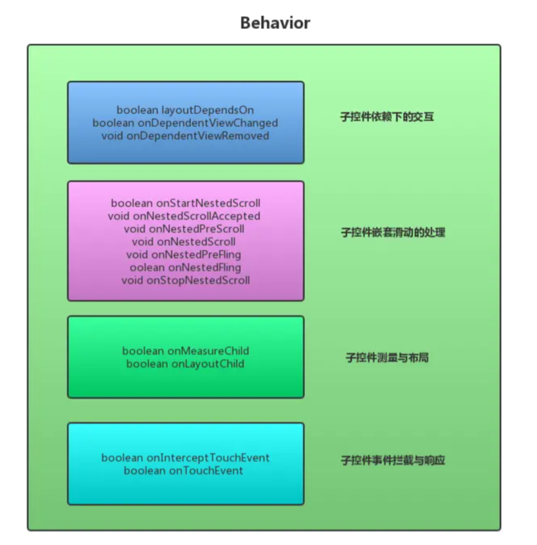
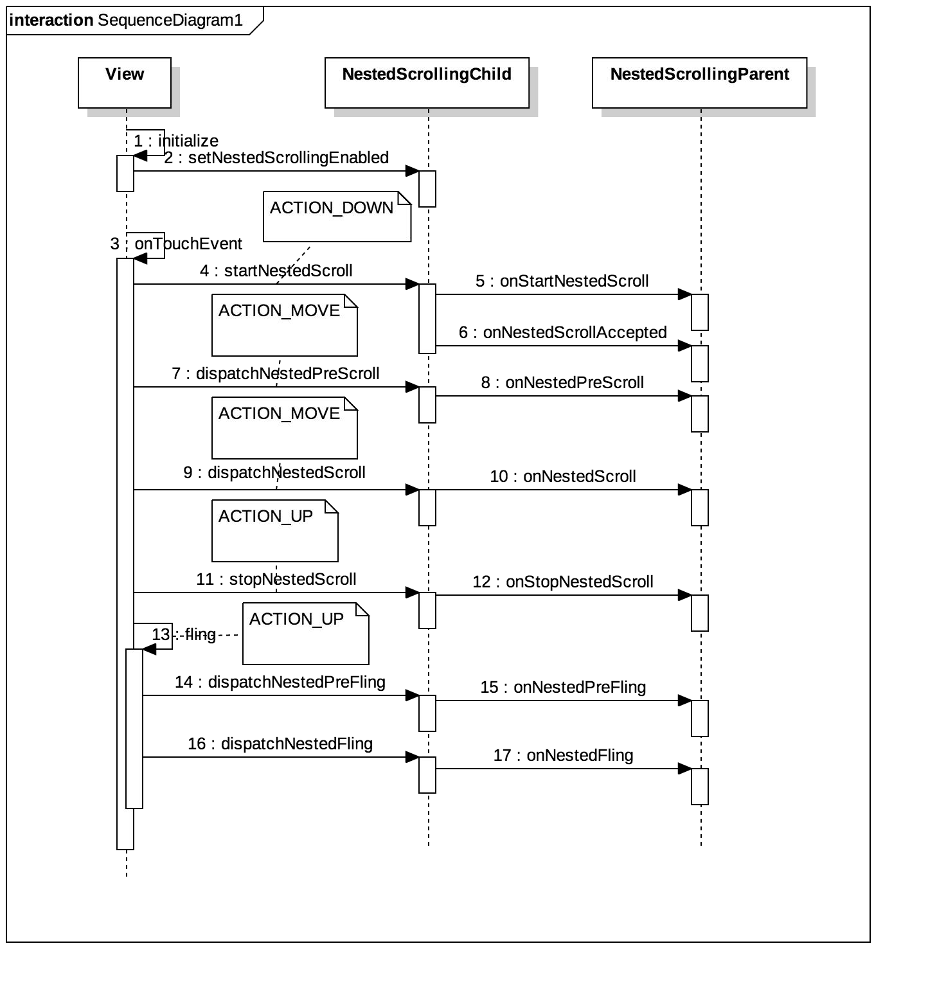

### 前言
CoordinatorLayout(协调者布局)是在 Google IO/15 大会发布的，遵循Material 风格，包含在 support Library中，结合AppbarLayout, CollapsingToolbarLayout等可产生各种炫酷的效果。使用CoordinatorLayout可以让我们方便地实现View之间的嵌套滑动。

在我们的业务开发中，通常需要解决以下四类需求。

1. 处理子控件之间依赖下的交互
2. 处理子控件之间的嵌套滑动
3. 处理子控件的测量与布局
4. 处理子控件的事件拦截与响应

在没有CoordinatorLayout之前，我们如果要实现以上四个功能不是件容易的事情，复杂难度又大，需要对View事件分发的机制极其熟悉。而有了CoordinatorLayout，极大地方便了我们开发者，这都建立于CoordainatorLayout中提供的一个叫做Behavior的“ 插件” 之上。通过Behavior，可以极大的解放开发者，从而实现解耦。

### 认识Behavior

我们使用CoordinatorLayout的时候，必须使用它作为父布局，并给它的直接子View添加`app:layout_behavior="xxx"`的属性。这里的behavior可以直接使用系统提供的`string/appbar_scrolling_view_behavior`，进一步可以发现它的值是`android.support.design.widget.AppBarLayout$ScrollingViewBehavior`，其实就是系统基于Behavior类实现的一个自定义Behavior，所以我们也可以使用自定义的Behavior。

CoordinatorLayout之所以可以实现各种酷炫的效果，就是因为Behavior的存在，所以我们先来认识一下Behavior类。
```java
public static abstract class Behavior<V extends View> {

        public Behavior() {
        }

        public Behavior(Context context, AttributeSet attrs) {
        }
       //省略了若干方法
}
```
这里有一个泛型，必须是View类的子类。这个泛型的意思就是，可以使用这个Behavior的View，我们可以指定为TextView、ImageView都可以，当然也可以指定为View，这样所有的View都可以使用该Behavior。

自定义Behavior可以选择重写以下的几个方法有：
- `onInterceptTouchEvent()`：是否拦截触摸事件
- `onTouchEvent()`：处理触摸事件
- `layoutDependsOn()`：确定使用Behavior的View要依赖的View的类型
- ` onDependentViewChanged()`：当被依赖的View状态改变时回调
- `onDependentViewRemoved()`：当被依赖的View移除时回调
- `onMeasureChild()`：测量使用Behavior的View尺寸
- `onLayoutChild()`：确定使用Behavior的View位置
- `onStartNestedScroll()`：嵌套滑动开始（ACTION_DOWN），确定Behavior是否要监听此次事件
- `onStopNestedScroll()`：嵌套滑动结束（ACTION_UP或ACTION_CANCEL）
- `onNestedScroll()`：嵌套滑动进行中，要监听的子 View的滑动事件已经被消费
- `onNestedPreScroll()`：嵌套滑动进行中，要监听的子 View将要滑动，滑动事件即将被消费（但最终被谁消费，可以通过代码控制）
- `onNestedFling()`：要监听的子 View在快速滑动中
- `onNestedPreFling()`：要监听的子View即将快速滑动

通过这些方法，就可以实现以下4种业务功能：
| 类型   | 描述  |
| -----| ---  |
| 处理子控件之间依赖交互     | 当CoordainatorLayout中子控件depandency的位置、大小等发生改变的时候，那么在CoordainatorLayout内部会通知所有依赖depandency的控件，并调用对应声明的Behavior，告知其依赖的depandency发生改变。那么如何判断依赖(layoutDependsOn)， 接受到通知后如何处理(`onDependentViewChanged`、`onDependentViewRemoved`)，这些都交由Behavior来处理。 |
| 处理子控件之间嵌套滑动     | CoordinatorLayout实现了NestedScrollingParent2接口。那么当事件（scroll或fling)产生后， 内部实现了NestedScrollingChild接口的子控件会将事件分发给CoordinatorLayout，CoordinatorLayout又会将事件传递给所有的Behavior，然后在Behavior中实现子控件的嵌套滑动。  |
| 处理子控件的测量与布局     | CoordainatorLayout主要负责的是子控件之间的交互，内部控件的测量与布局都非常简单。在特殊的情况下，如子控件需要处理宽高和布局的时候，那么交由Behavior内部的`onMeasureChild`与`onLayoutChild`方法来进行处理。  |
| 处理子控件的事件拦截与响应 | 同理对于事件的拦截与处理，如果子控件需要拦截并消耗事件，那么交由给Behavior内部的`onInterceptTouchEvent`与`onTouchEvent`方法进行处理。|


### CoordinatorLayout源码分析

我们在上文提到，CoordinatorLayout实现View的嵌套效果离不开Behavior，为了对整个协调者布局与Behavior的协作机理了解更加透彻，我们将从源码角度来进行分析。

#### Behavior的初始化
首先我们来看看Behavior的初始化，通常我们是在xml布局中为view添加layout_behavior属性，很显然最后这个属性会绑定在了LayoutParams上，查找CoordinatorLayout，可以找到LayoutParams的内部类，在其构造函数中，会从xml布局中加载对应的属性值。
```java
public static class LayoutParams extends MarginLayoutParams {
    LayoutParams(@NonNull Context context, @Nullable AttributeSet attrs) {
        super(context, attrs);

        final TypedArray a = context.obtainStyledAttributes(attrs,
                R.styleable.CoordinatorLayout_Layout);


        mAnchorId = a.getResourceId(R.styleable.CoordinatorLayout_Layout_layout_anchor,
                View.NO_ID);
        this.anchorGravity = a.getInteger(
                R.styleable.CoordinatorLayout_Layout_layout_anchorGravity,
                Gravity.NO_GRAVITY);

        this.keyline = a.getInteger(R.styleable.CoordinatorLayout_Layout_layout_keyline,
                -1);

        insetEdge = a.getInt(R.styleable.CoordinatorLayout_Layout_layout_insetEdge, 0);
        dodgeInsetEdges = a.getInt(
                R.styleable.CoordinatorLayout_Layout_layout_dodgeInsetEdges, 0);
        mBehaviorResolved = a.hasValue(
                R.styleable.CoordinatorLayout_Layout_layout_behavior);
        if (mBehaviorResolved) {
            mBehavior = parseBehavior(context, attrs, a.getString(
                    R.styleable.CoordinatorLayout_Layout_layout_behavior));
        }
        a.recycle();
        if (mBehavior != null) {
            mBehavior.onAttachedToLayoutParams(this);
        }
    }
}
```
如果layout_behavior获取到的属性不为空，则通过`parseBehavior()`方法解析得到的路径，下面我们来看一下该方法。
```java
static Behavior parseBehavior(Context context, AttributeSet attrs, String name) {
    //为空直接返回
    if (TextUtils.isEmpty(name)) {
        return null;
    }

    //全包名路径
    final String fullName;
    if (name.startsWith(".")) {
        // 如果设置behavior路径不包含包名，则需要拼接包名
        fullName = context.getPackageName() + name;
    } else if (name.indexOf('.') >= 0) {
        fullName = name;
    } else {
       // 系统内部实现，WIDGET_PACKAGE_NAME代表android.support.design.widget
        fullName = !TextUtils.isEmpty(WIDGET_PACKAGE_NAME)
                ? (WIDGET_PACKAGE_NAME + '.' + name)
                : name;
    }

    //通过反射实例化Behavior
    try {
        Map<String, Constructor<Behavior>> constructors = sConstructors.get();
        if (constructors == null) {
            constructors = new HashMap<>();
            sConstructors.set(constructors);
        }
        Constructor<Behavior> c = constructors.get(fullName);
        if (c == null) {
            final Class<Behavior> clazz =
                    (Class<Behavior>) Class.forName(fullName, false, context.getClassLoader());
            c = clazz.getConstructor(CONSTRUCTOR_PARAMS);
            c.setAccessible(true);
            constructors.put(fullName, c);
        }
        return c.newInstance(context, attrs);
    } catch (Exception e) {
        throw new RuntimeException("Could not inflate Behavior subclass " + fullName, e);
    }
}
```
在parseBehavior方法中，主要是通过包名全路径反射得到Behavior实例。在这里有一个sConstructors的变量，是一个ThreadLocal的实例，可以保证每个线程都有自己的唯一副本，实现了线程的安全。

当然实例化Behavior的方法不止一种，Google还为我们提供了注解的方法设置Behavior。例如AppBarLayout中的设置：
```java
@CoordinatorLayout.DefaultBehavior(AppBarLayout.Behavior.class)
public class AppBarLayout extends LinearLayout {}
```
当然使用注解的方式，其原理也是通过反射调用相应Behavior构造函数，并实例化对象。只是需要通过合适的时间解析注解罢了，这里不再赘述。我们接下来进一步分析源码的其他部分。

#### CoordinatorLayout加载流程

在View的生命周期中，当View从xml文件中加载完成后，会调用`onFinishInflate()`，然后通过`onAttachedToWindow()`附到一个window上，我们来看CoordinatorLayout的`onAttachToWindow()`方法中的关键代码。
```java
@Override
public void onAttachedToWindow() {
    super.onAttachedToWindow();
    resetTouchBehaviors(false);
    if (mNeedsPreDrawListener) {
        if (mOnPreDrawListener == null) {
            mOnPreDrawListener = new OnPreDrawListener();
        }
        final ViewTreeObserver vto = getViewTreeObserver();
        vto.addOnPreDrawListener(mOnPreDrawListener);
    }
    if (mLastInsets == null && ViewCompat.getFitsSystemWindows(this)) {
        // We're set to fitSystemWindows but we haven't had any insets yet...
        // We should request a new dispatch of window insets
        ViewCompat.requestApplyInsets(this);performTraversals
    }
    mIsAttachedToWindow = true;
}
```
首次绘制的时候，mNeedsPreDrawListener为true，因此会进入if代码中。然后实例化mOnPreDrawListener，并通过`getViewTreeObserver()`获取到视图树对象vto，然后将mOnPreDrawListener添加到vto中。

**ViewTreeObserver**通过注册一个观察者来监听视图树，当视图树的布局、视图树的焦点、视图树将要绘制、视图树滚动等发生改变时，ViewTreeObserver都会收到通知， ViewTreeObserver不能被实例化，可以用`View.getViewTreeObserver()`来获得View的生命周期。

| 内部接口类                   | 备注                                                     |
| ---------------------------- | -------------------------------------------------------- |
| OnPreDrawListener            | 当视图树将要被绘制时                                     |
| OnGlobalLayoutListener       | 当视图树的布局发生改变或者View在视图树的可变状态发生改变 |
| OnGlobalFocusChangerListener | 当一个视图树的焦点发生变化                               |
| OnScrollChangeListener       | 当视图树的一些组件发生滚动时                             |
| OnTouchModeChangeListener    | 当视图树的触摸模式发生改变时                             |

当绘制将要开始的时候，会调用`ViewTreeObserver.dispatchOnPreDraw()`方法，通知观察者绘制即将开始，然后进一步调用`OnPreDrawListener.onPreDraw()`。

```java
class OnPreDrawListener implements ViewTreeObserver.OnPreDrawListener {
    @Override
    public boolean onPreDraw() {
        onChildViewsChanged(EVENT_PRE_DRAW);
        return true;
    }
}
```
接口实现中会调用`onChildViewsChanged()`，并传入事件类型为EVENT_PRE_DRAW，除此之外还有
- EVENT_NESTED_SCROLL 标记滑动事件
- EVENT_VIEW_REMOVED 标记移除view事件。
```java
final void onChildViewsChanged(@DispatchChangeEvent final int type) {
    final int layoutDirection = ViewCompat.getLayoutDirection(this);
    final int childCount = mDependencySortedChildren.size();
    final Rect inset = acquireTempRect();
    final Rect drawRect = acquireTempRect();
    final Rect lastDrawRect = acquireTempRect();

    for (int i = 0; i < childCount; i++) {
        final View child = mDependencySortedChildren.get(i);
        final LayoutParams lp = (LayoutParams) child.getLayoutParams();

        //省略部分代码...

        // 如果有变化，更新与child有依赖交互的view
        for (int j = i + 1; j < childCount; j++) {
            final View checkChild = mDependencySortedChildren.get(j);
            final LayoutParams checkLp = (LayoutParams) checkChild.getLayoutParams();
            final Behavior b = checkLp.getBehavior();

             //调用当前子控件的Behavior的layoutDependsOn方法判断是否依赖
            if (b != null && b.layoutDependsOn(this, checkChild, child)) {

                final boolean handled;
                switch (type) {
                    case EVENT_VIEW_REMOVED:

                        b.onDependentViewRemoved(this, checkChild, child);
                        handled = true;
                        break;
                    default:
                        // 如果依赖，那么就会走当前子控件Behavior中的onDependentViewChanged方法
                        handled = b.onDependentViewChanged(this, checkChild, child);
                        break;
                }
            }
        }
    }

    releaseTempRect(inset);
    releaseTempRect(drawRect);
    releaseTempRect(lastDrawRect);
}
```

在`onChildViewsChanged()`方法中，通过遍历mDependencySortedChildren的集合，获取到布局中子View的LayoutParams对象，并拿到其Behavior，然后通过调用`layoutDependsOn()`方法判断当前子View与其他子View是否存在依赖关系，如果依赖那么就会走当前子控件Behavior中的`onDependentViewChanged()`方法。可见，这里就实现了Behavior的第一个功能：**处理子控件之间依赖交互**。

那么mDependencySortedChildren这个集合具体保存了什么对象呢，为什么我们不使用`getChildAt()`方法来获取子View呢。通过查找，我们发现在CoordinatorLayout的`onMeasure()`方法中，调用了`prepareChildren()`方法，在这里对mDependencySortedChildren添加了数据。
```java
private void prepareChildren() {
    mDependencySortedChildren.clear();
    mChildDag.clear();

    for (int i = 0, count = getChildCount(); i < count; i++) {
        final View view = getChildAt(i);
        final LayoutParams lp = getResolvedLayoutParams(view);
        lp.findAnchorView(this, view);
        mChildDag.addNode(view);

        for (int j = 0; j < count; j++) {
            if (j == i) {
                continue;
            }
            final View other = getChildAt(j);
            if (lp.dependsOn(this, view, other)) {
                if (!mChildDag.contains(other)) {
                    // Make sure that the other node is added
                    mChildDag.addNode(other);
                }
                // Now add the dependency to the graph
                mChildDag.addEdge(other, view);
            }
        }
    }

    mDependencySortedChildren.addAll(mChildDag.getSortedList());

    Collections.reverse(mDependencySortedChildren);
}
```
`prepareChildren()`方法中，会对所有子View做一次遍历，找到所有子View之间的依赖（包括anchor和behavior所形成的依赖），建立起一个有向无环图，保存到 mChildDag。然后对这个图排序处理，让mDependencySortedChildren得到一个按所依赖节点由低至高排序的子View集合。

#### CoordinatorLayout的事件传递
Behavior的嵌套滑动其实都是围绕CoordainatorLayout的的onInterceptTouchEvent与onTouchEvent方法展开的。那我们先从onInterceptTouchEvent方法讲起，具体代码如下所示：
```java
@Override
public boolean onInterceptTouchEvent(MotionEvent ev) {
    final int action = ev.getActionMasked();

    if (action == MotionEvent.ACTION_DOWN) {
        //重置Behavior
        resetTouchBehaviors(true);
    }

    final boolean intercepted = performIntercept(ev, TYPE_ON_INTERCEPT);

    if (action == MotionEvent.ACTION_UP || action == MotionEvent.ACTION_CANCEL) {
        //重置Behavior
        resetTouchBehaviors(true);
    }

    return intercepted;
}
```
可以看到事件拦截的真正实现是通过performIntercept()方法来完成的，我们接下来看一下这个方法：
```java
private boolean performIntercept(MotionEvent ev, final int type) {
    boolean intercepted = false;
    boolean newBlock = false;

    MotionEvent cancelEvent = null;

    final int action = ev.getActionMasked();

    final List<View> topmostChildList = mTempList1;
    getTopSortedChildren(topmostChildList);

    // Let topmost child views inspect first
    final int childCount = topmostChildList.size();
    for (int i = 0; i < childCount; i++) {
        final View child = topmostChildList.get(i);
        final LayoutParams lp = (LayoutParams) child.getLayoutParams();
        final Behavior b = lp.getBehavior();

        if ((intercepted || newBlock) && action != MotionEvent.ACTION_DOWN) {
            // Cancel all behaviors beneath the one that intercepted.
            // If the event is "down" then we don't have anything to cancel yet.
            if (b != null) {
                if (cancelEvent == null) {
                    final long now = SystemClock.uptimeMillis();
                    cancelEvent = MotionEvent.obtain(now, now,
                            MotionEvent.ACTION_CANCEL, 0.0f, 0.0f, 0);
                }
                switch (type) {
                    case TYPE_ON_INTERCEPT:
                        b.onInterceptTouchEvent(this, child, cancelEvent);
                        break;
                    case TYPE_ON_TOUCH:
                        b.onTouchEvent(this, child, cancelEvent);
                        break;
                }
            }
            continue;
        }

        if (!intercepted && b != null) {
            switch (type) {
                case TYPE_ON_INTERCEPT:
                    intercepted = b.onInterceptTouchEvent(this, child, ev);
                    break;
                case TYPE_ON_TOUCH:
                    intercepted = b.onTouchEvent(this, child, ev);
                    break;
            }
            if (intercepted) {
                mBehaviorTouchView = child;
            }
        }

        //...
    }

    topmostChildList.clear();

    return intercepted;
}
```
该方法首先会获取View集合topmostChildList，然后通过`getTopSortedChildren()`方法对该集合按Z轴进行排序。接下来会遍历所有子view，首次进入时，intercepted和newBlock均为false。因此我们直接看下一个if，然后会调用Behavior的`onInterceptTouchEvent()`方法判断是否拦截事件，如果拦截事件，则事件又会交给CoordinatorLayout的`onTouchEvent()`方法处理。一般情况下，Behavior的`onInterceptTouchEvent()`方法基本都是返回false。

如果所有子view的`onInterceptTouchEvent()`方法都返回false，那么说明CoordinatorLayout不会拦截事件，根据事件分发机制，事件将会分发到子View中去处理。如果子View实现了NestedScrollingChild接口，就会调用嵌套滑动的相关API。

如RecyclerView，当事件分发到RecyclerView的时候，在`onInterceptTouchEvent()`中处理MotionEvent.ACTION_DOWN的时候就会调用`startNestedScroll()`，然后又会通过NestedScrollingChildHelper类代理具体的实现，寻找到实现了NestedScrollingParent2接口的父类，调用父类的`startNestedScroll()`，也就是我们的CoordinatorLayout。
##### onStartNestedScroll
```java
public boolean onStartNestedScroll(View child, View target, int axes, int type) {
    boolean handled = false;

    final int childCount = getChildCount();
    for (int i = 0; i < childCount; i++) {
        final View view = getChildAt(i);
        if (view.getVisibility() == View.GONE) {
            // If it's GONE, don't dispatch
            continue;
        }
        final LayoutParams lp = (LayoutParams) view.getLayoutParams();
        final Behavior viewBehavior = lp.getBehavior();
        if (viewBehavior != null) {
            //判断Behavior是否接受嵌套滑动事件
            final boolean accepted = viewBehavior.onStartNestedScroll(this, view, child,
                    target, axes, type);
            handled |= accepted;
            //设置当前子控件接受接受嵌套滑动
            lp.setNestedScrollAccepted(type, accepted);
        } else {
            lp.setNestedScrollAccepted(type, false);
        }
    }
    return handled;
}
```
在这个方法中，会遍历其所有子View，然后拿到子View所对应的Behavior，并调用对应的``onStartNestedScroll()``。如果当前Behavior接受嵌套滑动事件，则调用`lp.setNestedScrollAccepted(type, accepted)`，设置当前子控件接受嵌套滑动事件，后续嵌套事件的分发都依赖于这个状态的设置。

关于嵌套滑动的流程，可以详见下面的流程图。



##### onNestedScrollAccepted
当`onStartNestedScroll()`返回了true之后，则会调用父类的`onNestedScrollAccepted()`方法，通过遍历子控件，获取到LayoutParams参数，然后判断`isNestedScrollAccepted()`是否为true，这就是在`onStartNestedScroll()`方法中设置过的，否则直接跳过。最后拿到Behavior对象，调用它的`onNestedScrollAccepted()`方法。
```java
public void onNestedScrollAccepted(View child, View target, int nestedScrollAxes, int type) {
    mNestedScrollingParentHelper.onNestedScrollAccepted(child, target, nestedScrollAxes, type);
    mNestedScrollingTarget = target;

    final int childCount = getChildCount();
    for (int i = 0; i < childCount; i++) {
        final View view = getChildAt(i);
        final LayoutParams lp = (LayoutParams) view.getLayoutParams();
        if (!lp.isNestedScrollAccepted(type)) {
            continue;
        }

        final Behavior viewBehavior = lp.getBehavior();
        if (viewBehavior != null) {
            viewBehavior.onNestedScrollAccepted(this, view, child, target,
                    nestedScrollAxes, type);
        }
    }
}
```
##### onNestedPreScroll
接下来的流程中，当子控件开始滑动，产生ACTION_MOVE事件，最终会将事件分发到父控件的`onNestedPreScroll()`方法。同样，在每次遍历的时候，都会先校验`lp.isNestedScrollAccepted()`，这就是我们前面说的所有嵌套事件的分发都依赖于这个状态的设置。
```java
@Override
public void onNestedPreScroll(View target, int dx, int dy, int[] consumed, int  type) {
    int xConsumed = 0;
    int yConsumed = 0;
    boolean accepted = false;

    final int childCount = getChildCount();
    for (int i = 0; i < childCount; i++) {
        final View view = getChildAt(i);
        if (view.getVisibility() == GONE) {
            // If the child is GONE, skip...
            continue;
        }

        final LayoutParams lp = (LayoutParams) view.getLayoutParams();
        if (!lp.isNestedScrollAccepted(type)) {
            continue;
        }

        final Behavior viewBehavior = lp.getBehavior();
        if (viewBehavior != null) {
            mBehaviorConsumed[0] = 0;
            mBehaviorConsumed[1] = 0;
            viewBehavior.onNestedPreScroll(this, view, target, dx, dy, mBehaviorConsumed, type);

            xConsumed = dx > 0 ? Math.max(xConsumed, mBehaviorConsumed[0])
                    : Math.min(xConsumed, mBehaviorConsumed[0]);
            yConsumed = dy > 0 ? Math.max(yConsumed, mBehaviorConsumed[1])
                    : Math.min(yConsumed, mBehaviorConsumed[1]);

            accepted = true;
        }
    }

    consumed[0] = xConsumed;
    consumed[1] = yConsumed;

    if (accepted) {
        onChildViewsChanged(EVENT_NESTED_SCROLL);
    }
}
```
同样的在该方法中，也是调用子控件的Behavior对应的`onNestedPreScroll()`方法，并消耗一定的距离，最后调用了onChildViewsChanged(EVENT_NESTED_SCROLL)。该方法与其他方法的最大的不同就是，用int[] mBehaviorConsumed = new int[2]记录了控件在X轴与Y轴的距离，获取并比较内部子控件中最大的消耗距离后，最后将最大的消耗距离，通过int[]consumed数组在传回NestedScrollingChild。

##### onNestedScroll
当预滑动没有消费完所有的dx、dy值，则会进一步调用`onNestedScroll()`。这里的处理跟`onNestedPreScroll()`几乎是一致的。
```java
@Override
public void onNestedScroll(@NonNull View target, int dxConsumed, int dyConsumed,
        int dxUnconsumed, int dyUnconsumed, @ViewCompat.NestedScrollType int type,
        @NonNull int[] consumed) {
    final int childCount = getChildCount();
    boolean accepted = false;
    int xConsumed = 0;
    int yConsumed = 0;

    for (int i = 0; i < childCount; i++) {
        final View view = getChildAt(i);
        if (view.getVisibility() == GONE) {
            // If the child is GONE, skip...
            continue;
        }

        final LayoutParams lp = (LayoutParams) view.getLayoutParams();
        if (!lp.isNestedScrollAccepted(type)) {
            continue;
        }

        final Behavior viewBehavior = lp.getBehavior();
        if (viewBehavior != null) {

            mBehaviorConsumed[0] = 0;
            mBehaviorConsumed[1] = 0;

            viewBehavior.onNestedScroll(this, view, target, dxConsumed, dyConsumed,
                    dxUnconsumed, dyUnconsumed, type, mBehaviorConsumed);

            xConsumed = dxUnconsumed > 0 ? Math.max(xConsumed, mBehaviorConsumed[0])
                    : Math.min(xConsumed, mBehaviorConsumed[0]);
            yConsumed = dyUnconsumed > 0 ? Math.max(yConsumed, mBehaviorConsumed[1])
                    : Math.min(yConsumed, mBehaviorConsumed[1]);

            accepted = true;
        }
    }

    consumed[0] += xConsumed;
    consumed[1] += yConsumed;

    if (accepted) {
        onChildViewsChanged(EVENT_NESTED_SCROLL);
    }
}
```
余下的onNestedPreFling与onNestedFling方法都大同小异，都是先校验isNestedScrollAccepted状态，然后调用Behavior的对应方法，最后调用onChildViewsChanged()方法。

#### Behavior的测量与布局
在View的绘制流程中，离不开onMeasure、onLayout、onDraw三个重要的方法，而Behavior中实现了onMeasureChild()和onLayoutChild()两个方法，这两个方法的调用又是在CoordinatorLayout的onMeasure和onLayout阶段进行的。接下来我们来看一下它是怎么将测量布局工作交给Behavior来进行的。
##### onMeasure
```java
@Override
protected void onMeasure(int widthMeasureSpec, int heightMeasureSpec) {
    //省略部分代码...
    final int childCount = mDependencySortedChildren.size();
    for (int i = 0; i < childCount; i++) {
        final View child = mDependencySortedChildren.get(i);
        if (child.getVisibility() == GONE) {
            // If the child is GONE, skip...
            continue;
        }

        final LayoutParams lp = (LayoutParams) child.getLayoutParams();

        int keylineWidthUsed = 0;


        int childWidthMeasureSpec = widthMeasureSpec;
        int childHeightMeasureSpec = heightMeasureSpec;


        final Behavior b = lp.getBehavior();
        //交给Behavior去测量
        if (b == null || !b.onMeasureChild(this, child, childWidthMeasureSpec, keylineWidthUsed,
                childHeightMeasureSpec, 0)) {
            onMeasureChild(child, childWidthMeasureSpec, keylineWidthUsed,
                    childHeightMeasureSpec, 0);
        }

        widthUsed = Math.max(widthUsed, widthPadding + child.getMeasuredWidth() +
                lp.leftMargin + lp.rightMargin);

        heightUsed = Math.max(heightUsed, heightPadding + child.getMeasuredHeight() +
                lp.topMargin + lp.bottomMargin);
        childState = View.combineMeasuredStates(childState, child.getMeasuredState());
    }

    final int width = View.resolveSizeAndState(widthUsed, widthMeasureSpec,
            childState & View.MEASURED_STATE_MASK);
    final int height = View.resolveSizeAndState(heightUsed, heightMeasureSpec,
            childState << View.MEASURED_HEIGHT_STATE_SHIFT);
    setMeasuredDimension(width, height);
}
```
观察上述代码，我们发现该方法对子控件进行遍历，并调那个用子控件的Behavior的onMeasureChild方法，判断是否自主测量，如果为true，那么则以子控件的测量为准。当子控件测量完毕后。会通过widthUsed 和 heightUsed 这两个变量来保存CoordinatorLayout中子控件最大的尺寸。这两个变量的值，最终将会影响CoordinatorLayout的宽高。

##### onLayout
```java
@Override
protected void onLayout(boolean changed, int l, int t, int r, int b) {
    final int layoutDirection = ViewCompat.getLayoutDirection(this);
    final int childCount = mDependencySortedChildren.size();
    for (int i = 0; i < childCount; i++) {
        final View child = mDependencySortedChildren.get(i);
        if (child.getVisibility() == GONE) {
            // If the child is GONE, skip...
            continue;
        }

        final LayoutParams lp = (LayoutParams) child.getLayoutParams();
        final Behavior behavior = lp.getBehavior();

        if (behavior == null || !behavior.onLayoutChild(this, child, layoutDirection)) {
            onLayoutChild(child, layoutDirection);
        }
    }
}
```
在onLayout方法中，通过遍历子View获取到Behavior，如果对象为空，或者Behavior的onLayoutChild()返回了false，则调用自己的onLayoutChild()方法进行测量。否则则以behavior的测量结果为准。

那么什么样的情况下，我们需要设置自主布局呢?CoordinatorLayout布局方式是类似于FrameLayout的。在FrameLayout的布局中是只支持Gravity来设置布局的。如果我们需要自主的摆放控件中的位置，那么我们就需要重写Behavior的onLayoutChild方法。并设置该方法返回结果为true。

### 总结

关于CoordinatorLayout的知识点很多，需要理解透彻不是一件容易的事情。但是通过学习Coordinatorlayout，对我们理解事件分发机制，嵌套滑动的机制等都有很大的帮助。
