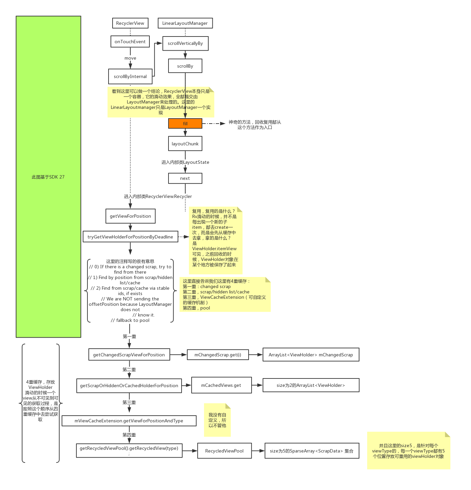
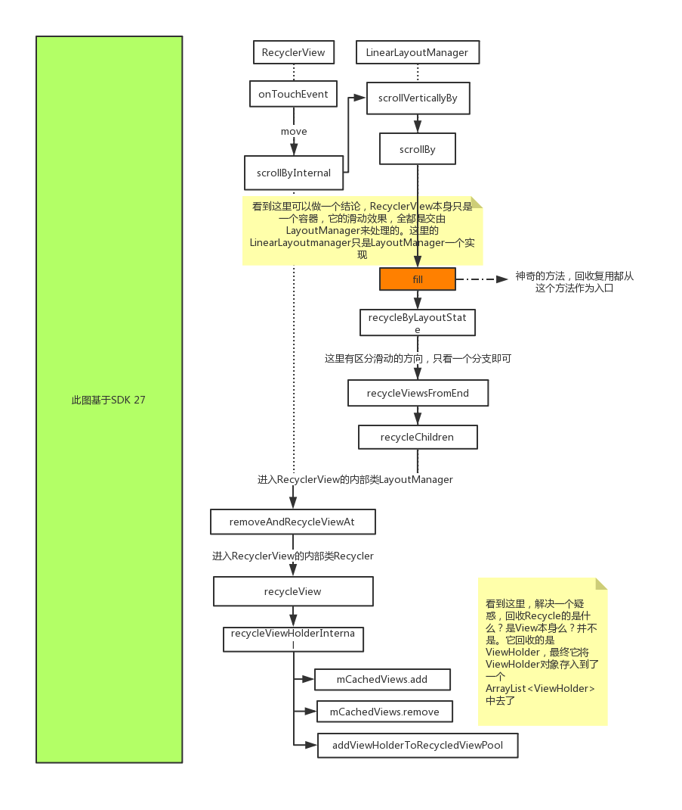

我们都知道，RecyclerView具有回收复用的机制，那么我们对这个机制有足够了解了吗，在这里先提出几个问题：
- 回收什么？复用什么？
- 回收到哪里去？从哪里获得复用？
- 什么时候回收？什么时候复用？

既然是回收复用，那么静止中的RecyclerView就不存在这一操作，必然是在滑动的时候才会涉及。当我们在Adapter下面两个方法进行日志打印的时候，可以发现onCreateViewHolder方法打印到一定次数的时候，就不再打印了。那么是不是说明，回收复用的其实是ViewHolder对象呢？
```java
@Override
public CustomViewHolder onCreateViewHolder(ViewGroup parent, int viewType) {
    Log.e(TAG, "onCreateViewHolder: " + getItemCount());
    return new CustomViewHolder(view);
}

@Override
public void onBindViewHolder(CustomViewHolder holder, int position) {
    Log.e(TAG, "onBindViewHolder: " + position);
}
```
#### 复用机制
那么我们该如何去探究RecyclerView的回收复用机制，既然当滑动的时候才会有回收复用的说法，我们可以从MOVE事件开始着手。查看onTouchEvent()的ACTION_MOVE事件，这里调用了RecyclerView的scrollByInternal方法：
```java
 boolean scrollByInternal(int x, int y, MotionEvent ev) {
        // ...
        if (mAdapter != null) {
            mReusableIntPair[0] = 0;
            mReusableIntPair[1] = 0;
            scrollStep(x, y, mReusableIntPair);
            consumedX = mReusableIntPair[0];
            consumedY = mReusableIntPair[1];
            unconsumedX = x - consumedX;
            unconsumedY = y - consumedY;
        }
        // 代码省略...

        return consumedNestedScroll || consumedX != 0 || consumedY != 0;
    }
```
在这里会根据scrollStep()的结果，得到x、y方向的消费值，最后返回事件消费的结果。我们来进一步看一下这个方法：
```java
void scrollStep(int dx, int dy, @Nullable int[] consumed) {
        //...

        int consumedX = 0;
        int consumedY = 0;
        if (dx != 0) {
            consumedX = mLayout.scrollHorizontallyBy(dx, mRecycler, mState);
        }
        if (dy != 0) {
            consumedY = mLayout.scrollVerticallyBy(dy, mRecycler, mState);
        }

       //...

        if (consumed != null) {
            consumed[0] = consumedX;
            consumed[1] = consumedY;
        }
    }
```
这里的关键是，通过判断dx和dy，确定滑动的方向是水平的还是竖直的，并调用mLayout.scrollHorizontallyBy()或者mLayout.scrollVerticallyBy()，而这里的mLayout对象其实是LayoutManager的一个实例。

由于LayoutManager是抽象的，所以实现是由setLayoutManager传入的对象决定的，这里我们来看LinearLayoutManager中的实现，因为两个方法只是方向上的不同，所以我们只看scrollHorizontallyBy()就可以了。
```java
@Override
public int scrollHorizontallyBy(int dx, RecyclerView.Recycler recycler,
        RecyclerView.State state) {
    if (mOrientation == VERTICAL) {
        return 0;
    }
    return scrollBy(dx, recycler, state);
}
```
首先判断方向是否为垂直，如果是则返回，否则调用scrollBy()
```java
int scrollBy(int delta, RecyclerView.Recycler recycler, RecyclerView.State state) {
    if (getChildCount() == 0 || delta == 0) {
        return 0;
    }
    ensureLayoutState();
    mLayoutState.mRecycle = true;
    final int layoutDirection = delta > 0 ? LayoutState.LAYOUT_END : LayoutState.LAYOUT_START;
    final int absDelta = Math.abs(delta);
    updateLayoutState(layoutDirection, absDelta, true, state);
    final int consumed = mLayoutState.mScrollingOffset
            + fill(recycler, mLayoutState, state, false);
    if (consumed < 0) {
        if (DEBUG) {
            Log.d(TAG, "Don't have any more elements to scroll");
        }
        return 0;
    }
    final int scrolled = absDelta > consumed ? layoutDirection * consumed : delta;

    // ...
    return scrolled;
}
```
在scrollBy()方法中，通过layoutDirection、absDelta、consumed三个参数计算出scrolled并返回，而cousumed由mLayoutState.mScrollingOffset和fill()方法的返回值计算而来。

fill()方法通过layoutState来填充layout，核心就是一个while循环，其中关键代码就是layoutChunk方法，每执行一次就会添加一个itemview到布局中。
```java
// fill填充方法， 返回的是填充ItemView需要的像素，以便拿去做滚动
int fill(RecyclerView.Recycler recycler, LayoutState layoutState,
        RecyclerView.State state, boolean stopOnFocusable) {
    // 填充起始位置
    final int start = layoutState.mAvailable;
    if (layoutState.mScrollingOffset != LayoutState.SCROLLING_OFFSET_NaN) {
        //如果有滚动就执行一次回收
        recycleByLayoutState(recycler, layoutState);
    }
    // 计算剩余可用的填充空间
    int remainingSpace = layoutState.mAvailable + layoutState.mExtra;
    // 用于记录每一次while循环的填充结果
    LayoutChunkResult layoutChunkResult = mLayoutChunkResult;

    while ((layoutState.mInfinite || remainingSpace > 0) && layoutState.hasMore(state)) {
        layoutChunkResult.resetInternal();

        layoutChunk(recycler, state, layoutState, layoutChunkResult);
        // ...
    }

    // ...略

    // 填充完成后修改起始位置
    return start - layoutState.mAvailable;
}
```
在layoutChunk方法中，共分为创建、填充、测量、布局4个步骤
1. layoutState.next(recycler) 方法从一二级缓存中获取或者是创建一个ItemView。
2. addView方法加入一个ItemView到ViewGroup中。
3. measureChildWithMargins方法测量一个ItemView。
4. layoutDecoratedWithMargins方法布局一个ItemView。布局之前会计算好一个ItemView的left, top, right, bottom位置。
```java
void layoutChunk(RecyclerView.Recycler recycler, RecyclerView.State state,
            LayoutState layoutState, LayoutChunkResult result) {
    // 从缓存中获取或者创建爱你一个itemView
    View view = layoutState.next(recycler);
    if (view == null) {
        if (DEBUG && layoutState.mScrapList == null) {
            throw new RuntimeException("received null view when unexpected");
        }

        result.mFinished = true;
        return;
    }
    RecyclerView.LayoutParams params = (RecyclerView.LayoutParams) view.getLayoutParams();
    // addview 到ViewGroup中
    if (layoutState.mScrapList == null) {
        if (mShouldReverseLayout == (layoutState.mLayoutDirection
                == LayoutState.LAYOUT_START)) {
            addView(view);
        } else {
            addView(view, 0);
        }
    } else {
        if (mShouldReverseLayout == (layoutState.mLayoutDirection
                == LayoutState.LAYOUT_START)) {
            addDisappearingView(view);
        } else {
            addDisappearingView(view, 0);
        }
    }
    //测量itemview
    measureChildWithMargins(view, 0, 0);
    result.mConsumed = mOrientationHelper.getDecoratedMeasurement(view);
    int left, top, right, bottom;
    if (mOrientation == VERTICAL) {
        if (isLayoutRTL()) {
            right = getWidth() - getPaddingRight();
            left = right - mOrientationHelper.getDecoratedMeasurementInOther(view);
        } else {
            left = getPaddingLeft();
            right = left + mOrientationHelper.getDecoratedMeasurementInOther(view);
        }
        if (layoutState.mLayoutDirection == LayoutState.LAYOUT_START) {
            bottom = layoutState.mOffset;
            top = layoutState.mOffset - result.mConsumed;
        } else {
            top = layoutState.mOffset;
            bottom = layoutState.mOffset + result.mConsumed;
        }
    } else {
        top = getPaddingTop();
        bottom = top + mOrientationHelper.getDecoratedMeasurementInOther(view);

        if (layoutState.mLayoutDirection == LayoutState.LAYOUT_START) {
            right = layoutState.mOffset;
            left = layoutState.mOffset - result.mConsumed;
        } else {
            left = layoutState.mOffset;
            right = layoutState.mOffset + result.mConsumed;
        }
    }
    // 布局一个ItemView
    layoutDecoratedWithMargins(view, left, top, right, bottom);

}
```
而回收复用机制就涉及到view的创建，因此我们接下来看next()方法是如何执行的。
```java
View next(RecyclerView.Recycler recycler) {
    if (mScrapList != null) {
        return nextViewFromScrapList();
    }
    final View view = recycler.getViewForPosition(mCurrentPosition);
    mCurrentPosition += mItemDirection;
    return view;
}
```
首先判断mScrapList是否为空，如果不为空则直接从ScrapList列表中返回下一个。否则从recycler.getViewForPosition()中去获取view。最终调用到tryGetViewHolderForPositionByDeadline()方法，该方法返回值为ViewHolder，并返回该对象的成员变量itemview。
```java
View getViewForPosition(int position, boolean dryRun) {
    return tryGetViewHolderForPositionByDeadline(position, dryRun, FOREVER_NS).itemView;
}
```

在tryGetViewHolderForPositionByDeadline()该方法中，会分几种情况去获取viewHolder，我们可以将之划分为四级缓存
1. getChangedScrapViewForPosition -- mChangeScrap 与动画相关
2. getScrapOrHiddenOrCachedHolderForPosition  -- mAttachedScrap 、mCachedViews
  getScrapOrCachedViewForId  -- mAttachedScrap 、mCachedViews (ViewType,itemid)
3. mViewCacheExtension.getViewForPositionAndType -- 自定义缓存
4. getRecycledViewPool().getRecycledView -- 从缓冲池里面获取

如果缓存为空，则会进入通过onCreateViewHolder方法创建新的ViewHolder。在这里，通过了一个多级缓存的机制提升了性能。
```java
ViewHolder tryGetViewHolderForPositionByDeadline(int position,
        boolean dryRun, long deadlineNs) {
    ViewHolder holder = null;

    // 0) 首先判断是否处于pre-layout状态中，如果是，则从mChangedScrap中获取
    if (mState.isPreLayout()) {
        holder = getChangedScrapViewForPosition(position);
        fromScrapOrHiddenOrCache = holder != null;
    }
    // 1) 如果上面不满足，则通过position从mAttachedScrap中获取
    //由于dryRun传入是false，如果从mAttachedScrap获取不到，则进一步从mCachedViews则获取
    if (holder == null) {
        holder = getScrapOrHiddenOrCachedHolderForPosition(position, dryRun);
        ...
    }

    if (holder == null) {
        final int offsetPosition = mAdapterHelper.findPositionOffset(position);
        final int type = mAdapter.getItemViewType(offsetPosition);
        // 2) 如果上面还是拿不到holder，则通过stable id从scrap 或者cache中获取
        if (mAdapter.hasStableIds()) {
            holder = getScrapOrCachedViewForId(mAdapter.getItemId(offsetPosition),
                    type, dryRun);
        }

        if (holder == null && mViewCacheExtension != null) {
            //3）通过自定义缓存来获取View
            final View view = mViewCacheExtension
                    .getViewForPositionAndType(this, position, type);
            if (view != null) {
                holder = getChildViewHolder(view);

            }
        }
        if (holder == null) { // fallback to pool
          // 4）从缓存池中获取
            holder = getRecycledViewPool().getRecycledView(type);
            ...
        }
        if (holder == null) {
            // 调用createViewHolder创建新的ViewHolder
            holder = mAdapter.createViewHolder(RecyclerView.this, type);
            ...
        }
    }
    boolean bound = false;
    //标记是否处于prelayout状态或者holder已被绑定
    if (mState.isPreLayout() && holder.isBound()) {
        // do not update unless we absolutely have to.
        holder.mPreLayoutPosition = position;
    } else if (!holder.isBound() || holder.needsUpdate() || holder.isInvalid()) {
        final int offsetPosition = mAdapterHelper.findPositionOffset(position);
        //然后调用bindViewHolder方法绑定holder
        bound = tryBindViewHolderByDeadline(holder, offsetPosition, position, deadlineNs);
    }

    //略...
    return holder;
}
```
我们来看一下缓冲池的数据结构，这里用了一个SparseArray类型（在这里简单看做是map）的变量mScrap，以viewType为键，ScrapData为值。而ScrapData中又有一个包裹ViewHolder类型的ArrayList变量mScrapHeap，这就是缓存池真正用来保存ViewHolder的地方。

当我们往里面put数据的时候，从putRecyclerdView方法可以看到，当`mMaxScrap <= scrapHeap.size()`的时候，就会直接返回，而mMaxScrap的值为5，说明每一个viewType有5个位置存放viewHolder。
```java
public static class RecycledViewPool {
    private static final int DEFAULT_MAX_SCRAP = 5;

    static class ScrapData {
        final ArrayList<ViewHolder> mScrapHeap = new ArrayList<>();
        int mMaxScrap = DEFAULT_MAX_SCRAP;
        long mCreateRunningAverageNs = 0;
        long mBindRunningAverageNs = 0;
    }

    SparseArray<ScrapData> mScrap = new SparseArray<>();


    public void putRecycledView(ViewHolder scrap) {
        final int viewType = scrap.getItemViewType();
        final ArrayList<ViewHolder> scrapHeap = getScrapDataForType(viewType).mScrapHeap;
        if (mScrap.get(viewType).mMaxScrap <= scrapHeap.size()) {
            return;
        }

        scrap.resetInternal();
        scrapHeap.add(scrap);
    }

    public ViewHolder getRecycledView(int viewType) {
        final ScrapData scrapData = mScrap.get(viewType);
        if (scrapData != null && !scrapData.mScrapHeap.isEmpty()) {
            final ArrayList<ViewHolder> scrapHeap = scrapData.mScrapHeap;
            for (int i = scrapHeap.size() - 1; i >= 0; i--) {
                if (!scrapHeap.get(i).isAttachedToTransitionOverlay()) {
                    return scrapHeap.remove(i);
                }
            }
        }
        return null;
      }
}
```
回到刚刚的代码，无论是从缓存获取还是新创建了ViewHolder，当没有被绑定的情况下，就会再调用tryBindViewHolderByDeadline()方法，并进一步调用mAdapter.bindViewHolder()。
```java
private boolean tryBindViewHolderByDeadline(@NonNull ViewHolder holder, int offsetPosition,
                int position, long deadlineNs) {
    holder.mOwnerRecyclerView = RecyclerView.this;

    if (deadlineNs != FOREVER_NS
            && !mRecyclerPool.willBindInTime(viewType, startBindNs, deadlineNs)) {
        // abort - we have a deadline we can't meet
        return false;
    }
    mAdapter.bindViewHolder(holder, offsetPosition);

    return true;
}
```
在bindViewHolder方法中最终会去调用onBindViewHolder()方法，这也是我们自定义ViewHolder中重写的方法，到这里，就完成了ItemView和ViewHolder的绑定。
```java
public final void bindViewHolder(@NonNull VH holder, int position) {
            holder.mPosition = position;
    // ...
    onBindViewHolder(holder, position, holder.getUnmodifiedPayloads());
    // ...
}

```
流程图如下：



#### 回收机制
到这里，复用的流程大概就是如此，接下来我们来看回收缓存的机制。

从上面的分析来看，ViewHolder的复用其实是使用了多级缓存，那么回收就是要看RecyclerView是怎么往缓存里面放数据的。我们前面分析LinearLayoutManager的fill()方法时，在while循环里面通过layoutChunk()方法去创建填充测量布局一个itemView，到这里就戛然而止了。我们继续看循环中的代码，有一句recycleByLayoutState()，这就是回收方法的关键入口。
```java
// fill填充方法， 返回的是填充ItemView需要的像素，以便拿去做滚动
int fill(RecyclerView.Recycler recycler, LayoutState layoutState,
        RecyclerView.State state, boolean stopOnFocusable) {
    // 填充起始位置
    final int start = layoutState.mAvailable;
    if (layoutState.mScrollingOffset != LayoutState.SCROLLING_OFFSET_NaN) {
        //如果有滚动就执行一次回收
        recycleByLayoutState(recycler, layoutState);
    }
    // 计算剩余可用的填充空间
    int remainingSpace = layoutState.mAvailable + layoutState.mExtra;
    // 用于记录每一次while循环的填充结果
    LayoutChunkResult layoutChunkResult = mLayoutChunkResult;

    while ((layoutState.mInfinite || remainingSpace > 0) && layoutState.hasMore(state)) {
        layoutChunkResult.resetInternal();

        layoutChunk(recycler, state, layoutState, layoutChunkResult);

        if (layoutState.mScrollingOffset != LayoutState.SCROLLING_OFFSET_NaN) {
                layoutState.mScrollingOffset += layoutChunkResult.mConsumed;
            if (layoutState.mAvailable < 0) {
                layoutState.mScrollingOffset += layoutState.mAvailable;
            }
            //回收方法入口
            recycleByLayoutState(recycler, layoutState);
        }
    }

    // ...略

    // 填充完成后修改起始位置
    return start - layoutState.mAvailable;
}
```
在该方法中，根据滑动的方向进一步执行回收，这里我们选定一个方向查看recycleViewsFromEnd方法。
```java
private void recycleByLayoutState(RecyclerView.Recycler recycler, LayoutState layoutState) {
    if (!layoutState.mRecycle || layoutState.mInfinite) {
        return;
    }
    int scrollingOffset = layoutState.mScrollingOffset;
    int noRecycleSpace = layoutState.mNoRecycleSpace;
    if (layoutState.mLayoutDirection == LayoutState.LAYOUT_START) {
        recycleViewsFromEnd(recycler, scrollingOffset, noRecycleSpace);
    } else {
        recycleViewsFromStart(recycler, scrollingOffset, noRecycleSpace);
    }
}
```
然后对遍历每一个childView，并执行recycleChildren方法
```java
private void recycleViewsFromEnd(RecyclerView.Recycler recycler, int scrollingOffset,
            int noRecycleSpace) {
    final int childCount = getChildCount();
    if (scrollingOffset < 0) {
        return;
    }
    final int limit = mOrientationHelper.getEnd() - scrollingOffset + noRecycleSpace;
    for (int i = 0; i < childCount; i++) {
        View child = getChildAt(i);
        if (mOrientationHelper.getDecoratedStart(child) < limit
                || mOrientationHelper.getTransformedStartWithDecoration(child) < limit) {
            // stop here
            recycleChildren(recycler, 0, i);
            return;
        }
    }
}
```
回收处于startIndex和endIndex之间childview，循环执行removeAndRecycleViewAt()方法
```java
private void recycleChildren(RecyclerView.Recycler recycler, int startIndex, int endIndex) {
    if (startIndex == endIndex) {
        return;
    }
    if (endIndex > startIndex) {
        for (int i = endIndex - 1; i >= startIndex; i--) {
            removeAndRecycleViewAt(i, recycler);
        }
    } else {
        for (int i = startIndex; i > endIndex; i--) {
            removeAndRecycleViewAt(i, recycler);
        }
    }
}
```
在该方法中，首先会先从LayoutManager中移除该index的view，接着调用recycler.recycleView(view)
```java
 public void removeAndRecycleViewAt(int index, @NonNull Recycler recycler) {
    final View view = getChildAt(index);
    removeViewAt(index);
    recycler.recycleView(view);
}
```
接着获取view绑定的viewHolder，调用recycleViewHolderInternal()方法
```java
public void recycleView(@NonNull View view) {

    ViewHolder holder = getChildViewHolderInt(view);
    // ...
    recycleViewHolderInternal(holder);

}
```
recycleViewHolderInternal()方法就是回收机制中核心代码的调用了，在该方法中可以看到回收的对象其实是ViewHolder。首先对状态进行校验，如果满足回收，首先判断cacheViewSize是否大于等于mViewCacheMax，如果是，则进入recycleCachedViewAt方法。

在该方法中，将mCachedViews中的列表头取出，通过addViewHolderToRecycledViewPool(viewHolder, true)将viewHolder添加到缓存池中，然后从mCachedViews中移除，相当于缓存池里面的数据都是从mCachedViews里面出来的。最后将回收的holder存入到mCachedViews中。

如果viewHolder处于改变状态，则不会进入，则直接添加到缓存池中。
```java
void recycleViewHolderInternal(ViewHolder holder) {

  //状态校验
  final boolean transientStatePreventsRecycling = holder
          .doesTransientStatePreventRecycling();
  final boolean forceRecycle = mAdapter != null
          && transientStatePreventsRecycling
          && mAdapter.onFailedToRecycleView(holder);
  boolean cached = false;
  boolean recycled = false;

  //进入回收
  if (forceRecycle || holder.isRecyclable()) {
      if (mViewCacheMax > 0
              && !holder.hasAnyOfTheFlags(ViewHolder.FLAG_INVALID
              | ViewHolder.FLAG_REMOVED
              | ViewHolder.FLAG_UPDATE
              | ViewHolder.FLAG_ADAPTER_POSITION_UNKNOWN)) {

          int cachedViewSize = mCachedViews.size();
          //如果cacheViewSize 大于等于 mViewCacheMax
          if (cachedViewSize >= mViewCacheMax && cachedViewSize > 0) {
              recycleCachedViewAt(0);
              cachedViewSize--;
          }

          int targetCacheIndex = cachedViewSize;
          //最后将回收的holder存入到mCachedViews中
          mCachedViews.add(targetCacheIndex, holder);
          cached = true;
      }
      //如果没有被缓存的话，则直接添加到缓存池中
      if (!cached) {
          addViewHolderToRecycledViewPool(holder, true);
          recycled = true;
      }
  }

  // 略...
}
```
流程图如下：




当然，上面我们所讲的只是去查找缓存和复用的一种情况，回收复用机制还有其他路径：
**复用：**
RecyclerView.onLayout --> dispatchLayout --> dispatchLayoutStep2 --> onLayoutChildren --> fill

**缓存：**
LinearLayoutManager.onLayoutChildren --> detachAndScrapAttachedViews --> scrapOrRecycleView
--> 1.recycler.recycleViewHolderInternal(viewHolder);
--> 2.recycler.scrapView(view);

这里我们再看一下scrapView这个方法，会将holder缓存到mAttachedScrap或者mChangedScrap中。
```java
void scrapView(View view) {
    final ViewHolder holder = getChildViewHolderInt(view);
    if (holder.hasAnyOfTheFlags(ViewHolder.FLAG_REMOVED | ViewHolder.FLAG_INVALID)
            || !holder.isUpdated() || canReuseUpdatedViewHolder(holder)) {

        holder.setScrapContainer(this, false);
        mAttachedScrap.add(holder);
    } else {
        if (mChangedScrap == null) {
            mChangedScrap = new ArrayList<ViewHolder>();
        }
        holder.setScrapContainer(this, true);
        mChangedScrap.add(holder);
    }
}
```
#### 总结

从源码来看，RecyclerView本身只是作为了一个`容器`，其itemView的排布方式都是通过`LayoutManager`去完成的，而回收复用机制又依赖于其`RecyclerView.Recycler`，回收复用的对象实际上是`ViewHolder`而不是itemview本身。

而且通过追踪源码，我们理解了自定义Adapter时，onCreatViewHolder和onBindViewHolder方法的调用时机，从而明白了重写这两个方法的意义所在。
