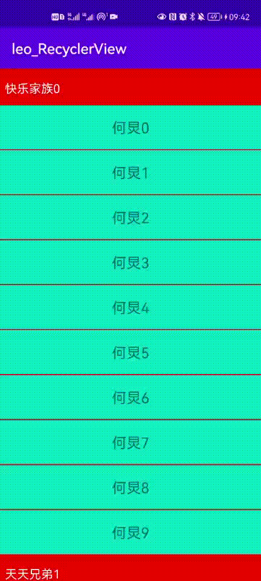
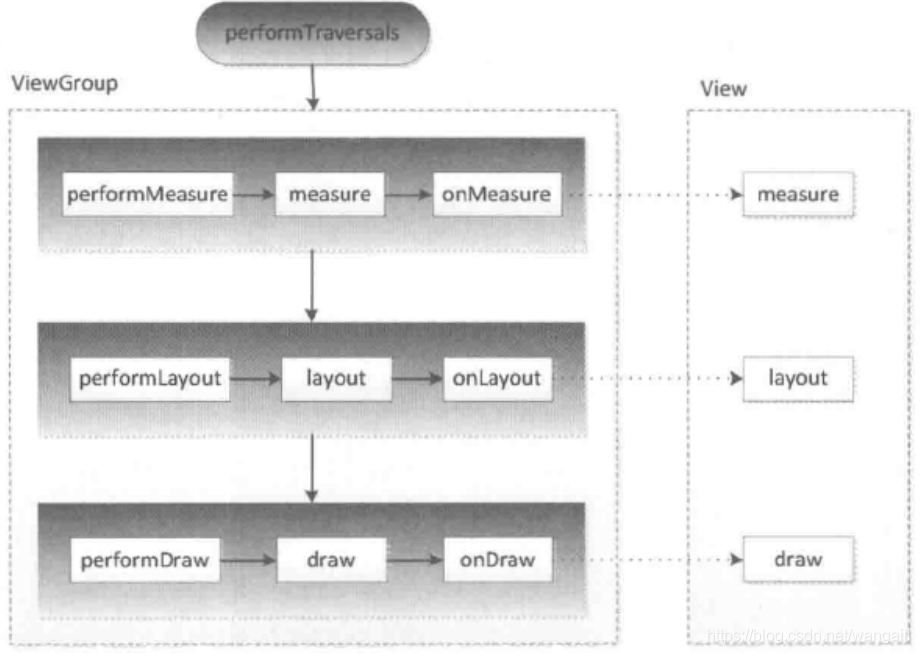

我们在开发中，经常会遇到RecyclerView实现分组和吸顶的需求，就如下图所示。



为了达到这样的效果，我们可以使用ItemDecoration来实现。ItemDecoration 允许应用给具体的View添加具体的图画或者layout的偏移，对于绘制View之间的分割线，视觉分组边界等等是非常有用的。

RecyclerView.ItemDecoration，该类为抽象类，官方目前只提供了一个实现类DividerItemDecoration。

```java
public abstract static class ItemDecoration {

        public void onDraw(@NonNull Canvas c, @NonNull RecyclerView parent, @NonNull State state) {
            onDraw(c, parent);
        }

        @Deprecated
        public void onDraw(@NonNull Canvas c, @NonNull RecyclerView parent) {
        }

        public void onDrawOver(@NonNull Canvas c, @NonNull RecyclerView parent,
                @NonNull State state) {
            onDrawOver(c, parent);
        }

        @Deprecated
        public void onDrawOver(@NonNull Canvas c, @NonNull RecyclerView parent) {
        }


        @Deprecated
        public void getItemOffsets(@NonNull Rect outRect, int itemPosition,
                @NonNull RecyclerView parent) {
            outRect.set(0, 0, 0, 0);
        }

        public void getItemOffsets(@NonNull Rect outRect, @NonNull View view,
                @NonNull RecyclerView parent, @NonNull State state) {
            getItemOffsets(outRect, ((LayoutParams) view.getLayoutParams()).getViewLayoutPosition(),
                    parent);
        }
    }
```
在ItemDecoration中，提供了onDraw、onDrawOver、getItemOffsets三个抽象方法。前两个方法均是进行绘制，但是也有不同。

**在官方文档在有指出，onDraw是在itemview绘制之前，onDrawOver是在itemview绘制之后。**
>All ItemDecorations are drawn in the order they were added, before the item views (in onDraw() and after the items (in onDrawOver(Canvas, RecyclerView, RecyclerView.State).

下面，从绘制流程来对此进行解释。

当我们调用addItemDecoration()方法添加decoration的时候，RecyclerView会将decoration对象保存在mItemDecorations列表里面，然后调用requestLayout()，请求重新布局。
```java
 public void addItemDecoration(@NonNull ItemDecoration decor, int index) {
    if (mLayout != null) {
        mLayout.assertNotInLayoutOrScroll("Cannot add item decoration during a scroll  or"
                + " layout");
    }
    if (mItemDecorations.isEmpty()) {
        setWillNotDraw(false);
    }
    if (index < 0) {
        mItemDecorations.add(decor);
    } else {
        mItemDecorations.add(index, decor);
    }
    markItemDecorInsetsDirty();
    requestLayout();
}
```
RecyclerView在requestLayout()中会继续调用super.requestLayout()，即View中的requestLayout()方法。
```java
public void requestLayout() {
    if (mMeasureCache != null) mMeasureCache.clear();

    if (mAttachInfo != null && mAttachInfo.mViewRequestingLayout == null) {
        // Only trigger request-during-layout logic if this is the view requesting it,
        // not the views in its parent hierarchy
        ViewRootImpl viewRoot = getViewRootImpl();
        if (viewRoot != null && viewRoot.isInLayout()) {
            if (!viewRoot.requestLayoutDuringLayout(this)) {
                return;
            }
        }
        mAttachInfo.mViewRequestingLayout = this;
    }

    mPrivateFlags |= PFLAG_FORCE_LAYOUT;
    mPrivateFlags |= PFLAG_INVALIDATED;

    if (mParent != null && !mParent.isLayoutRequested()) {
        mParent.requestLayout();
    }
    if (mAttachInfo != null && mAttachInfo.mViewRequestingLayout == this) {
        mAttachInfo.mViewRequestingLayout = null;
    }
}
```
在requestLayout方法中，首先先判断当前View树是否正在布局流程，接着为当前子View设置标记位，该标记位的作用就是标记了当前的View是需要进行重新布局的，接着调用mParent.requestLayout方法，这个十分重要，因为这里是向父容器请求布局，即调用父容器的requestLayout方法，为父容器添加PFLAG_FORCE_LAYOUT标记位，而父容器又会调用它的父容器的requestLayout方法，即requestLayout事件层层向上传递，直到DecorView，即根View，而根View又会传递给ViewRootImpl。

也即是说子View的requestLayout事件，最终会被ViewRootImpl接收并得到处理。纵观这个向上传递的流程，其实是采用了责任链模式，即不断向上传递该事件，直到找到能处理该事件的上级，在这里，只有ViewRootImpl能够处理requestLayout事件。

在ViewRootImpl中，又重写了requestLayout方法：
```java
@Override
public void requestLayout() {
    if (!mHandlingLayoutInLayoutRequest) {
        checkThread();
        mLayoutRequested = true;
        scheduleTraversals();
    }
}
```
scheduleTraversals()会异步执行TraversalRunnable()，最后调用到performTraversals()中，这也是View工作流程的核心方法，在这个方法内部，分别调用measure、layout、draw方法来进行View的三大工作流程。



回到RecyclerView，当调用到draw()，首先会先调用super.draw()，而后调用ItemDecoration.onDrawOver方法
```java
@Override
public void draw(Canvas c) {
    super.draw(c);
    ...
    final int count = mItemDecorations.size();
    for (int i = 0; i < count; i++) {
        mItemDecorations.get(i).onDrawOver(c, this, mState);
    }
    ...
}
```
在**View#draw**方法中，调用了onDraw(canvas)方法，而RecyclerView又重写了onDraw()方法
```java
@Override
public void onDraw(Canvas c) {
    super.onDraw(c);

    final int count = mItemDecorations.size();
    for (int i = 0; i < count; i++) {
        mItemDecorations.get(i).onDraw(c, this, mState);
    }
}
```
所以这就是为什么onDraw是在itemview绘制之前，onDrawOver是在itemview绘制之后。因此onDraw的内容会被itemView至遮挡，而itemview的内容又会被onDrawOver的内容遮挡。当我们懂得了这一点，那么实现我们文初的效果就有思路了。

首先我们需要判断每一组的头部，然后在getItemOffsets中，如果是头部则预留出头部的空间，否则预留出分割线的空间。在onDraw中，我们绘制移动的头部的分组和分割线，在onDrawOver中，绘制固定在顶端的头部。

具体代码如下:
```java

public class StarDecoration extends RecyclerView.ItemDecoration {

    private int groupHeaderHeight;

    private Paint headPaint;
    private Paint textPaint;

    private Rect textRect;

    public StarDecoration(Context context) {
        groupHeaderHeight = dp2px(context, 100);

        headPaint = new Paint();
        headPaint.setColor(Color.RED);

        textPaint = new Paint();
        textPaint.setTextSize(50);
        textPaint.setColor(Color.WHITE);

        textRect = new Rect();
    }

    @Override
    public void onDraw(@NonNull Canvas c, @NonNull RecyclerView parent, @NonNull RecyclerView.State state) {
        super.onDraw(c, parent, state);
        if (parent.getAdapter() instanceof StarAdapter) {
            StarAdapter adapter = (StarAdapter) parent.getAdapter();
            // 当前屏幕的item个数
            int count = parent.getChildCount();
            int left = parent.getPaddingLeft();
            int right = parent.getWidth() - parent.getPaddingRight();
            for (int i = 0; i < count; i++) {
                // 获取对应i的View
                View view = parent.getChildAt(i);
                // 获取View的布局位置
                int position = parent.getChildLayoutPosition(view);
                // 是否是头部
                boolean isGroupHeader = adapter.isGroupHeader(position);
                if (isGroupHeader && view.getTop() - groupHeaderHeight - parent.getPaddingTop() >= 0) {
                    c.drawRect(left, view.getTop() - groupHeaderHeight, right, view.getTop(), headPaint);
                    String groupName = adapter.getGroupName(position);
                    textPaint.getTextBounds(groupName, 0, groupName.length(), textRect);
                    c.drawText(groupName, left + 20, view.getTop() -
                            groupHeaderHeight / 2 + textRect.height() / 2, textPaint);
                } else if (view.getTop() - groupHeaderHeight - parent.getPaddingTop() >= 0) {
                    // 分割线
                    c.drawRect(left, view.getTop() - 4, right, view.getTop(), headPaint);
                }
            }
        }
    }

    @Override
    public void onDrawOver(@NonNull Canvas c, @NonNull RecyclerView parent, @NonNull RecyclerView.State state) {
        super.onDrawOver(c, parent, state);
        if (parent.getAdapter() instanceof StarAdapter) {
            StarAdapter adapter = (StarAdapter) parent.getAdapter();
            // 返回可见区域内的第一个item的position
            int position = ((LinearLayoutManager) parent.getLayoutManager()).findFirstVisibleItemPosition();
            // 获取对应position的View
            View itemView = parent.findViewHolderForAdapterPosition(position).itemView;
            int left = parent.getPaddingLeft();
            int right = parent.getWidth() - parent.getPaddingRight();
            int top = parent.getPaddingTop();
            // 当第二个是组的头部的时候
            boolean isGroupHeader = adapter.isGroupHeader(position + 1);
            if (isGroupHeader) {
                int bottom = Math.min(groupHeaderHeight, itemView.getBottom() - parent.getPaddingTop());

                c.drawRect(left, top, right, top + bottom, headPaint);
                c.clipRect(left, top, right, top + bottom);
                String groupName = adapter.getGroupName(position);
                textPaint.getTextBounds(groupName, 0, groupName.length(), textRect);
                c.drawText(groupName, left + 20, top + bottom
                        - groupHeaderHeight / 2 + textRect.height() / 2, textPaint);
            } else {
                c.drawRect(left, top, right, top + groupHeaderHeight, headPaint);
                String groupName = adapter.getGroupName(position);
                textPaint.getTextBounds(groupName, 0, groupName.length(), textRect);
                c.drawText(groupName, left + 20, top + groupHeaderHeight / 2 + textRect.height() / 2, textPaint);
            }

        }
    }

    @Override
    public void getItemOffsets(@NonNull Rect outRect, @NonNull View view, @NonNull RecyclerView parent, @NonNull RecyclerView.State state) {
        super.getItemOffsets(outRect, view, parent, state);

        if (parent.getAdapter() instanceof StarAdapter) {
            StarAdapter adapter = (StarAdapter) parent.getAdapter();
            int position = parent.getChildLayoutPosition(view);
            boolean isGroupHeader = adapter.isGroupHeader(position);
            // 怎么判断 itemView是头部
            if (isGroupHeader) {
                // 如果是头部，预留更大的地方
                outRect.set(0, groupHeaderHeight, 0, 0);
            } else {
                // 1像素
                outRect.set(0, 4, 0, 0);
            }
        }
    }

    private int dp2px(Context context, float dpValue) {
        float scale = context.getResources().getDisplayMetrics().density;
        return (int) (dpValue * scale * 0.5f);
    }
}

```
