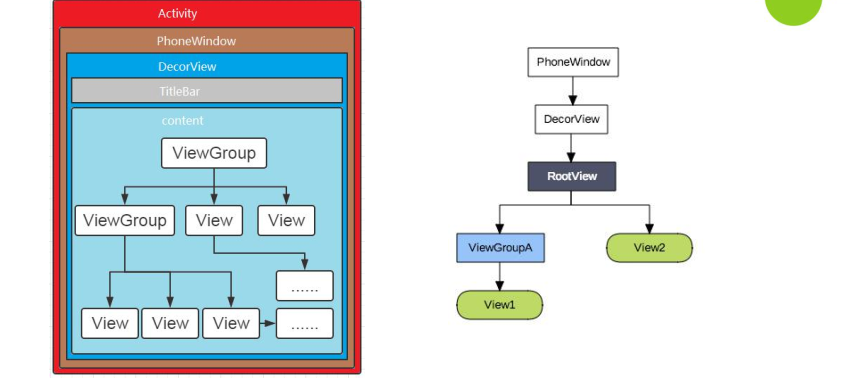

## 事件的种类和手势
在Android中，我们通过触摸屏幕与系统产生交互事件，根据面向对象思想，事件被封装成 MotionEvent 对象。而这又可以分为单点触摸和多点触摸。
#### 单点触摸
单点触摸就是只接受一个点的人机交互操作，基本流程为手指落下(ACTION_DOWN) －> 移动(ACTION_MOVE) －> 离开(ACTION_UP)
| 事件          | 简介                                    |
| ------------- | --------------------------------------- |
| ACTION_DOWN   | 手指初次接触到屏幕时触发              |
| ACTION_MOVE   | 手指在屏幕上滑动时触发，会会多次触发 |
| ACTION_UP     | 手指离开屏幕时触发                    |
| ACTION_CANCEL | 事件被上层拦截时触发                  |

### 多点触摸
多点触控 ( Multitouch， 也称 Multi-touch )， 即同时接受屏幕上多个点的人机交互操作， 多点触控是从 Android 2.0 开始引入的功能。
| 事件                | 简介                                             |
| ------------------- | ------------------------------------------------ |
| ACTION_DOWN         | 第一个手指初次接触到屏幕时触发                |
| ACTION_MOVE         | 手指在屏幕上滑动时触发，会多次触发            |
| ACTION_UP           | 最后一个手指离开屏幕时触发                    |
| ACTION_POINTER_DOWN | 有非主要的手指按下(即按下之前已经有手指在屏幕上) |
| ACTION_POINTER_UP   | 有非主要的手指抬起(即抬起之后仍然有手指在屏幕上) |

因为以上两种触控事件的存在，组合起来就形成了手势，其手指操作流程如下图：


从第一个手指按下，手势则开始，最后一个手指抬起则手势结束，中间其他手指操作则均为非必须的。组合起来就得到了不同的手势操作。
## View的体系结构
### view的体系结构
在Android中，最顶层的视图就是一个Activity，然后包裹着唯一的一个窗口PhoneWindow，而DecorView又是PhoneWindow唯一的子View，实际上是一个FrameLayout的布局。

ViewGroup是继承自View的，所有的Layout都是ViewGroup的子类，可以包裹其他View。因此，在Android中，View的体系是以树形结构存在的。



## 事件分发的框架


当我们通过触摸与系统产生交互的时候，会产生事件，对于事件来说有以下三种处理类型：
| 类型     | 相关方法              | Activity | ViewGroup | View |
| -------- | --------------------- | -------- | --------- | ---- |
| 事件分发 | dispatchTouchEvent    | √        | √         | √    |
| 事件拦截 | onInterceptTouchEvent | ×        | √         | ×    |
| 事件消费 | onTouchEvent          | √        | √ \|\| ×  | √    |


对事件的分发主要涉及三个对象，Activity,ViewGroup,具体的 View，这三个对象按分发的层次依次是Activity -> ViewGroup -> 具体的 View 。而涉及分发的方法同样主要有三个：
- dispatchTouchEvent 对一个事件进行分发，可能是分发给下一层处理，或者分发给自己。
-  onInterceptTouchEvent 这个方法只有ViewGroup 有，用来判断对事件是否进行拦截，如果拦截就不会分发给下一层.
- onTouchEvent 对事件进行处理，消耗或者不消耗，不消耗就会返回给上层。对于 ViewGroup和View这个方法还受到 OnTouchListener 和 enable 属性的影响，

### Activity对事件的处理
```java
public boolean dispatchTouchEvent(MotionEvent ev) {
      ...

      if (getWindow().superDispatchTouchEvent(ev)) {
          return true;
      }
      return onTouchEvent(ev);
  }
```
对于Activity来说，它对事件的处理很简单，首先通过调用getWindow().superDispatchTouchEvent(ev)，将事件分发给下层，包括View和ViewGroup，如果它们消费了事件，则直接返回true。否则调用自身的onTouchEvent()，由自己来处理。
```java
public boolean onTouchEvent(MotionEvent event) {
    if (mWindow.shouldCloseOnTouch(this, event)) {
        finish();
        return true;
    }

    return false;
}
```
如果该事件是在窗口边界之外的话，则返回true，否则返回false。
### View对事件的处理
这里先说 View 对事件的分发是因为 ViewGroup 继承自 View ,ViewGroup 对事件的分发会调用到父类（也就是View ）的方法，因此先理清 View 的分发有助于理解。


```java
public boolean dispatchTouchEvent(MotionEvent event) {
      ...
      //noinspection SimplifiableIfStatement
      ListenerInfo li = mListenerInfo;
      if (li != null && li.mOnTouchListener != null
              && (mViewFlags & ENABLED_MASK) == ENABLED
              && li.mOnTouchListener.onTouch(this, event)) {
          result = true;
      }

      if (!result && onTouchEvent(event)) {
          result = true;
      }
      ...
      return result;
```
可以看到，首先会检查mOnTouchListener!=null和view的状态是否为ENABLED两个条件是否成立，如果成立的话，则会调用listener的onTouch()方法，且onTouch()返回了 true ，这个事件就会被消费。

否则，则调用自身的onTouchEvent()来处理。
```java
public boolean onTouchEvent(MotionEvent event) {
        ...

        final boolean clickable = ((viewFlags & CLICKABLE) == CLICKABLE
                || (viewFlags & LONG_CLICKABLE) == LONG_CLICKABLE)
                || (viewFlags & CONTEXT_CLICKABLE) == CONTEXT_CLICKABLE;

        if ((viewFlags & ENABLED_MASK) == DISABLED) {
            return clickable;
        }


        if (clickable || (viewFlags & TOOLTIP) == TOOLTIP) {
            switch (action) {
                case MotionEvent.ACTION_UP:
                    if (mPerformClick == null) {
                          mPerformClick = new PerformClick();
                    }
                    if (!post(mPerformClick)) {
                        performClickInternal();
                    }
                    ...
                    break;

                case MotionEvent.ACTION_DOWN:
                    ...
                    break;

                case MotionEvent.ACTION_CANCEL:
                    ...
                    break;

                case MotionEvent.ACTION_MOVE:
                    ...

                    break;
            }

            return true;
        }

        return false;
    }
```
在View的onTouchEvent()方法中，会判断其是否可以点击，clickable或者longClickable,contextClickable，如果可以点击，则调用PerformClick()方法，并返回true表示消费事件，否则返回false。
### ViewGroup对事件的处理
最后我们来看ViewGroup对事件的处理，它对事件的分发同样是从``dispatchTouchEvent()``开始的，不同的是多了一个``onInterceptTouchEvent()``的拦截处理，它的派发流程大致分为三个部分：
1. 派发前准备
2. 派发目标查找
3. 执行派发

在看该段代码之前，我们先TouchTarget这个重要的类进行了解。
#### TouchTarget
TouchTarget的作用场景在事件派发流程中，用于记录派发目标，即消费了事件的子view。在ViewGroup中有一个成员变量mFirstTouchTarget，它会持有TouchTarget，并且作为TouchTarget链表的头节点。.
```java
private static final class TouchTarget {
    // ···
    @UnsupportedAppUsage
    private TouchTarget mFirstTouchTarget;

    // The touched child view.
    @UnsupportedAppUsage
    public View child;

    // The combined bit mask of pointer ids for all pointers captured by the target.
    public int pointerIdBits;

    // The next target in the target list.
    public TouchTarget next;

}
```
- **mFirstTouchTarget**，它会持有TouchTarget，并且作为TouchTarget链表的头节点。
- child：消费事件的子view
- pointerIdBits：child接收的触摸点的ID集合
- next：指向链表下一个节点

TouchTarget保存了响应触摸事件的子view和该子view上的触摸点ID集合，表示一个触摸事件派发目标。通过next成员可以看出，它支持作为一个链表节点储存。

**触摸点ID存储**
成员pointerIdBits用于存储多点触摸的这些触摸点的ID。pointerIdBits为int型，有32bit位，每一bit位可以表示一个触摸点ID，最多可存储32个触摸点ID。

pointerIdBits是如何做到在bit位上存储ID呢？假设触摸点ID取值为x（x的范围可从0～31），存储时先将1左移x位，然后pointerIdBits与之执行|=操作，从而设置到pointerIdBits的对应bit位上。

pointerIdBits的存在意义是记录TouchTarget接收的触摸点ID，在这个TouchTarget上可能只落下一个触摸点，也可能同时落下多个。当所有触摸点都离开时，pointerIdBits就已被清0，那么TouchTarget自身也将被从mFirstTouchTarget中移除。

**对象获取和回收**
TouchTarget的构造函数为私有，不允许直接创建。因为应用在使用过程中会涉及到大量的TouchTarget创建和销毁，因此TouchTarget封装了一个对象缓存池，通过TouchTarget.obtain方法获取，TouchTarget.recycle方法回收。

#### 分发前准备
在ViewGroup进行事件分发前，会进行一系列的安全校验。
```java
public boolean dispatchTouchEvent(MotionEvent ev) {
    // ···

    // 标记ViewGroup或child是否有消费该事件
    boolean handled = false;
    // onFilterTouchEventForSecurity中会进行安全校验，判断当前窗口被部分遮蔽的情况下是否仍然派发事件。
    if (onFilterTouchEventForSecurity(ev)) {
            // 获取事件类型。action的值高8位会包含该事件触摸点索引信息，actionMasked为干净的事件类型，
            // 在单点触摸情况下action和actionMasked无差别。
            final int action = ev.getAction();
            final int actionMasked = action & MotionEvent.ACTION_MASK;

            // Handle an initial down.
            if (actionMasked == MotionEvent.ACTION_DOWN) {
                // ACTION_DOWN表示一次全新的事件序列开始，那么清除旧的
                // TouchTarget（正常情况下TouchTarget在上一轮事件序列结束时会清
                // 空，若此时仍存在，则需要先给这些TouchTarget派发ACTION_CANCEL事
                // 件，然后再清除），重置触摸滚动等相关的状态和标识位。

                // Throw away all previous state when starting a new touch gesture.
                // The framework may have dropped the up or cancel event for the previous gesture
                // due to an app switch, ANR, or some other state change.
                cancelAndClearTouchTargets(ev);
                resetTouchState();
            }

            // Check for interception.
            // 标记ViewGroup是否拦截该事件（全新事件序列开始时判断）。
            final boolean intercepted;
            if (actionMasked == MotionEvent.ACTION_DOWN
                    || mFirstTouchTarget != null) {
                // 判断child是否抢先调用了requestDisallowInterceptTouchEvent方法
                final boolean disallowIntercept = (mGroupFlags & FLAG_DISALLOW_INTERCEPT) != 0;
                if (!disallowIntercept) {
                    // 再通过onInterceptTouchEvent方法判断（子类可重写）
                    intercepted = onInterceptTouchEvent(ev);
                    ev.setAction(action); // restore action in case it was changed
                } else {
                    intercepted = false;
                }
            } else {
                // There are no touch targets and this action is not an initial down
                // so this view group continues to intercept touches.
                intercepted = true;
            }

            // If intercepted, start normal event dispatch. Also if there is already
            // a view that is handling the gesture, do normal event dispatch.
            if (intercepted || mFirstTouchTarget != null) {
                ev.setTargetAccessibilityFocus(false);
            }

            // Check for cancelation.
            // 标记是否派发ACTION_CANCEL事件
            final boolean canceled = resetCancelNextUpFlag(this)
                    || actionMasked == MotionEvent.ACTION_CANCEL;
    }

    // ···
}

```
在派发事件前，会先判断若当次ev是ACTION_DOWN，则对当前ViewGroup来说，表示是一次全新的事件序列开始，那么需要保证清空旧的TouchTarget链表，以保证接下来mFirstTouchTarget可以正确保存派发目标。

#### 分发目标查找

```java
public boolean dispatchTouchEvent(MotionEvent ev) {
    // ···

    // Update list of touch targets for pointer down, if needed.
    // split标记是否需要进行事件拆分
    final boolean split = (mGroupFlags & FLAG_SPLIT_MOTION_EVENTS) != 0;
    // newTouchTarget用于保存新的派发目标
    TouchTarget newTouchTarget = null;
    // 标记在目标查找过程中是否已经对newTouchTarget进行过派发
    boolean alreadyDispatchedToNewTouchTarget = false;
    // 只有当非cancele且不拦截的情况才进行目标查找，否则直接跳到执行派发步骤。如果是
    // 因为被拦截，那么还没有派发目标，则会由ViewGroup自己处理事件。
    if (!canceled && !intercepted) {

        // ···

        if (actionMasked == MotionEvent.ACTION_DOWN
                || (split && actionMasked == MotionEvent.ACTION_POINTER_DOWN)
                || actionMasked == MotionEvent.ACTION_HOVER_MOVE) {
            // 当ev为ACTION_DOWN或ACTION_POINTER_DOWN时，表示对于当前ViewGroup
            // 来说有一个新的事件序列开始，那么需要进行目标查找。（不考虑悬浮手势操作）
            final int actionIndex = ev.getActionIndex(); // always 0 for down
            // 通过触摸点索引取得触摸点ID，然后左移x位（x=ID值）
            final int idBitsToAssign = split ? 1 << ev.getPointerId(actionIndex)
                    : TouchTarget.ALL_POINTER_IDS;

            // Clean up earlier touch targets for this pointer id in case they
            // have become out of sync.
            // 遍历mFirstTouchTarget链表，进行清理。若有TouchTarget设置了此触摸点ID，
            // 则将其移除该ID，若移除后的TouchTarget已经没有触摸点ID了，那么接着移除
            // 这个TouchTarget。
            removePointersFromTouchTargets(idBitsToAssign);

            final int childrenCount = mChildrenCount;
            if (newTouchTarget == null && childrenCount != 0) {
                // 通过触摸点索引获取对应触摸点的位置
                final float x = ev.getX(actionIndex);
                final float y = ev.getY(actionIndex);
                // Find a child that can receive the event.
                // Scan children from front to back.
                final ArrayList<View> preorderedList = buildTouchDispatchChildList();
                final boolean customOrder = preorderedList == null
                        && isChildrenDrawingOrderEnabled();
                final View[] children = mChildren;
                // 逆序遍历子view，即先查询上面的
                for (int i = childrenCount - 1; i >= 0; i--) {
                    final int childIndex = getAndVerifyPreorderedIndex(
                            childrenCount, i, customOrder);
                    final View child = getAndVerifyPreorderedView(
                            preorderedList, children, childIndex);

                    // ···

                    // 判断该child能否接收触摸事件和点击位置是否命中child范围内。
                    if (!child.canReceivePointerEvents()
                            || !isTransformedTouchPointInView(x, y, child, null)) {
                        ev.setTargetAccessibilityFocus(false);
                        continue;
                    }

                    // 遍历mFirstTouchTarget链表，查找该child对应的TouchTarget。
                    // 如果之前已经有触摸点落于该child中且消费了事件，这次新的触摸点也落于该child中，
                    // 那么就会找到之前保存的TouchTarget。
                    newTouchTarget = getTouchTarget(child);
                    if (newTouchTarget != null) {
                        // Child is already receiving touch within its bounds.
                        // Give it the new pointer in addition to the ones it is handling.

                        // 派发目标已经存在，只要给TouchTarget的触摸点ID集合添加新的
                        // ID即可，然后退出子view遍历。
                        newTouchTarget.pointerIdBits |= idBitsToAssign;
                        break;
                    }

                    resetCancelNextUpFlag(child);
                    // dispatchTransformedTouchEvent方法中会将事件派发给child，
                    // 若child消费了事件，将返回true。
                    if (dispatchTransformedTouchEvent(ev, false, child, idBitsToAssign)) {
                        // Child wants to receive touch within its bounds.
                        mLastTouchDownTime = ev.getDownTime();
                        if (preorderedList != null) {
                            // childIndex points into presorted list, find original index
                            for (int j = 0; j < childrenCount; j++) {
                                if (children[childIndex] == mChildren[j]) {
                                    mLastTouchDownIndex = j;
                                    break;
                                }
                            }
                        } else {
                            mLastTouchDownIndex = childIndex;
                        }
                        mLastTouchDownX = ev.getX();
                        mLastTouchDownY = ev.getY();
                        // 为该child创建TouchTarget，添加到mFirstTouchTarget链表的头部，
                        // 并将其设置为新的头节点。
                        newTouchTarget = addTouchTarget(child, idBitsToAssign);
                        // 标记已经派发过事件
                        alreadyDispatchedToNewTouchTarget = true;
                        break;
                    }

                    // The accessibility focus didn't handle the event, so clear
                    // the flag and do a normal dispatch to all children.
                    ev.setTargetAccessibilityFocus(false);
                }
                if (preorderedList != null) preorderedList.clear();
            }
            // 子view遍历完毕

            // 检查是否找到派发目标
            if (newTouchTarget == null && mFirstTouchTarget != null) {
                // Did not find a child to receive the event.
                // Assign the pointer to the least recently added target.

                // 若没有找到派发目标（没有命中child或命中的child不消费），但是存在
                // 旧的TouchTarget，那么将该事件派发给最开始添加的那个TouchTarget，
                // 多点触摸情况下有可能这个事件是它想要的。
                newTouchTarget = mFirstTouchTarget;
                while (newTouchTarget.next != null) {
                    newTouchTarget = newTouchTarget.next;
                }
                newTouchTarget.pointerIdBits |= idBitsToAssign;
            }
        }
    }

    // ···
}

```

首先当次事件未cancel且未被拦截，然后必须是ACTION_DOWN或ACTION_POINTER_DOWN，即新的事件序列或子序列的开始，才会进行派发事件查找。

在查找过程中，会逆序遍历子view，先找到命中范围的child。若该child对应的TouchTarget已经在mFirstTouchTarget链表中，则意味着之前已经有触摸点落于该child且消费了事件，那么只需要给其添加触摸点ID，然后结束子view遍历；若没有找到对应的TouchTarget，说明对于该child是新的事件，那么通过dispatchTransformedTouchEvent方法，对其进行派发，若child消费事件，则创建TouchTarget添加至mFirstTouchTarget链表，并标记已经派发过事件。

**注意：这里先前存在TouchTarget的情况下不执行dispatchTransformedTouchEvent，是因为需要对当次事件进行事件拆分，对ACTION_POINTER_DOWN类型进行转化，所以留到后面执行派发阶段，再统一处理。**

当遍历完子view，若没有找到派发目标，但是mFirstTouchTarget链表不为空，则把最早添加的那个TouchTarget当作查找到的目标。

可见，对于ACTION_DOWN类型的事件来说，在派发目标查找阶段，就会进行一次事件派发。

#### 执行分发
```java
public boolean dispatchTouchEvent(MotionEvent ev) {
    // ···

    boolean handled = false;
    if (onFilterTouchEventForSecurity(ev)) {
        // ···

        // Dispatch to touch targets.
        if (mFirstTouchTarget == null) {
            // No touch targets so treat this as an ordinary view.
            // 若mFirstTouchTarget链表为空，说明没有派发目标，那么交由ViewGroup自己处理
            // （dispatchTransformedTouchEvent第三个参数传null，会调用ViewGroup自己的dispatchTouchEvent方法）
            handled = dispatchTransformedTouchEvent(ev, canceled, null,
                    TouchTarget.ALL_POINTER_IDS);
        } else {
            // Dispatch to touch targets, excluding the new touch target if we already
            // dispatched to it.  Cancel touch targets if necessary.
            TouchTarget predecessor = null;
            TouchTarget target = mFirstTouchTarget;
            // 遍历链表
            while (target != null) {
                final TouchTarget next = target.next;
                if (alreadyDispatchedToNewTouchTarget && target == newTouchTarget) {
                    // 若已经对newTouchTarget派发过事件，则标记消费该事件。
                    handled = true;
                } else {
                    final boolean cancelChild = resetCancelNextUpFlag(target.child)
                            || intercepted;
                    // 通过dispatchTransformedTouchEvent派发事件给child
                    if (dispatchTransformedTouchEvent(ev, cancelChild,
                            target.child, target.pointerIdBits)) {
                        // 若child消费了事件，则标记handled为true
                        handled = true;
                    }
                    if (cancelChild) {
                        // 若取消该child，则从链表中移除对应的TouchTarget，并将
                        // TouchTarget回收进对象缓存池。
                        if (predecessor == null) {
                            mFirstTouchTarget = next;
                        } else {
                            predecessor.next = next;
                        }
                        target.recycle();
                        target = next;
                        continue;
                    }
                }
                predecessor = target;
                target = next;
            }
        }

        // Update list of touch targets for pointer up or cancel, if needed.
        if (canceled
                || actionMasked == MotionEvent.ACTION_UP
                || actionMasked == MotionEvent.ACTION_HOVER_MOVE) {
            // 若是取消事件或事件序列结束，则清空TouchTarget链表，重置其他状态和标记位。
            resetTouchState();
        } else if (split && actionMasked == MotionEvent.ACTION_POINTER_UP) {
            // 若是某个触摸点的事件子序列结束，则从所有TouchTarget中移除该触摸点ID。
            // 若有TouchTarget移除ID后，ID为空，则再移除这个TouchTarget。
            final int actionIndex = ev.getActionIndex();
            final int idBitsToRemove = 1 << ev.getPointerId(actionIndex);
            removePointersFromTouchTargets(idBitsToRemove);
        }
    }

    if (!handled && mInputEventConsistencyVerifier != null) {
        mInputEventConsistencyVerifier.onUnhandledEvent(ev, 1);
    }
    return handled;
}

```

执行派发阶段，即是对TouchTarget链表进行派发。在前面查找派发目标过程中，会将TouchTarget保存在以mFirstTouchTarget作为头节点的链表中，因此，只需要遍历该链表进行派发即可。

**mFirstTouchTarget说明**

ViewGroup不用单个TouchTarget保存消费了事件的child，而是通过mFirstTouchTarget链表保存多个TouchTarget，是因为存在多点触摸情况下，需要将事件拆分后派发给不同的child。


假设childA、childB都能响应事件：

- 当触摸点1落于childA时，产生事件ACTION_DOWN，ViewGroup会为childA生成一个TouchTarget，后续滑动事件将派发给它。
- 当触摸点2落于childA时，产生ACTION_POINTER_DOWN事件，此时可以复用TouchTarget，并给它添加触摸点2的ID。
- 当触摸点3落于childB时，产生ACTION_POINTER_DOWN事件，ViewGroup会再生成一个TouchTarget，此时ViewGroup中有两个TouchTarget，后续产生滑动事件，将根据触摸点信息对事件进行拆分，之后再将拆分事件派发给对应的child。
