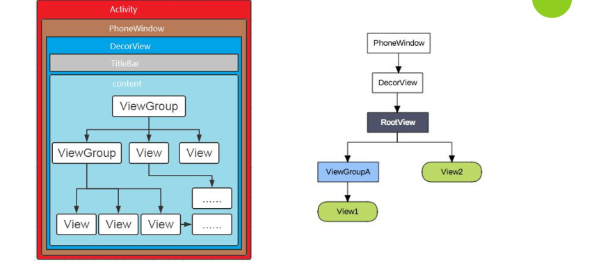

我们来看苏宁易购首页一个联动的效果：


下拉滑动之后导航栏会吸顶，这其实是一个嵌套滑动的实现。为了实现这样的效果，我们从以下几个方面去进行分析。
1. 事件的种类和手势
2. View的体系结构和事件分发的框架
3. View和ViewGroup的分发流程
4. 滑动冲突解决方案

## 事件的种类和手势
在Android中，我们通过触摸屏幕与系统产生交互事件，根据面向对象思想，事件被封装成 MotionEvent 对象。而这又可以分为单点触摸和多点触摸。
#### 单点触摸
单点触摸就是只接受一个点的人机交互操作，基本流程为手指落下(ACTION_DOWN) －> 移动(ACTION_MOVE) －> 离开(ACTION_UP)
| 事件          | 简介                                    |
| ------------- | --------------------------------------- |
| ACTION_DOWN   | 手指初次接触到屏幕时触发              |
| ACTION_MOVE   | 手指在屏幕上滑动时触发，会会多次触发 |
| ACTION_UP     | 手指离开屏幕时触发                    |
| ACTION_CANCEL | 事件被上层拦截时触发                  |

#### 多点触摸
多点触控 ( Multitouch， 也称 Multi-touch )， 即同时接受屏幕上多个点的人机交互操作， 多点触控是从 Android 2.0 开始引入的功能。
| 事件                | 简介                                             |
| ------------------- | ------------------------------------------------ |
| ACTION_DOWN         | 第一个手指初次接触到屏幕时触发                |
| ACTION_MOVE         | 手指在屏幕上滑动时触发，会多次触发            |
| ACTION_UP           | 最后一个手指离开屏幕时触发                    |
| ACTION_POINTER_DOWN | 有非主要的手指按下(即按下之前已经有手指在屏幕上) |
| ACTION_POINTER_UP   | 有非主要的手指抬起(即抬起之后仍然有手指在屏幕上) |

因为以上两种触控事件的存在，组合起来就形成了手势，其手指操作流程如下图：


从第一个手指按下，手势则开始，最后一个手指抬起则手势结束，中间其他手指操作则均为非必须的。组合起来就得到了不同的手势操作。
## View的体系结构和事件分发的框架
#### view的体系结构
在Android中，最顶层的视图就是一个Activity，然后包裹着唯一的一个窗口PhoneWindow，而DecorView又是PhoneWindow唯一的子View，实际上是一个FrameLayout的布局。

ViewGroup是继承自View的，所有的Layout都是ViewGroup的子类，可以包裹其他View。因此，在Android中，View的体系是以树形结构存在的。




#### 事件分发

当我们通过触摸与系统产生交互的时候，会产生事件，对于事件来说有以下三种处理类型：
| 类型     | 相关方法              | Activity | ViewGroup | View |
| -------- | --------------------- | -------- | --------- | ---- |
| 事件分发 | dispatchTouchEvent    | √        | √         | √    |
| 事件拦截 | onInterceptTouchEvent | ×        | √         | ×    |
| 事件消费 | onTouchEvent          | √        | √ \|\| ×  | √    |


对事件的分发主要涉及三个对象，Activity,ViewGroup,具体的 View，这三个对象按分发的层次依次是Activity -> ViewGroup -> 具体的 View 。而涉及分发的方法同样主要有三个：
- dispatchTouchEvent 对一个事件进行分发，可能是分发给下一层处理，或者分发给自己。
-  onInterceptTouchEvent 这个方法只有ViewGroup 有，用来判断对事件是否进行拦截，如果拦截就不会分发给下一层.
- onTouchEvent 对事件进行处理，消耗或者不消耗，不消耗就会返回给上层。对于 ViewGroup和View这个方法还受到 OnTouchListener 和 enable 属性的影响，

##### Activity对事件的处理
```java
public boolean dispatchTouchEvent(MotionEvent ev) {
      ...

      if (getWindow().superDispatchTouchEvent(ev)) {
          return true;
      }
      return onTouchEvent(ev);
  }
```
对于Activity来说，它对事件的处理很简单，首先通过调用getWindow().superDispatchTouchEvent(ev)，将事件分发给下层，包括View和ViewGroup，如果它们消费了事件，则直接返回true。否则调用自身的onTouchEvent()，由自己来处理。
```java
public boolean onTouchEvent(MotionEvent event) {
    if (mWindow.shouldCloseOnTouch(this, event)) {
        finish();
        return true;
    }

    return false;
}
```
如果该事件是在窗口边界之外的话，则返回true，否则返回false。
##### View对事件的处理
这里先说 View 对事件的分发是因为 ViewGroup 继承自 View ,ViewGroup 对事件的分发会调用到父类（也就是View ）的方法，因此先理清 View 的分发有助于理解。


```java
public boolean dispatchTouchEvent(MotionEvent event) {
      ...
      //noinspection SimplifiableIfStatement
      ListenerInfo li = mListenerInfo;
      if (li != null && li.mOnTouchListener != null
              && (mViewFlags & ENABLED_MASK) == ENABLED
              && li.mOnTouchListener.onTouch(this, event)) {
          result = true;
      }

      if (!result && onTouchEvent(event)) {
          result = true;
      }
      ...
      return result;
```

##### ViewGroup对事件的处理
```java
@Override
    public boolean dispatchTouchEvent(MotionEvent ev) {
        if (mInputEventConsistencyVerifier != null) {
            mInputEventConsistencyVerifier.onTouchEvent(ev, 1);
        }

        // If the event targets the accessibility focused view and this is it, start
        // normal event dispatch. Maybe a descendant is what will handle the click.
        if (ev.isTargetAccessibilityFocus() && isAccessibilityFocusedViewOrHost()) {
            ev.setTargetAccessibilityFocus(false);
        }

        boolean handled = false;
        if (onFilterTouchEventForSecurity(ev)) {
            final int action = ev.getAction();
            final int actionMasked = action & MotionEvent.ACTION_MASK;

            ...

            // 检查子view是否允许父view拦截事件
            final boolean intercepted;
            if (actionMasked == MotionEvent.ACTION_DOWN
                    || mFirstTouchTarget != null) {
                final boolean disallowIntercept = (mGroupFlags & FLAG_DISALLOW_INTERCEPT) != 0;
                if (!disallowIntercept) {
                  //如果不允许拦截
                    intercepted = onInterceptTouchEvent(ev);
                    ev.setAction(action); // restore action in case it was changed
                } else {
                    intercepted = false;
                }
            } else {
                // There are no touch targets and this action is not an initial down
                // so this view group continues to intercept touches.
                intercepted = true;
            }

            // If intercepted, start normal event dispatch. Also if there is already
            // a view that is handling the gesture, do normal event dispatch.
            if (intercepted || mFirstTouchTarget != null) {
                ev.setTargetAccessibilityFocus(false);
            }

            // Check for cancelation.
            final boolean canceled = resetCancelNextUpFlag(this)
                    || actionMasked == MotionEvent.ACTION_CANCEL;

            // Update list of touch targets for pointer down, if needed.
            final boolean split = (mGroupFlags & FLAG_SPLIT_MOTION_EVENTS) != 0;
            TouchTarget newTouchTarget = null;
            boolean alreadyDispatchedToNewTouchTarget = false;
            if (!canceled && !intercepted) {

                // If the event is targeting accessibility focus we give it to the
                // view that has accessibility focus and if it does not handle it
                // we clear the flag and dispatch the event to all children as usual.
                // We are looking up the accessibility focused host to avoid keeping
                // state since these events are very rare.
                View childWithAccessibilityFocus = ev.isTargetAccessibilityFocus()
                        ? findChildWithAccessibilityFocus() : null;

                if (actionMasked == MotionEvent.ACTION_DOWN
                        || (split && actionMasked == MotionEvent.ACTION_POINTER_DOWN)
                        || actionMasked == MotionEvent.ACTION_HOVER_MOVE) {
                    final int actionIndex = ev.getActionIndex(); // always 0 for down
                    final int idBitsToAssign = split ? 1 << ev.getPointerId(actionIndex)
                            : TouchTarget.ALL_POINTER_IDS;

                    // Clean up earlier touch targets for this pointer id in case they
                    // have become out of sync.
                    removePointersFromTouchTargets(idBitsToAssign);

                    final int childrenCount = mChildrenCount;
                    if (newTouchTarget == null && childrenCount != 0) {
                        final float x = ev.getX(actionIndex);
                        final float y = ev.getY(actionIndex);
                        // Find a child that can receive the event.
                        // Scan children from front to back.
                        final ArrayList<View> preorderedList = buildTouchDispatchChildList();
                        final boolean customOrder = preorderedList == null
                                && isChildrenDrawingOrderEnabled();
                        final View[] children = mChildren;
                        for (int i = childrenCount - 1; i >= 0; i--) {
                            final int childIndex = getAndVerifyPreorderedIndex(
                                    childrenCount, i, customOrder);
                            final View child = getAndVerifyPreorderedView(
                                    preorderedList, children, childIndex);

                            // If there is a view that has accessibility focus we want it
                            // to get the event first and if not handled we will perform a
                            // normal dispatch. We may do a double iteration but this is
                            // safer given the timeframe.
                            if (childWithAccessibilityFocus != null) {
                                if (childWithAccessibilityFocus != child) {
                                    continue;
                                }
                                childWithAccessibilityFocus = null;
                                i = childrenCount - 1;
                            }

                            if (!child.canReceivePointerEvents()
                                    || !isTransformedTouchPointInView(x, y, child, null)) {
                                ev.setTargetAccessibilityFocus(false);
                                continue;
                            }

                            newTouchTarget = getTouchTarget(child);
                            if (newTouchTarget != null) {
                                // Child is already receiving touch within its bounds.
                                // Give it the new pointer in addition to the ones it is handling.
                                newTouchTarget.pointerIdBits |= idBitsToAssign;
                                break;
                            }

                            resetCancelNextUpFlag(child);
                            if (dispatchTransformedTouchEvent(ev, false, child, idBitsToAssign)) {
                                // Child wants to receive touch within its bounds.
                                mLastTouchDownTime = ev.getDownTime();
                                if (preorderedList != null) {
                                    // childIndex points into presorted list, find original index
                                    for (int j = 0; j < childrenCount; j++) {
                                        if (children[childIndex] == mChildren[j]) {
                                            mLastTouchDownIndex = j;
                                            break;
                                        }
                                    }
                                } else {
                                    mLastTouchDownIndex = childIndex;
                                }
                                mLastTouchDownX = ev.getX();
                                mLastTouchDownY = ev.getY();
                                newTouchTarget = addTouchTarget(child, idBitsToAssign);
                                alreadyDispatchedToNewTouchTarget = true;
                                break;
                            }

                            // The accessibility focus didn't handle the event, so clear
                            // the flag and do a normal dispatch to all children.
                            ev.setTargetAccessibilityFocus(false);
                        }
                        if (preorderedList != null) preorderedList.clear();
                    }

                    if (newTouchTarget == null && mFirstTouchTarget != null) {
                        // Did not find a child to receive the event.
                        // Assign the pointer to the least recently added target.
                        newTouchTarget = mFirstTouchTarget;
                        while (newTouchTarget.next != null) {
                            newTouchTarget = newTouchTarget.next;
                        }
                        newTouchTarget.pointerIdBits |= idBitsToAssign;
                    }
                }
            }

            // Dispatch to touch targets.
            if (mFirstTouchTarget == null) {
                // No touch targets so treat this as an ordinary view.
                handled = dispatchTransformedTouchEvent(ev, canceled, null,
                        TouchTarget.ALL_POINTER_IDS);
            } else {
                // Dispatch to touch targets, excluding the new touch target if we already
                // dispatched to it.  Cancel touch targets if necessary.
                TouchTarget predecessor = null;
                TouchTarget target = mFirstTouchTarget;
                while (target != null) {
                    final TouchTarget next = target.next;
                    if (alreadyDispatchedToNewTouchTarget && target == newTouchTarget) {
                        handled = true;
                    } else {
                        final boolean cancelChild = resetCancelNextUpFlag(target.child)
                                || intercepted;
                        if (dispatchTransformedTouchEvent(ev, cancelChild,
                                target.child, target.pointerIdBits)) {
                            handled = true;
                        }
                        if (cancelChild) {
                            if (predecessor == null) {
                                mFirstTouchTarget = next;
                            } else {
                                predecessor.next = next;
                            }
                            target.recycle();
                            target = next;
                            continue;
                        }
                    }
                    predecessor = target;
                    target = next;
                }
            }

            // Update list of touch targets for pointer up or cancel, if needed.
            if (canceled
                    || actionMasked == MotionEvent.ACTION_UP
                    || actionMasked == MotionEvent.ACTION_HOVER_MOVE) {
                resetTouchState();
            } else if (split && actionMasked == MotionEvent.ACTION_POINTER_UP) {
                final int actionIndex = ev.getActionIndex();
                final int idBitsToRemove = 1 << ev.getPointerId(actionIndex);
                removePointersFromTouchTargets(idBitsToRemove);
            }
        }

        if (!handled && mInputEventConsistencyVerifier != null) {
            mInputEventConsistencyVerifier.onUnhandledEvent(ev, 1);
        }
        return handled;
    }
```
## View和ViewGroup的分发流程

## 滑动冲突解决方案
