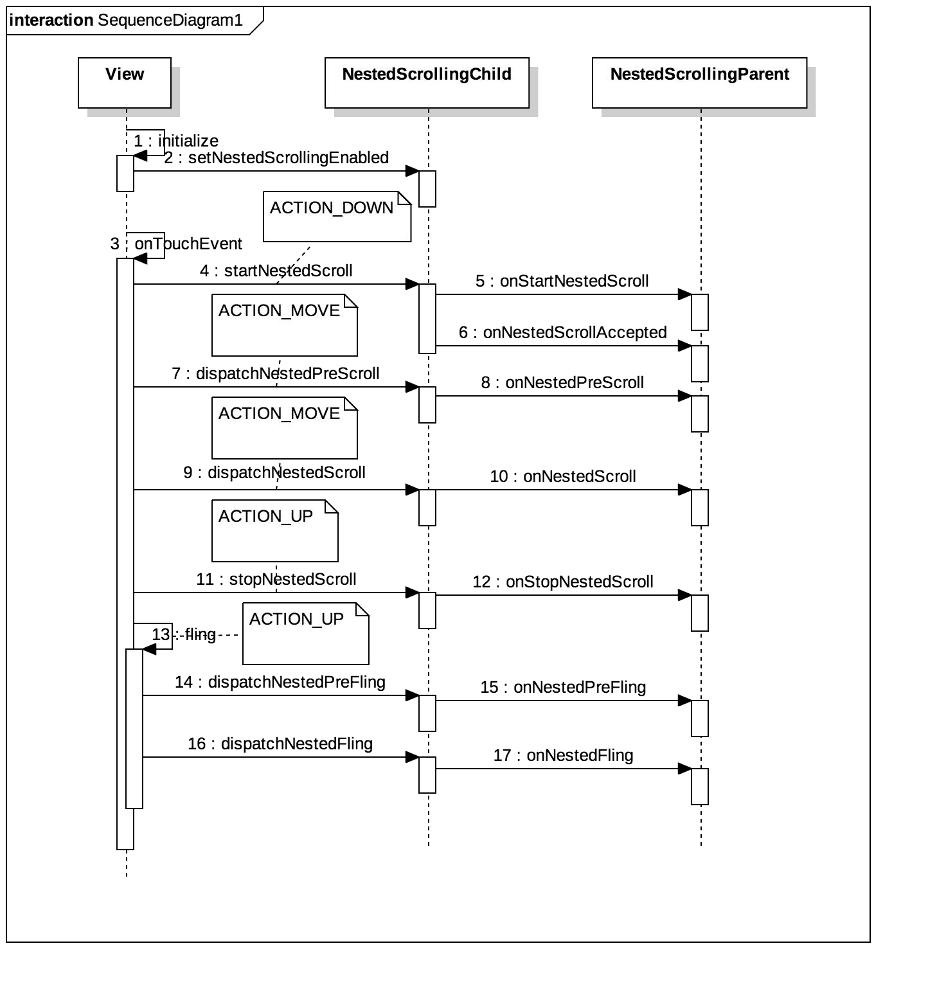

我们来看苏宁易购首页一个联动的效果：


上拉滑动之后导航栏会吸顶，这其实是一个嵌套滑动的实现。为了实现这样的效果，我们来分析一下他的布局。

从界面布局来看，我们可以大概得到以下的布局层次。最外层是一个swiperfreshLayout，然后包裹着scrollview，顶部我们可以看做是一个不能滑动的recyclerview，而底部则是由tablayout和viewpager组成，里面是包裹着recyclerview的fragment。


我们可以根据这个层次写出xml布局来

```java
<androidx.swiperefreshlayout.widget.SwipeRefreshLayout xmlns:android="http://schemas.android.com/apk/res/android"
    android:id="@+id/swipe_refresh_layout"
    android:layout_width="match_parent"
    android:layout_height="match_parent">

    <ScrollView
        android:layout_width="match_parent"
        android:layout_height="match_parent"
        android:orientation="vertical">

        <LinearLayout
            android:layout_width="match_parent"
            android:layout_height="match_parent"
            android:orientation="vertical">

            <com.xiangxue.common.views.xxrecyclerview.FixedDataScrollDisabledRecyclerView
                android:id="@+id/combo_top_view"
                android:layout_width="match_parent"
                android:layout_height="wrap_content" />

            <LinearLayout
                android:layout_width="match_parent"
                android:layout_height="match_parent"
                android:orientation="vertical">

                <com.google.android.material.tabs.TabLayout
                    android:id="@+id/tablayout"
                    android:layout_width="match_parent"
                    android:layout_height="wrap_content" />

                <androidx.viewpager2.widget.ViewPager2
                    android:id="@+id/viewpager_view"
                    android:layout_width="match_parent"
                    android:layout_height="match_parent" />
            </LinearLayout>
        </LinearLayout>
    </ScrollView>
</androidx.swiperefreshlayout.widget.SwipeRefreshLayout>

```
我们知道ScrollView只能有唯一的一个子View，但是当我们把这个xml布局写出来的时候，发现并不能达到我们想要的效果。滑动上方headerview的时候，还没到顶就无法滑动了，滑动下方viewpager中的recyclerview的时候，整个布局没有联动起来。

这时候，我们思考，当我们手指触摸滑动的时候，整个事件分发的流程是怎样的。由于同一个事件不能被两个view消费，当我们滑动recyclerview的时候，事件已经被它消费了，自然就不能将滑动事件再反馈。

在嵌套滑动中，有两个角色，一个是父亲，一个是孩子。我们可以看到recyclerview实现了嵌套滑动中孩子的接口。
```java
public class RecyclerView extends ViewGroup implements ScrollingView,
        NestedScrollingChild2, NestedScrollingChild3 {}
```
我们期望的父亲是scrollview，但是它并没有实现嵌套滑动中父亲的接口，因此它并不是父亲。
```java
public class ScrollView extends FrameLayout {}
```
如果我们将scrollview换成NestedScrollView能不能实现呢，它实现了NestedScrollingParent3接口。
```java
public class NestedScrollView extends FrameLayout implements NestedScrollingParent3,
        NestedScrollingChild3, ScrollingView {}
```
这时候，当我们滑动recyclerview的时候，scrollview已经可以跟着一起滑动起来了，但是问题来了，现在tablayout并不能达到吸顶的效果。为了达到吸顶的效果我们看下面的图，当viewpager中的recyclerview继续滑动的时候，只要让整块区域大小刚好与窗体大小一致，自然就能达到吸顶的效果了。


在嵌套滑动中，父亲与孩子的关联过程中，主动的对象必须是孩子，由孩子来带动父亲进行滑动。但现在仍存在一个问题，recyclerview开始滑动之后，并没有带动nestedscrollview一起滑动。这是为什么呢。

我们来看下面的嵌套滑动流程图，当recyclerview开始滑动的时候，会先通过setNestedScrollingEnabled 初始化，通知说滑动开始了，然后startNestedScroll 开始滑动。



recyclerview实现的NestedScrollingChild接口方法中，它都是通过getScrollingChildHelper这一个帮助类对象去处理滑动事件。

```java

    // NestedScrollingChild

    @Override
    public void setNestedScrollingEnabled(boolean enabled) {
        getScrollingChildHelper().setNestedScrollingEnabled(enabled);
    }

    @Override
    public boolean startNestedScroll(int axes) {
        return getScrollingChildHelper().startNestedScroll(axes);
    }

    ......
```

我们来看NestedScrollingChildHelper中的实现。首先检查有没有嵌套onNestedPreScroll滑动的父亲，如果没有，继续检查有没有开始嵌套滑动。然后通过遍历，向上寻找支持嵌套滑动的父类（可能是曾祖父）。

```java
public boolean startNestedScroll(@ScrollAxis int axes, @NestedScrollType int type) {
        if (hasNestedScrollingParent(type)) {
            // Already in progress
            return true;
        }
        if (isNestedScrollingEnabled()) {
            ViewParent p = mView.getParent();
            View child = mView;
            while (p != null) {
                if (ViewParentCompat.onStartNestedScroll(p, child, mView, axes, type)) {
                    setNestedScrollingParentForType(type, p);
                    ViewParentCompat.onNestedScrollAccepted(p, child, mView, axes, type);
                    return true;
                }
                if (p instanceof View) {
                    child = (View) p;
                }
                p = p.getParent();
            }
        }
        return false;
    }
```
在我们的布局中，第一个支持嵌套滑动的父类就是NestedScrollView，它会在onStartNestedScroll方法中判断是否支持嵌套滑动，并调用onNestedScrollAccepted接受嵌套事件。到这里，都是对ACTION_DOWN事件的处理。

接下来，当ACTION_MOVE事件发生，recyclerview会dispatchNestedPreScroll开始分发预滑动事件给父亲，紧接着会执行父亲的onNestedPreScroll方法。
```java
public boolean dispatchNestedPreScroll(int dx, int dy, @Nullable int[] consumed,
            @Nullable int[] offsetInWindow, @NestedScrollType int type) {
        if (isNestedScrollingEnabled()) {
            final ViewParent parent = getNestedScrollingParentForType(type);
            if (parent == null) {
                return false;
            }
            ...
            ViewParentCompat.onNestedPreScroll(parent, mView, dx, dy, consumed, type);
          }
    }
```
对于我们的例子来说，接受嵌套滑动的父亲是NestedScrollView，但同时，它又实现了NestedScrollingChild3的接口，所以在它的onNestedPreScroll实现中，它又把自己当做孩子询问它的嵌套滑动父亲能否滑动。
```java
@Override
public void onNestedPreScroll(@NonNull View target, int dx, int dy, @NonNull int[] consumed,
        int type) {
    dispatchNestedPreScroll(dx, dy, consumed, null, type);
}
```
为此，我们必须重写onNestedPreScroll函数，让它不再去调用dispatchNestedPreScroll函数，而是直接处理滑动嵌套的逻辑。
```java
@Override
public void onNestedPreScroll(@NonNull View target, int dx, int dy, @NonNull int[] consumed, int type) {
    Log.i("NestedScrollLayout", getScrollY()+"::onNestedPreScroll::"+topView.getMeasuredHeight());
    // 向上滑动。若当前topview可见，需要将topview滑动至不可见
    boolean hideTop = dy > 0 && getScrollY() < topView.getMeasuredHeight();
    if (hideTop) {
        scrollBy(0, dy);
        consumed[1] = dy;
    }
}
```
通过判断headerview的可见性与滑动方向，决定对事件是否消费。如果headerview可见，则滑动NestedScrollview，并消费该事件。

到这里嵌套滑动就已经完成了，但是与实际的效果相比，我们还少了惯性滑动的效果。在惯性滑动的效果里面，会根据拖拽的力度表现出不同的滑动距离，当自己滑动完之后，如果还有惯性在，则孩子会继续滑动。在NestedScrollView中，惯性滑动的部分叫做fling。

在fling函数中，我们可以记录下来滑动的速度，并通过FlingHelper工具类将速度转换成距离，这里涉及到的物理知识不再涉猎，仅提供方法。这样子，根据速度转换后的距离 - 自己滑动的距离 ，就可以得出孩子应该滑的距离。然后根据距离，又可以得出孩子的速度，并调用recyclerview.fling(velocityx, velocity)方法。
```java
 @Override
public void fling(int velocityY) {
    super.fling(velocityY);
    if (velocityY <= 0) {
        this.velocityY = 0;
    } else {
        isStartFling = true;
        this.velocityY = velocityY;
    }
}
```

惯性Helper类：
```java
public class FlingHelper {
    private static float DECELERATION_RATE = ((float) (Math.log(0.78d) / Math.log(0.9d)));
    private static float mFlingFriction = ViewConfiguration.getScrollFriction();
    private static float mPhysicalCoeff;

    public FlingHelper(Context context) {
        mPhysicalCoeff = context.getResources().getDisplayMetrics().density * 160.0f * 386.0878f * 0.84f;
    }


    private double getSplineDeceleration(int i) {
        return Math.log((double) ((0.35f * ((float) Math.abs(i))) / (mFlingFriction * mPhysicalCoeff)));
    }

    private double getSplineDecelerationByDistance(double d) {
        return ((((double) DECELERATION_RATE) - 1.0d) * Math.log(d / ((double) (mFlingFriction * mPhysicalCoeff)))) / ((double) DECELERATION_RATE);
    }

    public double getSplineFlingDistance(int i) {
        return Math.exp(getSplineDeceleration(i) * (((double) DECELERATION_RATE) / (((double) DECELERATION_RATE) - 1.0d))) * ((double) (mFlingFriction * mPhysicalCoeff));
    }

    public int getVelocityByDistance(double d) {
        return Math.abs((int) (((Math.exp(getSplineDecelerationByDistance(d)) * ((double) mFlingFriction)) * ((double) mPhysicalCoeff)) / 0.3499999940395355d));
    }
}

```

所以整个流程代码如下：
```java
package com.xiangxue.nestedscroll.e_perfect_nestedscroll;

import android.content.Context;
import android.util.AttributeSet;
import android.util.Log;
import android.view.View;
import android.view.ViewGroup;

import androidx.annotation.NonNull;
import androidx.annotation.Nullable;
import androidx.core.widget.NestedScrollView;
import androidx.recyclerview.widget.RecyclerView;

import com.xiangxue.common.fragment.NestedLogRecyclerView;
import com.xiangxue.common.utils.FlingHelper;

public class NestedScrollLayout extends NestedScrollView {
    private View topView;
    private ViewGroup contentView;
    private static final String TAG = "NestedScrollLayout";

    public NestedScrollLayout(Context context) {
        this(context, null);
        init();
    }

    public NestedScrollLayout(Context context, @Nullable AttributeSet attrs) {
        this(context, attrs, 0);
        init();
    }

    public NestedScrollLayout(Context context, @Nullable AttributeSet attrs, int defStyleAttr) {
        this(context, attrs, defStyleAttr, 0);
        init();
    }

    public NestedScrollLayout(Context context, AttributeSet attrs, int defStyleAttr, int defStyleRes) {
        super(context, attrs, defStyleAttr);
        init();
    }

    private FlingHelper mFlingHelper;

    int totalDy = 0;
    /**
     * 用于判断RecyclerView是否在fling
     */
    boolean isStartFling = false;
    /**
     * 记录当前滑动的y轴加速度
     */
    private int velocityY = 0;

    private void init() {
        mFlingHelper = new FlingHelper(getContext());
        setOnScrollChangeListener(new View.OnScrollChangeListener() {
            @Override
            public void onScrollChange(View v, int scrollX, int scrollY, int oldScrollX, int oldScrollY) {
                if (isStartFling) {
                    totalDy = 0;
                    isStartFling = false;
                }
                if (scrollY == 0) {
                    Log.i(TAG, "TOP SCROLL");
                   // refreshLayout.setEnabled(true);
                }
                if (scrollY == (getChildAt(0).getMeasuredHeight() - v.getMeasuredHeight())) {
                    Log.i(TAG, "BOTTOM SCROLL");
                    dispatchChildFling();
                }
                //在RecyclerView fling情况下，记录当前RecyclerView在y轴的偏移
                totalDy += scrollY - oldScrollY;
            }
        });
    }

    private void dispatchChildFling() {
        if (velocityY != 0) {
            Double splineFlingDistance = mFlingHelper.getSplineFlingDistance(velocityY);
            if (splineFlingDistance > totalDy) {
                childFling(mFlingHelper.getVelocityByDistance(splineFlingDistance - Double.valueOf(totalDy)));
            }
        }
        totalDy = 0;
        velocityY = 0;
    }

    private void childFling(int velY) {
        RecyclerView childRecyclerView = getChildRecyclerView(contentView);
        if (childRecyclerView != null) {
            childRecyclerView.fling(0, velY);
        }
    }

    @Override
    public void fling(int velocityY) {
        super.fling(velocityY);
        if (velocityY <= 0) {
            this.velocityY = 0;
        } else {
            isStartFling = true;
            this.velocityY = velocityY;
        }
    }

    @Override
    protected void onFinishInflate() {
        super.onFinishInflate();
        topView = ((ViewGroup) getChildAt(0)).getChildAt(0);
        contentView = (ViewGroup) ((ViewGroup) getChildAt(0)).getChildAt(1);
    }

    @Override
    protected void onMeasure(int widthMeasureSpec, int heightMeasureSpec) {
        // 调整contentView的高度为父容器高度，使之填充布局，避免父容器滚动后出现空白
        super.onMeasure(widthMeasureSpec, heightMeasureSpec);
        ViewGroup.LayoutParams lp = contentView.getLayoutParams();
        lp.height = getMeasuredHeight();
        contentView.setLayoutParams(lp);
    }

    @Override
    public void onNestedPreScroll(@NonNull View target, int dx, int dy, @NonNull int[] consumed, int type) {
        Log.i("NestedScrollLayout", getScrollY()+"::onNestedPreScroll::"+topView.getMeasuredHeight());
        // 向上滑动。若当前topview可见，需要将topview滑动至不可见
        boolean hideTop = dy > 0 && getScrollY() < topView.getMeasuredHeight();
        if (hideTop) {
            scrollBy(0, dy);
            consumed[1] = dy;
        }
    }

    private RecyclerView getChildRecyclerView(ViewGroup viewGroup) {
        for (int i = 0; i < viewGroup.getChildCount(); i++) {
            View view = viewGroup.getChildAt(i);
            if (view instanceof RecyclerView && view.getClass() == NestedLogRecyclerView.class) {
                return (RecyclerView) viewGroup.getChildAt(i);
            } else if (viewGroup.getChildAt(i) instanceof ViewGroup) {
                ViewGroup childRecyclerView = getChildRecyclerView((ViewGroup) viewGroup.getChildAt(i));
                if (childRecyclerView instanceof RecyclerView) {
                    return (RecyclerView) childRecyclerView;
                }
            }
            continue;
        }
        return null;
    }
}

```
