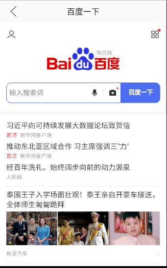
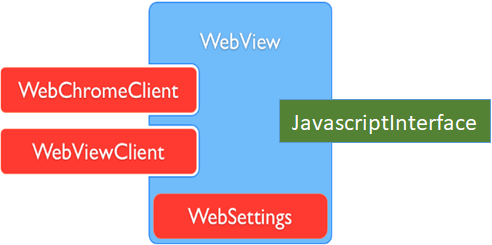

## 前言
WebView在我们的安卓开发过程中，是一个不可或缺的组件。通过WebView的使用，可以减少开发的流程，一套页面多个系统都可以使用，同时当我们的业务需求交互比较少，点击深度比较深的时候，使用WebView也可以提高App的性能，因此WebView的使用场景越来越广泛。

我们要实现的WebView应该是**高可靠的**，当webview出了问题不影响主进程，还是**可扩展的**，可以实现html页面与native的通信，同时是**模块化的**，以满足设计的重用。

## WebView 的简单使用
首先我们先来看一下WebView的简单使用，相信大家都或多或少使用过WebView组件用于加载H5页面。WebView是一个基于WebKit引擎、展现Web页面的控件，我们要使用它只需要简单的两步:
1. 在布局文件中添加WebView控件
2. 在代码中让WebView加载网页

以加载百度为例，我们来实现一个简单的WebView例子，使用一个WebViewActivity来统一管理WebView页面的加载。

layout_webview_activity布局文件：

```xml
<layout>
  <LinearLayout xmlns:android="http://schemas.android.com/apk/res/android"
          android:layout_width="match_parent"
          android:layout_height="match_parent"
          android:orientation="vertical">

          <WebView
              android:id="@+id/web_view"
              android:layout_width="match_parent"
              android:layout_height="0dp"
              android:layout_weight="1"/>
  </LinearLayout>
</layout>
```
然后是WebViewActivity的代码，在这里我们使用了DataBinding，具体使用可自己查阅：
```java
public class WebViewActivity extends AppCompatActivity {
    private ActivityWebviewBinding mBinding;

    @Override
    protected void onCreate(@Nullable Bundle savedInstanceState) {
        super.onCreate(savedInstanceState);
        mBinding = DataBindingUtil.setContentView(this, R.layout.activity_webview);
        mBinding.title.setText(getIntent().getStringExtra(Constants.TITLE));
        mBinding.actionBar.setVisibility(getIntent().getBooleanExtra(Constants.IS_SHOW_ACTION_BAR, true)? View.VISIBLE:View.GONE);
        mBinding.back.setOnClickListener(new View.OnClickListener() {
            @Override
            public void onClick(View v) {
                WebViewActivity.this.finish();
            }
        });
        mBinding.webView.setJavaScriptEnabled(true);
        mBinding.webView.loadUrl(getIntent().getSerializableExtra(Constants.URL));
    }

    public void updateTitle(String title){
        mBinding.title.setText(title);
    }

    public static void startWebViewActivity(Context context, String url, String title, boolean isShowActionBar) {
        if (context != null) {
            Intent intent = new Intent(context, WebViewActivity.class);
            intent.putExtra(Constants.TITLE, title);
            intent.putExtra(Constants.URL, url);
            intent.putExtra(Constants.IS_SHOW_ACTION_BAR, isShowActionBar);
            context.startActivity(intent);
        }
    }
}
```
最后在我们的MainActivity中，只需要这么调用就可以了。当然还需要在AndroidManifest.xml中添加一下    `<uses-permission android:name="android.permission.INTERNET"/>`网络权限
```java
public void switchToBaidu(){
    String url ="https://www.baidu.com";
    WebViewActivity.startWebViewActivity(this,url,"百度",true);
}
```
运行程序效果如下：



<!-- native
用户体验 数据安全  流量转化 -->

<!-- #### WebChromeClient

#### WebViewClient

#### WebSettings -->

可能在我们很多人的开发中，都是这样简单的去使用WebView控件，但是这样会带来不少问题。首先，我们要实现的是一个WebView的模块，所以在MainActivity中不应该直接调用webview.class去打开WebView。其次，我们现在不能满足在Fragment中打开WebView的需求，所以应该对页面进行重构。同时，由于WebView与主进程同在一个进程内，而WebView又会占用较多的内存，当内存不足的时候就容易产生崩溃，因此为了提高可靠性，可以考虑跨进程实现。


## 模块化
所谓模块化，就是解决一个复杂问题时自顶向下逐层把系统划分成若干模块的过程。在我们的代码实现中，就是把WebView的使用抽离成为webview模块。在Android中，实现模块化需要我们新建一个Module，并在build.gradle中声明为`apply plugin: 'com.android.library'`，在settings.gradle中添加引用`include ':webview'`。当然如果使用Android Studio的话，ide会帮我们完成这一系列工作。


### 模块的层次化
在我们的开发中，有一些基础的公共类，我们同样可以将其模块化，比如base模块就可以放一些公共的依赖和基础类，common模块可以放一些基础的接口。所有的业务模块都依赖common层，app被称为壳工程，它依赖所有的业务模块。这样模块之间就通过层次化避免了循环依赖。

**implementation**：该依赖方式所依赖的库不会传递，只会在当前module中生效。
**api**：该依赖方式会传递所依赖的库，当其他module依赖了该module时，可以使用该module下使用api依赖的库。
```java
implementation 'com.google.code.gson:gson:2.8.2' 相当于 private
api 'com.google.code.gson:gson:2.8.2' 相当于 public
```
### AutoService
AutoService是google提供的一款路由框架，组件化搭建的过程中需要模块间的通信功能，一般常用的是阿里的Arouter、CC等第三方库通信。相比于这两者，AutoService使用更方便，业务开发的过程中Bug更少，更加轻量化，实现了接口下沉，提供功能给组件用，且组件之间相互不依赖。

#### 添加依赖
```java
dependencies{
   api 'com.google.auto.service:auto-service:1.0-rc4'
}
```
#### 编写接口
相关的autoservice接口我们在common层编写。
```java
public interface Processor {
  void process();
}
```

#### 接口实现
在我们的模块中，要去实现Processor接口，并且添加@AutoService的注释
```java
@AutoService(Processor.class)
public ProcessorImpl implements Processor{

  @Override
  void process(){

  }
}
```
#### 调用接口
调用接口实现，需要通过ServiceLoader来加载实现了`@AutoService(Processor.class)`注解的类。
```java
ServiceLoader.load(Processor.class).iterator().next().process();
```
ServiceLoader实现了Iterable接口，所以load()调用之后实际上得到是迭代器的对象。通过`.iterator().next()`方法可以拿到所有同一个Class接口的实现类。

为了方法的重用，也为了避免每次都写重复代码，因此将`load()`封装在base层作为基础方法供调用。
```java
public class IServiceLoader {
    public IServiceLoader() {
    }

    public static <T> T load(Class<T> service) {
        try {
            return ServiceLoader.load(service).iterator().next();
        } catch (Exception e) {
            e.printStackTrace();
            return null;
        }
    }
}
```

## WebView 优化

### 页面重构
在前面我们说了，现在的WebView由于跟Activity绑定，不能作为一个Fragment交给别的Activity，可复用性不够高，因此我们应该将页面进行重构。为了实现下拉刷新，我们还引入了SmartRefreshLayout的框架
```java
api 'com.scwang.smartrefresh:SmartRefreshLayout:1.1.0-alpha-7'
```
Fragment布局如下：
```xml
<layout>
    <com.scwang.smartrefresh.layout.SmartRefreshLayout xmlns:android="http://schemas.android.com/apk/res/android"
        android:layout_width="match_parent"
        android:id="@+id/srl"
        android:layout_height="match_parent"
        android:orientation="vertical">

        <com.king.webview.webviewprocess.BaseWebView
            android:id="@+id/webview"
            android:layout_width="match_parent"
            android:layout_height="match_parent" />

    </com.scwang.smartrefresh.layout.SmartRefreshLayout>
</layout>

```
##### 基本配置

BaseWebView是基于WebView实现的自定义类，添加了一些基础的方法。包括WebViewSettings的配置，WebViewClient、WebChromeClient的配置。



| 类名        | 作用             | 常用方法                |
| ----------- | ---------------- | ----------------------- |
| WebSettings | 配置&管理WebView | 1. 缓存：setCacheMode()<br>2. 与JS交互 ：setJavaScriptEnable()<br> ......  |
|     WebViewClient        |          处理各种通知&请求事件        |       1. shouldOverrideLoading() : 打开网页时在WebView显示<br> 2. onPageStarted(): 载入页面调用<br>3. onPageFinished(): 页面加载结束调用<br> ......                 |
| WebChromeClient |辅助WebView处理JavaScript | 1. onProgressChanged(): 获取当前网页加载进度<br>2. onReceivedTitle(): 获取网页中的标题<br> 3. onJsAlert() :支持javascript的警告框<br>...... |

```java

public class BaseWebView extends WebView {
    private static final String TAG = "BaseWebView";
    private WebViewCallBack mCallback;

    public BaseWebView(@NonNull Context context) {
        super(context);
        init(context);
    }


    public BaseWebView(@NonNull Context context, @Nullable AttributeSet attrs) {
        super(context, attrs);
        init(context);
    }

    public BaseWebView(@NonNull Context context, @Nullable AttributeSet attrs, int defStyleAttr) {
        super(context, attrs, defStyleAttr);
        init(context);
    }


    private void init(Context context) {
        WebViewDefaultSettings.getInstance().setSettings(this);
        addJavascriptInterface(this, "webview");
        WebViewProcessCommandDispatcher.getInstance().initAidlConnection();
    }

    public void setWebViewCallBack(WebViewCallBack callBack) {
        this.mCallback = callBack;
        setWebViewClient(new MyWebViewClient(mCallback));
        setWebChromeClient(new MyWebChromeClient(mCallback));
    }

}
```

自定义WebChromeClient代码如下：
```java
public class MyWebChromeClient extends WebChromeClient {
    private final static String TAG = "MyWebChromeClient";
    private WebViewCallBack mCallback;

    public MyWebChromeClient(WebViewCallBack mCallback) {
        this.mCallback = mCallback;
    }


    /**
    *通过该回调可以获取到网页的标题，从而回调callback的相关方法。
    */
    @Override
    public void onReceivedTitle(WebView view, String title) {
        super.onReceivedTitle(view, title);
        if (mCallback != null) {
            mCallback.receivedTitle(title);
        }
    }

    /**
    *通过该方法可以过滤打印的日志，并将日志输出到logcat中
    */
    @Override
    public boolean onConsoleMessage(ConsoleMessage consoleMessage) {
        Log.d(TAG, consoleMessage.message());
        return super.onConsoleMessage(consoleMessage);
    }
}
```
自定义WebViewClient代码如下：这里我们实现了其中的三个方法，并通过callback进行回调。
```java
public class MyWebViewClient extends WebViewClient {
    private final WebViewCallBack mCallback;

    public MyWebViewClient(WebViewCallBack mCallback) {
        this.mCallback = mCallback;
    }


    @Override
    public void onPageStarted(WebView view, String url, Bitmap favicon) {
        super.onPageStarted(view, url, favicon);
        if (callBack != null) {
            mCallback.pageStarted(url);
        }
    }

    @Override
    public void onPageFinished(WebView view, String url) {
        super.onPageFinished(view, url);
        if (mCallback != null) {
            mCallback.pageFinished(url);
        }
    }

    @Override
    public void onReceivedError(WebView view, WebResourceRequest request, WebResourceError error) {
        super.onReceivedError(view, request, error);
        if (mCallback!=null){
            mCallback.receivedError();
        }
    }
}
```
然后是WebSettings的配置
```java
package com.xiangxue.webview.webviewprocess.settings;

import android.content.Context;
import android.net.ConnectivityManager;
import android.net.NetworkInfo;
import android.os.Build;
import android.util.Log;
import android.webkit.WebSettings;
import android.webkit.WebView;

import com.xiangxue.webview.BuildConfig;

public class WebViewDefaultSettings {
    private WebSettings mWebSettings;

    public static WebViewDefaultSettings getInstance(){
        return new WebViewDefaultSettings();
    }

    private WebViewDefaultSettings(){
    }

    private static boolean isNetworkConnected(Context context) {
        ConnectivityManager cm = (ConnectivityManager) context.getSystemService(Context.CONNECTIVITY_SERVICE);
        NetworkInfo networkInfo = cm.getActiveNetworkInfo();
        if (networkInfo != null) {
            boolean a = networkInfo.isConnected();
            return a;
        } else {
            return false;
        }
    }

    public void setSettings(WebView webView) {
        if (Build.VERSION.SDK_INT >= Build.VERSION_CODES.LOLLIPOP) {
            webView.enableSlowWholeDocumentDraw();
        }
        mWebSettings = webView.getSettings();
        mWebSettings.setJavaScriptEnabled(true);
        mWebSettings.setSupportZoom(true);
        mWebSettings.setBuiltInZoomControls(false);
        if (isNetworkConnected(webView.getContext())) {
            mWebSettings.setCacheMode(WebSettings.LOAD_DEFAULT);
        } else {
            mWebSettings.setCacheMode(WebSettings.LOAD_CACHE_ELSE_NETWORK);
        }

        if (Build.VERSION.SDK_INT >= Build.VERSION_CODES.LOLLIPOP) {
            mWebSettings.setMixedContentMode(WebSettings.MIXED_CONTENT_ALWAYS_ALLOW);
        }

        mWebSettings.setTextZoom(100);
        mWebSettings.setDatabaseEnabled(true);
        mWebSettings.setAppCacheEnabled(true);
        mWebSettings.setLoadsImagesAutomatically(true);
        mWebSettings.setSupportMultipleWindows(false);
        mWebSettings.setBlockNetworkImage(false);//是否阻塞加载网络图片  协议http or https
        mWebSettings.setAllowFileAccess(true); //允许加载本地文件html  file协议
        if (Build.VERSION.SDK_INT >= Build.VERSION_CODES.JELLY_BEAN) {
            mWebSettings.setAllowFileAccessFromFileURLs(false); //通过 file url 加载的 Javascript 读取其他的本地文件 .建议关闭
            mWebSettings.setAllowUniversalAccessFromFileURLs(false);//允许通过 file url 加载的 Javascript 可以访问其他的源，包括其他的文件和 http，https 等其他的源
        }
        mWebSettings.setJavaScriptCanOpenWindowsAutomatically(true);
        if (Build.VERSION.SDK_INT >= Build.VERSION_CODES.KITKAT) {

            mWebSettings.setLayoutAlgorithm(WebSettings.LayoutAlgorithm.SINGLE_COLUMN);
        } else {
            mWebSettings.setLayoutAlgorithm(WebSettings.LayoutAlgorithm.NORMAL);
        }
        mWebSettings.setSavePassword(false);
        mWebSettings.setSaveFormData(false);
        mWebSettings.setLoadWithOverviewMode(true);
        mWebSettings.setUseWideViewPort(true);
        mWebSettings.setDomStorageEnabled(true);
        mWebSettings.setNeedInitialFocus(true);
        mWebSettings.setDefaultTextEncodingName("utf-8");//设置编码格式
        mWebSettings.setDefaultFontSize(16);
        mWebSettings.setMinimumFontSize(10);//设置 WebView 支持的最小字体大小，默认为 8
        mWebSettings.setGeolocationEnabled(true);
        mWebSettings.setUseWideViewPort(true);

        String appCacheDir = webView.getContext().getDir("cache", Context.MODE_PRIVATE).getPath();
        Log.i("WebSetting", "WebView cache dir: " + appCacheDir);
        mWebSettings.setDatabasePath(appCacheDir);
        mWebSettings.setAppCachePath(appCacheDir);
        mWebSettings.setAppCacheMaxSize(1024*1024*80);

        if (Build.VERSION.SDK_INT >= Build.VERSION_CODES.KITKAT) {
            webView.setWebContentsDebuggingEnabled(BuildConfig.DEBUG);
        }
    }

}

```
##### WebViewFragment
接下来来看WebViewFragment的代码文件如下，实现了WebViewCallBack接口，并作为MyWebViewClient、MyWebChromeClient中方法的回调对象。
```java
public class WebViewFragment extends Fragment implements WebViewCallBack, OnRefreshListener {
    private FragmentWebviewBinding mBinding;
    private String mUrl;
    private boolean canRefresh;

    private WebViewFragment() {
    }

    public static WebViewFragment getInstance(String url, boolean canRefresh) {
        WebViewFragment fragment = new WebViewFragment();
        Bundle bundle = new Bundle();
        bundle.putString(Constants.BASE_URL, url);
        bundle.putBoolean(Constants.CAN_REFRESH, canRefresh);
        fragment.setArguments(bundle);
        return fragment;
    }

    @Override
    public void onCreate(@Nullable Bundle savedInstanceState) {
        super.onCreate(savedInstanceState);
        Bundle bundle = getArguments();
        if (bundle != null) {
            mUrl = bundle.getString(Constants.BASE_URL);
            canRefresh = bundle.getBoolean(Constants.CAN_REFRESH);
        }
    }

    @Nullable
    @Override
    public View onCreateView(@NonNull LayoutInflater inflater, @Nullable ViewGroup container, @Nullable Bundle savedInstanceState) {
        mBinding = DataBindingUtil.inflate(inflater, R.layout.fragment_webview, container, false);
        mBinding.webview.loadUrl(mUrl);
        mBinding.srl.setEnableLoadMore(false);
        mBinding.srl.setEnableRefresh(canRefresh);
        mBinding.srl.setOnRefreshListener(this);
        mLoadService = LoadSir.getDefault().register(mBinding.srl, new Callback.OnReloadListener() {
            @Override
            public void onReload(View v) {
                mLoadService.showCallback(LoadingCallback.class);
                mBinding.webview.reload();
            }
        });
        return mLoadService.getLoadLayout();
    }

    @Override
    public void onRefresh(@NonNull RefreshLayout refreshLayout) {
        mBinding.webview.reload();
    }

    @Override
    public void pageStarted(String url) {
        if (mLoadService != null) {
            mLoadService.showCallback(LoadingCallback.class);
        }
    }

    @Override
    public void pageFinished(String url) {
        if (mLoadService != null && !mIsError) {
            mLoadService.showCallback(SuccessCallback.class);
            mBinding.srl.setEnableRefresh(canRefresh);
        }
        mBinding.srl.finishRefresh();
        mIsError = false;
    }

    @Override
    public void receivedError() {
        mIsError = true;
        mBinding.srl.setEnableRefresh(true);
        mBinding.srl.finishRefresh();
        if (mLoadService != null) {
            mLoadService.showCallback(ErrorCallback.class);
        }
    }
}
```
我们在Fragment中实现了WebView的布局，我们一来可以封装WebViewActivity来使用，二来也可以将WebViewFragment进行二次封装使用。

WebViewCallback代码如下：
```java
public interface WebViewCallBack {
    void pageStarted(String url);
    void pageFinished(String url);
    void onError();
    void updateTitle(String title);
}
```
在这里我们使用了LoadSir框架，用于轻量化管理加载、显示、错误等状态的界面。
```java
api 'com.kingja.loadsir:loadsir:1.3.6'
```

##### WebViewActivity
接下来是WebViewActivity的布局：
```xml
<?xml version="1.0" encoding="utf-8"?>
<layout>

    <LinearLayout xmlns:android="http://schemas.android.com/apk/res/android"
        android:layout_width="match_parent"
        android:layout_height="match_parent"
        android:orientation="vertical">
        <RelativeLayout
            android:layout_width="match_parent"
            android:layout_height="@dimen/action_bar_height"
            android:background="#00ffffff"
            android:id="@+id/action_bar"
            android:gravity="center_vertical">

            <ImageView
                android:id="@+id/back"
                android:layout_width="wrap_content"
                android:layout_height="wrap_content"
                android:layout_alignParentLeft="true"
                android:layout_marginTop="5dp"
                android:layout_marginBottom="5dp"
                android:layout_marginLeft="5dp"
                android:background="?selectableItemBackground"
                android:padding="5dp"
                android:src="@mipmap/pc_left_arrow" />


            <TextView
                android:id="@+id/title"
                android:layout_width="match_parent"
                android:layout_height="match_parent"
                android:layout_centerInParent="true"
                android:gravity="center"
                android:singleLine="true"
                android:textColor="@android:color/black"
                android:textSize="20sp" />

        </RelativeLayout>
        <FrameLayout
            android:id="@+id/web_view_fragment"
            android:layout_width="match_parent"
            android:layout_height="0dp"
            android:layout_weight="1"/>
    </LinearLayout>
</layout>

```
WebViewActivity代码文件如下：
```java
public class WebViewActivity extends AppCompatActivity {
    private ActivityWebviewBinding mBinding;

    @Override
    protected void onCreate(@Nullable Bundle savedInstanceState) {
        super.onCreate(savedInstanceState);
        mBinding = DataBindingUtil.setContentView(this, R.layout.activity_webview);
        mBinding.actionBar.setVisibility(getIntent().getBooleanExtra(Constants.IS_SHOW_ACTION_BAR, true) ? View.VISIBLE : View.GONE);
        mBinding.back.setOnClickListener(new View.OnClickListener() {
            @Override
            public void onClick(View v) {
                WebViewActivity.this.finish();
            }
        });
        FragmentManager fm = getSupportFragmentManager();
        FragmentTransaction transaction = fm.beginTransaction();
        WebViewFragment fragment = WebViewFragment.getInstance(getIntent().getStringExtra(Constants.BASE_URL), true);
        transaction.replace(R.id.fragment_webview, fragment).commit();
    }

    public void updateTitle(String title) {
        mBinding.title.setText(title);
    }
}
```

### webview 组件化

由于避免模块间的直接依赖，因此我们需要对外提供WebView的相关接口。

##### 定义接口
```java
public interface IWebViewService {
    void startWebViewActivity(Context context, String url, String title, boolean isShowActionBar);
    Fragment getWebViewFragment(String url, boolean canNativeRefresh);
}
```
##### 接口实现
```java
@AutoService({IWebViewService.class})
public class WebViewServiceImpl implements IWebViewService {
    @Override
    public void startWebViewActivity(Context context, String url, String title, boolean isShowActionBar) {
        if (context != null) {
            Intent intent = new Intent(context, WebViewActivity.class);
            intent.putExtra(Constants.TITLE, title);
            intent.putExtra(Constants.URL, url);
            intent.putExtra(Constants.IS_SHOW_ACTION_BAR, isShowActionBar);
            context.startActivity(intent);
        }
    }

    @Override
    public Fragment getWebViewFragment(String url, boolean canNativeRefresh) {
        return WebViewFragment.newInstance(url, canNativeRefresh);
    }
}
```
##### 主模块调用
```java
IWebViewService webviewService = IServiceLoader.load(IWebViewService.class);
if(webviewService != null) {
    String url ="https://www.baidu.com";
    webviewService.startWebViewActivity(MainActivity.this,url,"百度",true);
}
```
由于使用了AutoService，整个调用变得简单轻量。我们只需要在common模块中定义对外的接口类，并在webview模块中实现，最后在app模块中通过ServiceLoader来加载实现类，调用相关的方法就可以了。

### 跨进程通信 aidl
由于WebView底层使用的是webkit内核，复杂的H5页面优化不好甚至很容易就会内存溢出。因此为了保证可靠性，因此可以WebView单独开一个进程。需要在webview模块的AndroidManifest.xml中添加一个进程字段`android:process=":webview"`。

```xml
<manifest xmlns:android="http://schemas.android.com/apk/res/android"
    package="com.king.webview">

    <uses-permission android:name="android.permission.ACCESS_NETWORK_STATE" />
    <uses-permission android:name="android.permission.INTERNET"></uses-permission>

    <application
        android:usesCleartextTraffic="true">
        <activity
            android:name=".WebViewActivity"
            android:process=":webview"
            android:theme="@style/Theme.AppCompat.Light.NoActionBar" />
        <service android:name=".mainprocess.MainProcessService" />
    </application>

</manifest>
```
既然WebView与主线程不在同一个进程，那么之间的通信就必须跨进程实现了，而android为我们提供了AIDL这样一个利器。AIDL是Android中IPC（Inter-Process Communication）方式中的一种，AIDL是Android Interface definition language的缩写，是用于定义服务器和客户端通信接口的一种描述语言，设计AIDL这门语言的目的就是为了实现进程间通信。

有关AIDL的相关知识这里不再赘述，可以自行查阅。

##### 新建aidl文件
通过AS，直接在webview模块右键新建aidl文件，可以自动生成aidl文件夹，并生成一个有basicTypes方法的接口文件。basicTypes这个方法可以无视，看注解知道这个方法只是告诉你在AIDL中你可以使用的基本类型。
```java
package com.king.webview;

interface IWebViewProcessToMainProcessInterface {
    void handleWebCommand(String commandName,String jsonParams );
}
```
然后我们编译一下，系统就会生成一个实现了IWebViewProcessToMainProcessInterface接口的Stub抽象类，同时，Stub类继承了Binder类，因此需要实现Binder类的相关方法。这里可以看出，就是通过bind方法去绑定一个Service的。

##### 定义服务端
为了统一命令管理，我们通过一个Manager继承自Stub。
```java
public class MainProcessCommandsManager extends IWebViewProcessToMainProcessInterface.Stub {
    private static MainProcessCommandsManager sInstance;

    public static MainProcessCommandsManager getInstance() {
        if (sInstance == null) {
            synchronized (MainProcessCommandsManager.class) {
                sInstance = new MainProcessCommandsManager();
            }
        }
        return sInstance;
    }

}
```
然后新建一个服务端MainProcessService，在onBind()方法中，返回MainProcessCommandsManager的实例。
```java
public class MainProcessService extends Service {

    @Nullable
    @Override
    public IBinder onBind(Intent intent) {
        return MainProcessCommandsManager.getInstance();
    }
}
```
并在manifest中声明service。
```xml
<service android:name=".mainprocess.MainProcessService" />
```
##### 绑定服务端
我们新建一个WebViewProcessCommandDispatcher类，作为ServiceConnection接口的实现类，并在内部完成Service的绑定，并在BaseWebView初始化的时候调用其初始化方法。
```java
public class WebViewProcessCommandDispatcher implements ServiceConnection {
    private static WebViewProcessCommandDispatcher sInstance;
    private IWebViewProcessToMainProcessInterface iWebViewProcessToMainProcessInterface;

    public static WebViewProcessCommandDispatcher getInstance() {
        if (sInstance == null) {
            synchronized (WebViewProcessCommandDispatcher.class) {
                sInstance = new WebViewProcessCommandDispatcher();
            }
        }
        return sInstance;
    }

    public void initAidlConnection() {
        Intent intent = new Intent(BaseApplication.sApp, MainProcessService.class);
        BaseApplication.sApp.bindService(intent, this, Context.BIND_AUTO_CREATE);
    }

    @Override
    public void onServiceConnected(ComponentName name, IBinder service) {
        iWebViewProcessToMainProcessInterface = IWebViewProcessToMainProcessInterface.Stub.asInterface(service);
    }

    @Override
    public void onServiceDisconnected(ComponentName name) {
        iWebViewProcessToMainProcessInterface = null;
        initAidlConnection();
    }

    @Override
    public void onBindingDied(ComponentName name) {
        iWebViewProcessToMainProcessInterface = null;
        initAidlConnection();
    }

    public void executeCommand(String commandName, String params,BaseWebView webView) {
        if (iWebViewProcessToMainProcessInterface != null) {
            try {
                iWebViewProcessToMainProcessInterface.handleWebCommand(commandName, params);
            } catch (RemoteException e) {
                e.printStackTrace();
            }
        }
    }
}
```

##### 自定义demo.html
我们使用一个自定义的demo.html来测试aidl的通信功能，在html中只放了两个按钮，通过点击按钮调起native方法，并跨进程通知app进程。
```html
<!DOCTYPE html>
<html lang="en">
  <head>
      <meta http-equiv="Content-Type" content="text/html; charset=UTF-8">
      <meta name="format-detection" content="telephone = no">
      <meta name="viewport" content="width=device-width, initial-scale=1.0, maximum-scale=1.0, minimum-scale=1.0, user-scalable=no">
      <meta name="apple-mobile-web-app-capable" content="yes">
      <style type="text/css">
           .item {
               padding: 20px;
               max-width: 600px;
               margin: 0 auto;
               text-align: center;
               background-color: #999999;
               margin-top: 20px;
           }

      </style>
      <script>
          function callAppToast(){
              console.log("callAppToast.");
              takeNativeAction("showToast", {message: "this is a message from html."});
          }
          function openActivityA(){
              console.log("openActivityA.");
              takeNativeAction("openPage", {target_class: "com.king.myapplication.MainProcessTestActivity"});
          }
          function takeNativeAction (commandname, parameters){
              console.log("takeNativeAction")
              var request = {};
              request.name = commandname;
              request.param = parameters;
              window.webview.takeNativeAction(JSON.stringify(request));
          }
      </script>
  </head>
  <body style="height: 100%;">
    <div class="item" style="font-size: 20px; color: #ffffff" onclick="callAppToast()">调用: showToast
    </div>
    <div class="item" style="font-size: 20px; color: #ffffff" onclick="openActivityA()">调用:  openActivityA
    </div>
  </body>
</html>
```
##### 测试
为了更方便命令的管理，在webview模块中新建Commands接口。
```java
public interface Command {
    String name();
    void execute(Map params);
}
```
在app模块中，每一个命令新建一个类，并实现Commands方法，并添加`@AutoService`注释。

**CommandShowToast.java:**
```java
@AutoService({Command.class})
public class CommandShowToast implements Command {
    @Override
    public String name() {
        return "showToast";
    }

    @Override
    public void execute(Map params , ICallbackMainProcessToWebViewProcessInterface callback) {
        Handler handler = new Handler(Looper.getMainLooper());
        handler.post(new Runnable() {
            @Override
            public void run() {
                Toast.makeText(BaseApplication.sApp, String.valueOf(params.get("message")), Toast.LENGTH_SHORT).show();
            }
        });
    }
}
```
**CommandOpenPage.java:**
```java
@AutoService({Command.class})
public class CommandOpenPage implements Command {

    @Override
    public String name() {
        return "openPage";
    }

    @Override
    public void execute(Map parameters, ICallbackMainProcessToWebViewProcessInterface callback) {
        String targetClass = String.valueOf(parameters.get("target_class"));
        if (!TextUtils.isEmpty(targetClass)) {
            Intent intent = new Intent();
            intent.setComponent(new ComponentName(BaseApplication.sApp, targetClass));
            intent.addFlags(Intent.FLAG_ACTIVITY_NEW_TASK);
            BaseApplication.sApp.startActivity(intent);
        }
    }
}
```
然后在MainProcessCommandsManager的初始化阶段，通过ServiceLoader收集Commands的实现类，在调用的时候就可以直接取出，所以完善后的MainProcessCommandsManager如下：
```java
public class MainProcessCommandsManager extends IWebViewProcessToMainProcessInterface.Stub {
    private static MainProcessCommandsManager sInstance;
    private Map<String, Command> mCommands = new HashMap<>();

    private MainProcessCommandsManager() {
        ServiceLoader<Command> serviceLoader = ServiceLoader.load(Command.class);
        for (Command command : serviceLoader) {
            if (!mCommands.containsKey(command.name())) {
                mCommands.put(command.name(), command);
            }
        }
    }

    public static MainProcessCommandsManager getInstance() {
        if (sInstance == null) {
            synchronized (MainProcessCommandsManager.class) {
                sInstance = new MainProcessCommandsManager();
            }
        }
        return sInstance;
    }


    public void executeCommand(String commandName, Map params, ICallbackMainProcessToWebViewProcessInterface callback) {
        mCommands.get(commandName).execute(params, callback);
    }

    @Override
    public void handleWebCommand(String commandName, String jsonParams, ICallbackMainProcessToWebViewProcessInterface callback) throws RemoteException {
        executeCommand(commandName, new Gson().fromJson(jsonParams, Map.class), callback);
    }
}
```
最后，在BaseWebView上添加@JavascriptInterface，响应html的方法。
```java
@JavascriptInterface
public void takeNativeAction(final String jsParam) {
    Log.d(TAG, jsParam);
    if (jsParam != null && !TextUtils.isEmpty(jsParam)) {
        final JSParams jsParams = new Gson().fromJson(jsParam, JSParams.class);
        if (jsParams != null) {
            WebViewProcessCommandDispatcher.getInstance().executeCommand(jsParams.getName(), String.valueOf(jsParams.getObject()), this);
        }
    }
}
```
这样一来，当在demo.html上点击事件，就能通过js接口调起native代码，然后通过WebViewProcessCommandDispatcher将事件分发到Commands的对应实现类上。

### 资源预加载
提早加载将需使用的H5页面，即提前构建缓存。

| 类型              | 原因 | 实现思路 | 具体实现 |
| ----------------- | ---- | -------- | -------- |
| 首次初始化WebView |    首次使用的WebView对象会比第2次初始化慢很多<br>1. 初始化后，即使WebView已释放， 但一些多个WebView共用的全局服务资源对象仍未释放<br>2. 第2次初始化时则不需再生成从而变快  |     1. 应用启动时就初始化1个全局的WebView对象 <br>2. 当用户需加载H5页面时，则直接使用该WebView对象加载&显示    |       在Android的BaseApplicaiton里初始化1个WebView对象  |
|       后续使用的WebView对象            |  多次创建WebView对象会耗费很多时间&资源    |    1. 自身构建Webview复用池<br>2. 当用户需使用WebView加载H5页面时，直接使用该WebView对象加载&展示     |     采用2个或者多个`webview`重复使用而不需每次打开H5都新建 <br>(每次页面跳转时需清空上1个页面、即置Webview内容为空)     |


## 总结
一个加载网页的过程中，native、网络、后端处理、CPU都会参与，各自都有必要的工作和依赖关系；让他们相互并行处理而不是相互阻塞才可以让网页加载更快：
1. WebView初始化慢，可以在初始化同时先请求数据，让后端和网络不要闲着。
2. 后端处理慢，可以让服务器分trunk输出，在后端计算的同时前端也加载网络静态资源。
3. 脚本执行慢，就让脚本在最后运行，不阻塞页面解析。
4. 同时，合理的预加载、预缓存可以让加载速度的瓶颈更小。
5. WebView初始化慢，就随时初始化好一个WebView待用。
6. DNS和链接慢，想办法复用客户端使用的域名和链接。
7. 脚本执行慢，可以把框架代码拆分出来，在请求页面之前就执行好。
