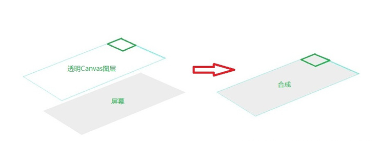
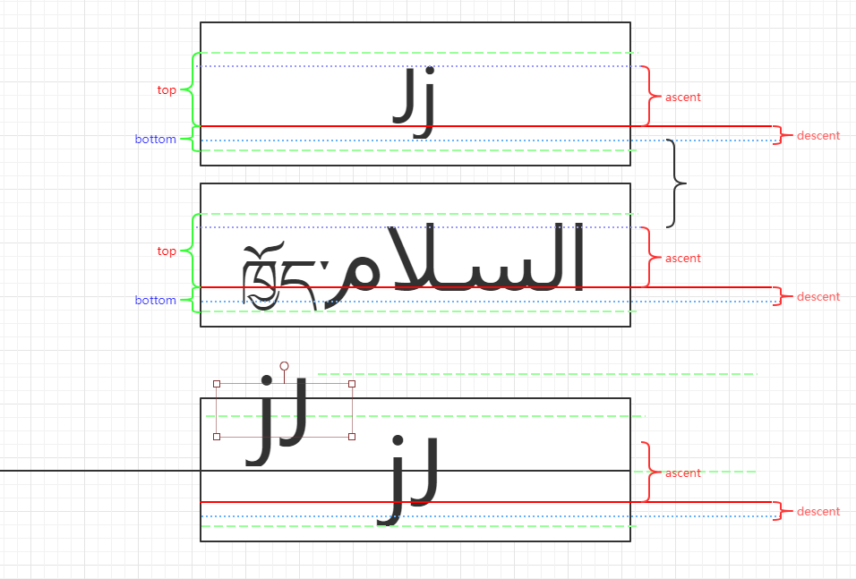

我们知道，自定义View的绘制通常有三个方法，onMesure->onLayout->onDraw。文字的绘制需要在Canvas上进行，而这一步发生在onDraw阶段。我们除了要了解Canvas的概念外，还要掌握文字绘制的基本方法，包括文字的测量，文字绘制的位置等。

#### Canvas画布
Canvas是一个很虚幻的概念，相当于一个透明图层（用过PS的同学应该都知道），每次Canvas画图时（即调用Draw系列函数），都会产生一个透明图层，然后在这个图层上画图，画完之后覆盖在屏幕上显示。所以上面的两个结果是由下面几个步骤形成的。



Canvas提供了保存和回滚属性的方法(save和restore)，比如你可以先保存目前画纸的位置(save)，然后旋转90度，向下移动100像素后画一些图形，画完后调用restore方法返回到刚才保存的位置。

因此在canvas.save()与canvas.restore()之间的代码，可以看做是一个图层。
```java
canvas.save()
...
canvas.restore()
```
#### 文字的绘制
在绘制文字之前，我们需要新建一个Paint画笔对象，它保存了绘制几何图形、文本和位图的样式和颜色信息，为我们绘制图形、文本等提供了诸多API方法。
```java
Paint paint = new Paint();
```
在这里，我们常用于文字绘制的是drewText()方法，需要提供4个参数，text为要绘制的文字，x为横坐标的绘制起始位置，y为纵坐标的基线位置，paint则是我们的画笔对象。
```java
public void drawText(@NonNull String text, float x, float y, @NonNull Paint paint) {
        super.drawText(text, x, y, paint);
}
```
既然提到了基线位置，那就引申出了文字的测量的概念。我们先来看下面的图片。


红色的线是baseline基线，文字绘制的时候并不是贴在基线上的，对于不同的文字，他们都是以baseline为基准位置，然后做相对位置上的绘制。

- top为上方可绘制范围的最大值，即文字的绘制向上不能超过的最大范围
- ascent为文字绘制的上界，即某个被绘制文字最顶端的的位置
- bottom为下方可绘制范围的最大值，即文字的绘制向下不能超过的最大范围
- descent为文字绘制的下界，即某个被绘制文字最低端的的位置。

其中top和ascent均为负值，bottom和descent均为正值。

这些属性都可以从FontMetrics类中获取，它是Paint中的一个内部类，记录着绘制文本的测量属性。
```java
public static class FontMetrics {
      public float   top;
      public float   ascent;
      public float   descent;
      public float   bottom;
      public float   leading;
}
```
现在我们已经了解了文字绘制的基本知识了，那么我们如何才能灵活的绘制文字的位置呢，比如将文字绘制到View的中心位置。Canvas中的drawText是以baseline作为绘制的基准线的，所以我们这里要先算出baseline的位置才行。

我们想要把文字绘制到中心的话，那就是文字的高度/2的位置(descent-ascent)/2，但由于descent的存在，文字的绘制并不是严格在baseline上，因此还要再减去一个descent的高度。得到baseline的位置为:
```java
float baseline = getHeight() / 2 - (fontMetrics.descent + fontMetrics.ascent) / 2;
```

#### Canvas画布裁切
我们如果要实现今日头条字体颜色渐变的效果的话，由于文本绘制并不能只绘制一半，那就必须得先来了解Canva的画布裁切。clipRect函数是Canvas类下一个用于对画布进行矩形裁剪的方法。它裁剪了我们想要的绘制区域，有点类似ps里面的遮罩效果，绘制的时候只会在裁剪的区域进行。

除此之外还有clipOutRect函数，它则与clipRect函数相反，会在画布上裁剪出一个洞，处了该区域外的地方都可以进行绘制。

#### 过度绘制
在Canvas上进行绘制的时候，如果同一个色素点重复绘制了多次，那就称为过度绘制，我们在开发者模式里面可以通过Debug GPU overdraw开启显示。这时候界面上的View就会有明显的提示。根据不同颜色可以知道是否发生了过度绘制。
- 真彩色：没有过度绘制
- 蓝色：过度绘制1次
- 绿色：过度绘制2次
- 粉色：过度绘制3次
- 红色：过度绘制4次或更多次

#### 文字渐变绘制
有了以上的基本知识，我们就能开始实现我们的字体颜色渐变的绘制了。假设我们的文字分为黑色的底色和红色的显色，那么我们就得分两个图层开始绘制。而为了避免过度绘制，我们不仅要通过clipRect控制红色的绘制区域，黑色的部分也要通过clipRect来进行裁切绘制。为了控制绘制的区域，我们需要通过一个mPercent的参数，根据进度的大小来决定。

**绘制黑色底层文字：**
```java

    private void drawBelowText(final Canvas canvas) {
        //反面教程
        canvas.save();
        paint.setAntiAlias(true);
        paint.setTextSize(80);
        float width = paint.measureText(mText);
        float left = getWidth() / 2 - width / 2;
        float left_x = left + width * mPercent;
        Paint.FontMetrics fontMetrics = paint.getFontMetrics();
        float baseline = getHeight() / 2 - (fontMetrics.descent + fontMetrics.ascent) / 2;
        Rect rect = new Rect((int) left_x, 0, getWidth(), getHeight());
        canvas.clipRect(rect);
        canvas.drawText(mText, left, baseline, paint);
        canvas.restore();
    }
```

**绘制红色上层文字：**

```java
private void drawAboveText(final Canvas canvas) {
        canvas.save();
        paint.setColor(Color.RED);
        paint.setAntiAlias(true);
        paint.setTextSize(80);
        float width = paint.measureText(mText);
        float left = getWidth() / 2 - width / 2;
        float right = left + width * mPercent;
        Paint.FontMetrics fontMetrics = paint.getFontMetrics();
        float baseline = getHeight() / 2 - (fontMetrics.descent + fontMetrics.ascent) / 2;
        Rect rect = new Rect((int) left, 0, (int) right, getHeight());
        canvas.clipRect(rect);
        canvas.drawText(mText, left, baseline, paint);
        canvas.restore();

    }
```

并为ViewPager控件添加滑动的监听，改变mPercent的大小:
```java
 mViewPager.addOnPageChangeListener(new ViewPager.OnPageChangeListener() {
        @Override
        public void onPageSelected(int position) {
        }

        @Override
        public void onPageScrolled(int position, float positionOffset,
                                   int positionOffsetPixels) {
            if (positionOffset > 0) {
                ColorChangeTextView left = mTabs.get(position);
                ColorChangeTextView right = mTabs.get(position + 1);

                left.setDirection(ColorChangeTextView.DIRECTION_RIGHT);
                right.setDirection(ColorChangeTextView.DIRECTION_LEFT);
                Log.v(TAG, positionOffset + "");
                left.setProgress(1 - positionOffset);
                right.setProgress(positionOffset);
            }
        }

        @Override
        public void onPageScrollStateChanged(int state) {

        }
    });
```
