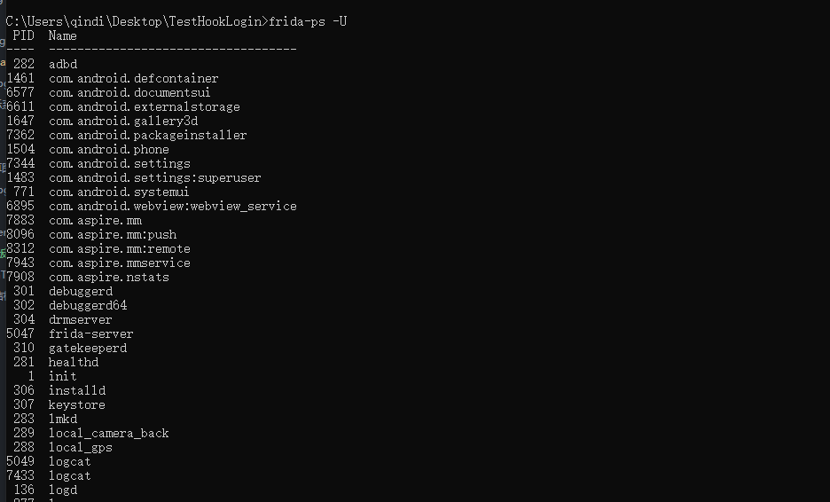

## Frida基本原理
#### 简介
Frida是一款基于python + javascript 的hook框架，可运行在android ios linux windows osx等各平台，主要使用动态二进制插桩技术;由于是基于脚本(javascript)的交互，因此相比xposed和substrace cydia更加便捷。

Frida的基本流程如下：
>1. 手机端安装一个server程序
>2. 然后把手机端的端口转到PC端，
>3. PC端运行python脚本进行通信，python脚本中需要hook的代码采用javascript语言。

官网址址：https://frida.re/
github地址：https://github.com/frida/frida

## Frida的环境配置
首先通过上面的介绍，明白frida是通过本地设备与远程设备端通信实现hook脚本传递注入的，所以可以确定要有本地客户端和远程服务端两部分组成。

#### 客户端

本地客户端是基于Python的，所以我们需要先安装并配置python环境。[Python下载地址](https://www.python.org/)

然后使用pip命令安装frida。
```python
pip install frida
```

#### 服务端
Android 客户端上要运行服务端代码，用于接收我们编写的js代码。其中包括了各种平台的frida版本，在这里我们使用的是android平台的frida-server。  [frida下载地址](https://github.com/frida/frida/releases)


其实我们在这里还可以看到有很多其他的Android的选择，每类服务端都适用于不同的场景，比如：Gadget适用于当无法获取root权限时可以将gadget.so植入目标apk中重打包，通过修改应用，使得server以应用的权限启动；还有frida-gum、frida-gumjs、frida-inject、frida-devkit等。


我们下载相应版本的frida-server后得到安装包并解压，将得到的文件命名为frida-server，将该文件upload到模拟器的/data/local/tmp文件夹中。

获取root权限并进入adb shell
```cmd
adb root
adb shell
```
进入/data/local/tmp文件夹并修改frida-server权限
```cmd
cd /data/local/tmp
chmod 777 frida-server
```
运行frida-server以启动远程服务
```cmd
./frida-server
```
为了检查服务端是否启动成功，我们另起一个命令行窗口输入frida-ps -U命令(查看运行的进程)
```cmd
frida-ps -U
```
如果出现以下界面，则说明服务端启动成功。


最后将手机端的端口转发到PC端进行通信。
```cmd
adb forward tcp:27042 tcp:27042
```
## Frida的基本使用
由前文，客户端是通过运行py脚本与服务端进行通信，其中的Python代码起到的是通信以及将js代码发送到设备的功能，核心代码都是在JS中实现。js代码function大括号内部是用于hook的主要代码，其余部分基本不变。由于js语言是弱语言，不对变量类型做强检查，所以我们可以都用var表示。
```python
import frida, sys
# 接收脚本信息的回调函数
# message是一个对象，type属性为send则表示send函数发送的信息，其内容在payload里
# 下面这个on_message函数可以做固定用法，一般无需改动，当然也可直接打印message看看里边的内容
def on_message(message, data):
    if message['type'] == 'send':
        print("[*] {0}".format(message['payload']))
    else:
        print(message)

# JavaScript代码段落：Hook方法插入处
jscode = """

Java.perform(function () {
	var currentApplication = Java.use("android.app.ActivityThread").currentApplication();
	var context = currentApplication.getApplicationContext();
	var networkManager = Java.use('com.aspire.util.NetworkManager')
  	networkManager.getSubscriberId.overload('android.content.Context').implementation = function (context) {
   		send('调用了getSubscriberId:')
   		return this.getSubscriberId(context)
  };
  networkManager.getIMEI.overload('android.content.Context').implementation = function (context) {
   		send('调用了getIMEI:')
   		return this.getIMEI(context)
  };
});
"""

# 注入进程,attach传入进程名称（字符串）或者进程号（整数）
process = frida.get_usb_device().attach('com.aspire.mm')
script = process.create_script(jscode)
# 设置message事件的回调函数
script.on('message', on_message)
print('[*] Running CTF')
# 加载hook脚本
script.load()
# 保持主线程不结束（也可以使用time.sleep循环）
sys.stdin.read()
```
运行脚本前一定要先在模拟器中将app运行起来，然后我们在cmd中将脚本运行。
```cmd
python hook_script.py
```
下面讲解一下JS代码中的用法：
#### Java层的hook
首先脚本中使用Java.use方法通过类名获取类的类型，例如代码中的
```java
var networkManager = Java.use('com.aspire.util.NetworkManager')
```
就可以获取到NetworkManager的类变量，这就有点类似于Java中的反射的getClass方法获得类的实例。
##### 构造方法
hook构造方法需要用到关键字`$init`，这里通过一个实例来展示。
```java
package com.example.test

public class People{
  private int age;
  private String name;
  public People(int age,String name){
    this.age=age;
    this.name=name;
  }

  public void setName(String name){
    this.name=name;
  }

  pubilc People getPeople(){
    return this;
  }
}
```
首先我们通过use来获取到People类，因为是构造方法，所以我们使用$init，由于需要重载，所以使用overload(……)形式。中间传入的参数通过逗号隔开，如果是基本参数类型如int等，则直接写入int。如果是非基本类型，如String类，则需要写入全类名``"java.lang.String"``。
| Hook重载       | 语法                    |
| -------------- | ----------------------- |
| int类型        | int                     |
| float类型      | float                   |
| boolean类型    | boolean                 |
| string类型     | java.lang.String        |
| byte类型       | byte                      |
| char类型       | char                      |
| List       | java.util.List          |
| Context | android.content.Context |


重写function(...)方法的时候，由于js是弱参数类型，所以我们在这里不用指定参数类型了。最后通过return，重新调用了原方法。
```js
var people = Java.use('com.example.test.People')

people.$init.overload("int","java.lang.String").implementation = function(age,name)(){
  // 在这里使用send可以向客户端发送消息。
  send('age:'+age+'name:'+name);
  return this.$init(age,name)
};
```
##### 普通方法
hook普通方法的时候，用法和构造方法基本一致，就是把$init换成了方法名而已；
```js
people.setName.overload("java.lang.String").implementation = function(name)(){
  // 我们就可以拦截传入的age值，传入自己设置的age并返回
  name = "MM"
  return this.setName(name)
};
```
##### 修改参数和返回值
参数和返回值的修改在上面内容很容易看出来，就是在方法拦截后通过arguments参数去获取传入参数，然后修改，返回值的话直接修改return函数就好了，这里重点讲的是自定义类型的参数：

造一个新对象的方法有很多，可以选择最简单的$new，也可以调用构造方法来完成。
```js
people.getPeople.implementation = function()(){
  // 我们就可以拦截传入的age值，传入自己设置的age并返回
  // var peopleObj = people.$new(15,"Jack");
  var peopleObj = people.$new.overload("int","java.lang.String").call(people,15,"Jack");
  return peopleObj
};
```
这里的返回值修改成了我们构造出来的这个对象peopleObj，但是如果要修改一个对象的内部值的话，直接用对象名加参数是不行的，那么就需要用反射了。

在这里我们通过java.cast(Object.getClass(),clazz)来获取类对象，剩下的就跟Java中类似了。
```js
Java.perform(function(){
    var testutils = Java.use('com.example.test.Utils');
    var people = Java.use('com.example.test.people');
    testutils.test.overload('com.example.test.people').implementation = function(a){
      console.log('hook start...');
      var p = XXXX.$new(20,"Rose");
      var clazz = Java.use('java.lang.Class');
      var age = Java.cast(p.getClass(), clazz).getDeclaredField('age');
      age.setAccessible(true);
      var value = age.get(p);
      console.log(value);
      send(value);
      age.setInt(p,30);
      return this.test(p);
    }
  }
);


```
